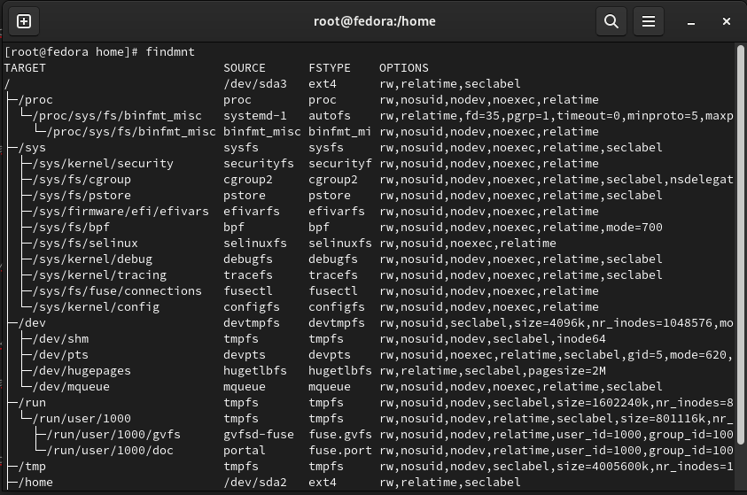

---
## Front matter
title: "Архитектура компьютеров и операционные системы. Раздел операционные системы"
subtitle: "Лабораторная работа № 1"
author: "Мугари Абдеррахим - НКАбд-03-22"

## Generic otions
lang: ru-RU
toc-title: "Содержание"

## Bibliography
bibliography: bib/cite.bib
csl: pandoc/csl/gost-r-7-0-5-2008-numeric.csl

## Pdf output format
toc: true # Table of contents
toc-depth: 2
lof: true # List of figures
lot: true # List of tables
fontsize: 12pt
linestretch: 1.5
papersize: a4
documentclass: scrreprt
## I18n polyglossia
polyglossia-lang:
  name: russian
  options:
	- spelling=modern
	- babelshorthands=true
polyglossia-otherlangs:
  name: english
## I18n babel
babel-lang: russian
babel-otherlangs: english
## Fonts
mainfont: PT Serif
romanfont: PT Serif
sansfont: PT Sans
monofont: PT Mono
mainfontoptions: Ligatures=TeX
romanfontoptions: Ligatures=TeX
sansfontoptions: Ligatures=TeX,Scale=MatchLowercase
monofontoptions: Scale=MatchLowercase,Scale=0.9
## Biblatex
biblatex: true
biblio-style: "gost-numeric"
biblatexoptions:
  - parentracker=true
  - backend=biber
  - hyperref=auto
  - language=auto
  - autolang=other*
  - citestyle=gost-numeric
## Pandoc-crossref LaTeX customization
figureTitle: "Рис."
tableTitle: "Таблица"
listingTitle: "Листинг"
lofTitle: "Список иллюстраций"
lotTitle: "Список таблиц"
lolTitle: "Листинги"
## Misc options
indent: true
header-includes:
  - \usepackage{indentfirst}
  - \usepackage{float} # keep figures where there are in the text
  - \floatplacement{figure}{H} # keep figures where there are in the text
---

# Цель работы:

- Целью данной работы является приобретение практических навыков установки операционной системы на виртуальную машину, настройки минимально необходимых для дальнейшей работы сервисов.

# Последовательность выполнения работы:

## Установка операционной системы :

1. Прежде всего мы настраиваем имя виртуальной машины и выбираем тип и версию нашего дистрибутива (рис. @fig:001).

{#fig:001 width=70%}

2. Настройка объема оперативной памяти с 2048 МБ (в нашем случае 3084 МБ) (рис. @fig:002).

{#fig:002 width=70%}

3. Задаём конфигурацию жесткого диска– VDI (VirtualBox Disk Image)(рис. @fig:003) (рис. @fig:004).

{#fig:003 width=70%}

{#fig:004 width=70%}

4. Задаём размер диска от 80 ГБ (рис. @fig:005).

{#fig:005 width=70%}

5. Увеличение доступного объема видеопамяти до 128 МБ (рис. @fig:006).

{#fig:006 width=70%}

6. Во вкладке Носители добавляем новый оптический дисковод и выбираем наш образ Linux-Fedora с компьютера (рис. @fig:007).

{#fig:007 width=70%}

7. Запуск виртуальной машины и начало установки системы (рис. @fig:008) (рис. @fig:009).
   1. Мы выбираем верхний вариант «Start Fedora-workstation-live 36», затем нажимаем "Install to hard drive".

{#fig:008 width=70%}

{#fig:009 width=70%}

8. Настройка системного языка, языка ввода и времени (рис. @fig:010).

{#fig:010 width=70%}

9. Выбор диска, на который будем устанавливать нашу операционную систему,затем мы нажимаем начать установку (рис. @fig:011)

{#fig:011 width=70%}

10. Мы ждем окончания установки, затем нажимаем завершить установку (рис. @fig:012) (рис. @fig:013).

{#fig:012 width=70%}

{#fig:013 width=70%}

11. после установки мы завершаем сеанс виртуальной машины, удаляем образ диска из дисковода (рис. @fig:014) (рис. @fig:015).

{#fig:014 width=70%}

{#fig:015 width=70%}

12. Мы запускаем виртуальную машину, в которой мы должны создать нового пользователя (логин пользователя совпадает с логином студента в дисплейном классе) и настройкой пароля (рис. @fig:016) (рис. @fig:017)

{#fig:016 width=70%}

{#fig:017 width=70%}

13. На данный момент мы успешно установили операционную систему «Fedora» на виртуальную машину (рис. @fig:018).

{#fig:018 width=70%}

## После установки:

1. После установки мы взяли на себя роль суперпользователя, а затем обновили все пакеты и мы позаботились о том, чтобы обновления **dnf** были автоматическими с помощью таймера **dnf** (рис. @fig:019) (рис. @fig:020).

{#fig:019 width=70%}

{#fig:020 width=70%}

2. Затем мы установили **tmux**, чтобы сделать использование терминала более комфортным.

3. Мы отключили **SELINUX**, потому что он нам не нужен в будущей работе.(рис. @fig:022)

{#fig:022 width=70%}

4. когда мы загрузили пакет драйверов virtualbox (рис. @fig:023)

{#fig:023 width=70%}

5. мы добавляем эти дополнения на оптический диск, чтобы мы могли запустить их на нашей виртуальной машине (рис. @fig:024)

{#fig:024 width=70%}

6. после этого мы смонтировали драйверы и установили их (рис. @fig:025)

{#fig:025 width=70%}

7. затем мы отредактировали способ изменения языка клавиатуры с помощью сочетаний клавиш, используя **правый ctrl** (рис. @fig:026)

{#fig:026 width=70%}

## Установка программного обеспечения для создания документации: 

1. На этом шаге мы запустили терминал, присвоили роль суперпользователя и запустили **tmux** затем мы вводим команду для установки **pandoc**(рис. @fig:027)

{#fig:027 width=70%}

2. мы установили необходимые расширения (рис. @fig:028)

{#fig:028 width=70%}

3.  мы установили дистрибутив TeXlive (рис. @fig:029)

{#fig:029 width=70%}

# Задание

## Контрольные вопросы: 

1. Какую информацию содержит учётная запись пользователя?

- Учетная запись пользователя содержит первую букву имени, отчества и полную фамилию студента.
- Например, мое полное имя Мугари Абдеррахим, имя моей учетной записи будет **amugari**

2. команда для получения справки по команде

- чтобы получить помощь по команде, нам нужно использовать команду **man -command** (рис. @fig:030)

{#fig:030 width=70%}

3. команда для перемещения по файловой системе 

-  ДЛЯ перемещения по файловой системе нам нужно использовать команду **cd** (рис. @fig:031)

{#fig:031 width=70%}

4. команда для просмотра содержимого каталога

-  чтобы просмотреть содержимое каталога, нам нужно использовать команду **ls** (рис. @fig:032)

{#fig:032 width=70%}

5. команда для определения объёма каталога

- чтобы определить объем каталога, нам нужно использовать команду **du -s** (рис. @fig:033)

{#fig:033 width=70%} 

6. команда для создания / удаления каталогов / файлов

- для создания каталога в Linux мы используем команду **mkdir**, а для создания файла мы используем команду **touch**, для удаления файлов мы используем команду **rm** (рис. @fig:034)

{#fig:034 width=70%} 

7. команда для задания определённых прав на файл / каталог

- чтобы предоставить и создать определенное право для файла или каталога, нам нужно использовать команду **chmod** (рис. @fig:035)

{#fig:035 width=70%}

8. команда для просмотра истории команд

- Чтобы проверить историю команд, нам нужно использовать **history** (рис. @fig:036)

{#fig:036 width=70%}

9. Что такое файловая система? Приведите примеры с краткой характеристикой?

- файловая система - способ именования, хранения и манипуляци файлами на носителе данных. например, **FAT32**г де FAT32 предлагает только общие разрешения и **NTFS** в то время как **NTFS** позволяет вам устанавливать определенные разрешения для локальных файлов / папок

10. Как посмотреть, какие файловые системы подмонтированы в ОС?
- чтобы увидеть, какие файловые системы смонтированы в ОС, мы можем использовать команду **findmnt**(рис. @fig:037)

{#fig:037 width=70%}

11. Как удалить зависший процесс?

- чтобы завершить зависший процесс, мы можем использовать команду **pkill**(рис. @fig:038)

{#fig:038 width=70%}

## Домашнее задание

1. Версия ядра Linux (рис. @fig:039)

{#fig:039 width=70%}
   
2. Частота процессора (Detected Mhz processor).(рис. @fig:040)

{#fig:040 width=70%}
   
3. Модель процессора (CPU0).(рис. @fig:041)

{#fig:041 width=70%}
   
4. Объём доступной оперативной памяти (Memory available).(рис. @fig:042)
   
{#fig:042 width=70%}

5. Тип обнаруженного гипервизора (Hypervisor detected).(рис. @fig:043)

{#fig:043 width=70%}
   
6. Тип файловой системы корневого раздела.(рис. @fig:044)

{#fig:044 width=70%}
   
7. Последовательность монтирования файловых систем.(рис. @fig:045)

{#fig:045 width=70%}

# Выводы

## результатов выполнения задания :

- В этой лабораторной работе мы узнали, как установить операционную систему на виртуальную машину, как использовать терминал для выполнения определенной команды и как использовать **pandoc** и **texlive**

