---
## Front matter
lang: ru-RU
title: Операционные системы
subtitle: Лабораторная работа № 4. Основы интерфейса взаимодействия пользователя с системой Unix на уровне командной строки
author:
  - Абдеррахим Мугари.
institute:
  - Российский университет дружбы народов, Москва, Россия
  
date: 04 марта 2023

## i18n babel
babel-lang: russian
babel-otherlangs: english

## Formatting pdf
toc: false
toc-title: Содержание
slide_level: 2
aspectratio: 169
section-titles: true
theme: metropolis
header-includes:
 - \metroset{progressbar=frametitle,sectionpage=progressbar,numbering=fraction}
 - '\makeatletter'
 - '\beamer@ignorenonframefalse'
 - '\makeatother'
 
---

# Информация

## Докладчик

:::::::::::::: {.columns align=center}
::: {.column width="70%"}

  * Абдеррахим Мугари
  * Студент
  * Российский университет дружбы народов
  * [1032215692@pfur.ru](mailto:1032215692@pfur.ru)
  * <https://github.com/iragoum>

:::
::: {.column width="30%"}

:::
::::::::::::::

## Цель работы:

- Приобретение практических навыков взаимодействия пользователя с системой посредством командной строки.

## Материалы и методы

- Терминал Unix

## Ход работы: 

## определиние имени домашнего каталога:

- определиние полного имени нашего домашнего каталога.

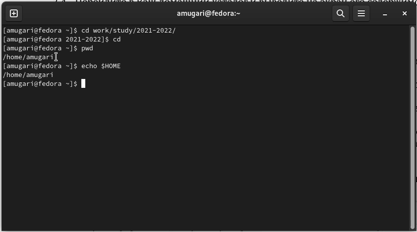{#fig:001 width=70%}

## Работа в каталоге /tmp/:

-  перемещение в каталог **tmp**.

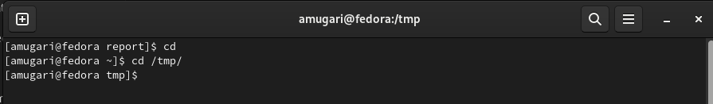{#fig:002 width=70%}

## Работа в каталоге /tmp/:

- отображение содержимого каталога **tmp/** .

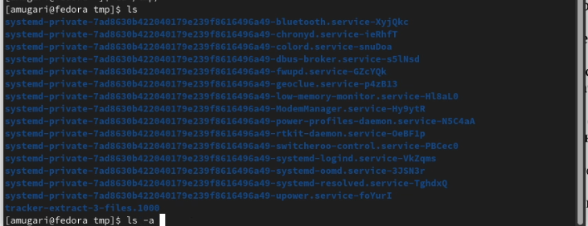{#fig:003 width=70%}

## проверка существования каталога:

- проверка существования подкаталога **cron** в каталоге /var/spool.

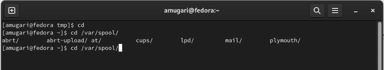{#fig:004 width=70%}

## определение того, кто является владельцем файла или каталога:

- определение того, кто является владельцем файлов и каталогов в домашнем каталоге .

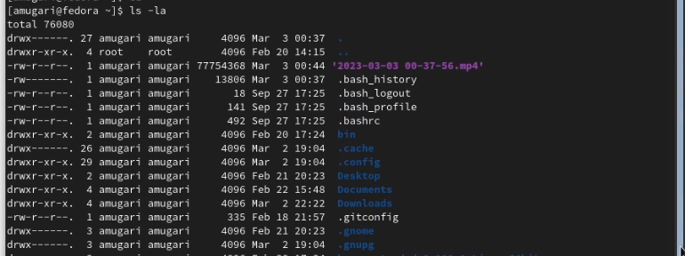{#fig:005 width=70%}

## Создание каталогов в различных сценариях:

- Создание нового подкаталога с именем **newdir**.

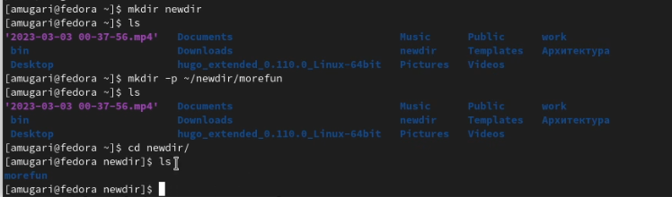{#fig:006 width=70%}

## Создание каталогов в различных сценариях:

- создание нового каталога с именем *morefun/* .
    
{#fig:006 width=70%}

## Создание каталогов в различных сценариях:
    
- создание трех файлов с помощью одной команды, а затем удаление их всех только одной командой.
    
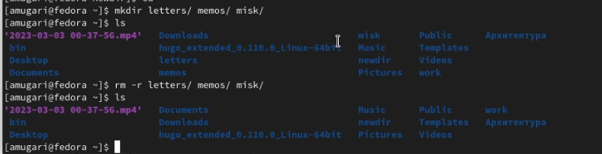{#fig:007 width=70%}

## удаление файлов с помощью **rm**:
    
- удаление каталога с помощью команды **rm** без опций.
    
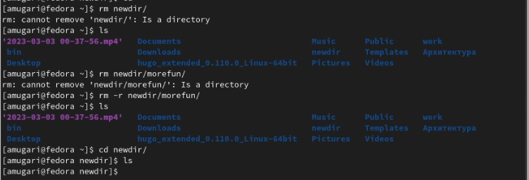{#fig:008 width=70%}

## удаление файлов с помощью **rm**:
    
- удаление файла **morefun** и проверка того, что он был успешно удален .
    
{#fig:009 width=70%}

## отображение содержимого каталога и его подкаталогов:
    
4. отображение содержимого каталога и его подкаталогов.

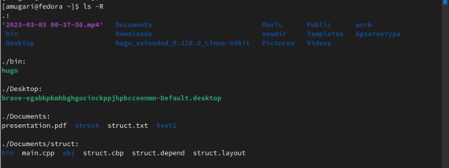{#fig:010 width=70%}

## отображение подкаталогов по времени последнего редактирования:

5. отображение подкаталогов по времени последнего редактирования .

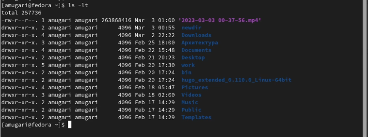{#fig:011 width=70%}

## определили набор опций для комманд:

6. Используя команду **man**, мы просмотрели описание следующих команд: *cd, pwd, mkdir,rmdir, rm* 

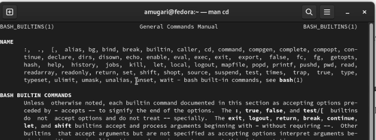

## определили набор опций для комманд:

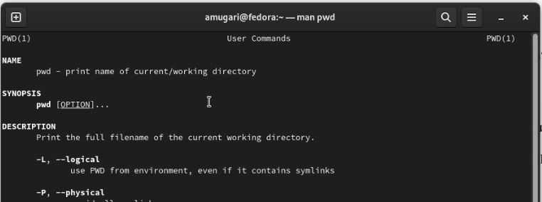

## определили набор опций для комманд:

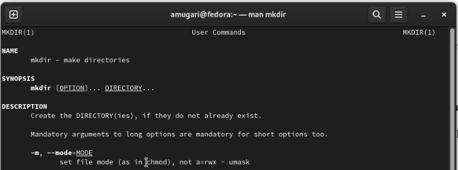

## определили набор опций для комманд:

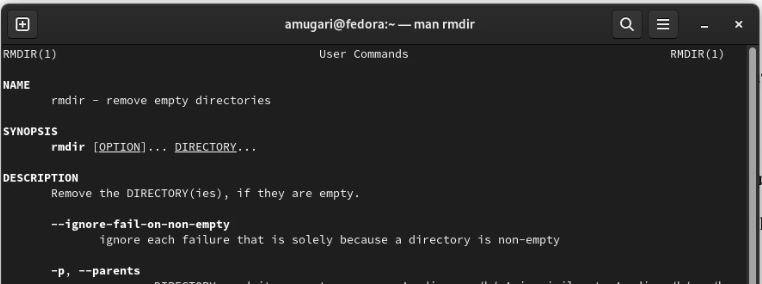

## определили набор опций для комманд:

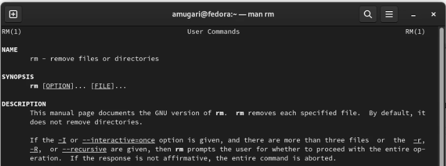

## изменение старой команды:

7. Используя информацию, полученную с помощью команды history, мы выполнили модификацию и выполнили команду.

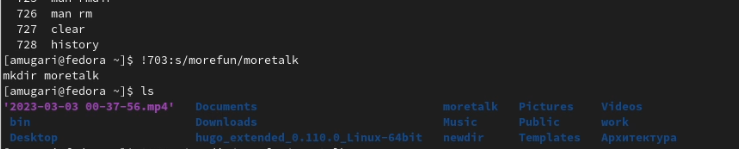{#fig:017 width=70%}

## выводы по результатам выполнения заданий:

- выполнив эти упражнения, мы смогли применить наши теоретические знания о **командной строке** на практике и посмотреть, как их использовать в системе **UNIX**.
  
  
# Выводы, согласованные с целью работы:

- В этой лабораторной работе мы приобрели практические навыки взаимодействия пользователя с системой через командную строку.

