---
## Front matter
title: "Архитектура компьютеров и операционные системы | Операционные системы"
subtitle: "Лабораторная работа № 4. Основы интерфейса взаимодействия пользователя с системой Unix на уровне командной строки"
author: "Мугари Абдеррахим - НКАбд-03-22"

## Generic otions
lang: ru-RU
toc-title: "Содержание"

## Bibliography
bibliography: bib/cite.bib
csl: pandoc/csl/gost-r-7-0-5-2008-numeric.csl

## Pdf output format
toc: true # Table of contents
toc-depth: 2
lof: true # List of figures
lot: true # List of tables
fontsize: 12pt
linestretch: 1.5
papersize: a4
documentclass: scrreprt
## I18n polyglossia
polyglossia-lang:
  name: russian
  options:
	- spelling=modern
	- babelshorthands=true
polyglossia-otherlangs:
  name: english
## I18n babel
babel-lang: russian
babel-otherlangs: english
## Fonts
mainfont: PT Serif
romanfont: PT Serif
sansfont: PT Sans
monofont: PT Mono
mainfontoptions: Ligatures=TeX
romanfontoptions: Ligatures=TeX
sansfontoptions: Ligatures=TeX,Scale=MatchLowercase
monofontoptions: Scale=MatchLowercase,Scale=0.9
## Biblatex
biblatex: true
biblio-style: "gost-numeric"
biblatexoptions:
  - parentracker=true
  - backend=biber
  - hyperref=auto
  - language=auto
  - autolang=other*
  - citestyle=gost-numeric
## Pandoc-crossref LaTeX customization
figureTitle: "Рис."
tableTitle: "Таблица"
listingTitle: "Листинг"
lofTitle: "Список иллюстраций"
lotTitle: "Список таблиц"
lolTitle: "Листинги"
## Misc options
indent: true
header-includes:
  - \usepackage{indentfirst}
  - \usepackage{float} # keep figures where there are in the text
  - \floatplacement{figure}{H} # keep figures where there are in the text
---

# Цель работы

- Приобретение практических навыков взаимодействия пользователя с системой посредством командной строки.

# Выполнение лабораторной работы

1. Сначала мы должны были определить полное имя нашего домашнего каталога (рис. @fig:001).

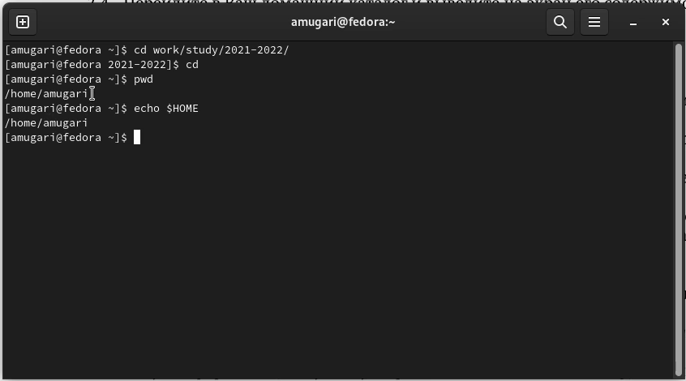{#fig:001 width=70%}

2. Затем нам пришлось перейти в каталог /tmp с помощью команды **cd** (рис. @fig:002).

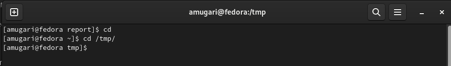{#fig:002 width=70%}

- Здесь мы отобразили содержимое каталога* /tmp*. используя команду **ls** с различными опциями (рис. @fig:003).
    
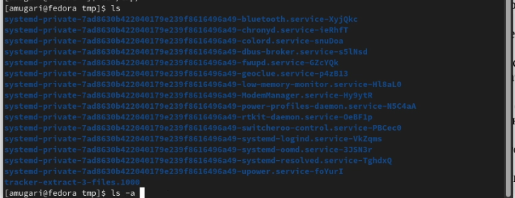{#fig:003 width=70%}
    
- здесь мы проверили, есть ли подкаталог с именем cron в каталоге /var/spool (рис. @fig:004).
    
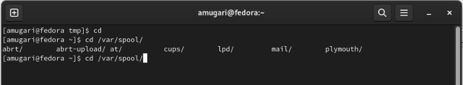{#fig:004 width=70%}
    
- здесь мы должны были перейти в домашний каталог и отобразить его содержимое, а также определить, кто является владельцем файлов и подкаталогов (рис. @fig:005)
    
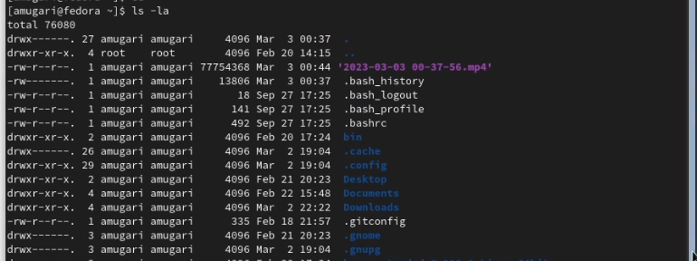{#fig:005 width=70%}

3. В домашнем каталоге нам пришлось создать новый каталог с именем **newdir** (рис. @fig:006).

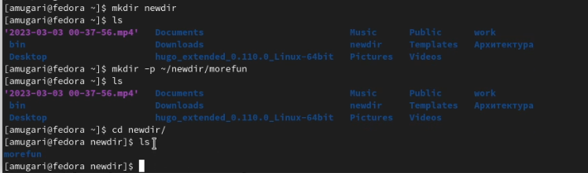{#fig:006 width=70%}

- В каталоге *~/newdir* нам нужно было создать новый каталог с именем *morefun/*, и мы сделали это двумя разными способами, как показано на рисунке  (рис. @fig:006).
    
{#fig:006 width=70%}
    
- В домашнем каталоге мы создали три новых каталога с именами **letters, memos, misc** с помощью одной команды. Затем удалил эти каталоги одной командой (рис. @fig:007).
    
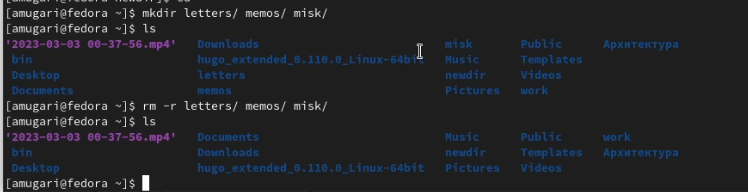{#fig:007 width=70%}
    
- мы попытались удалить ранее созданный каталог ~/newdir с помощью команды rm, но это не сработало (рис. @fig:008).
    
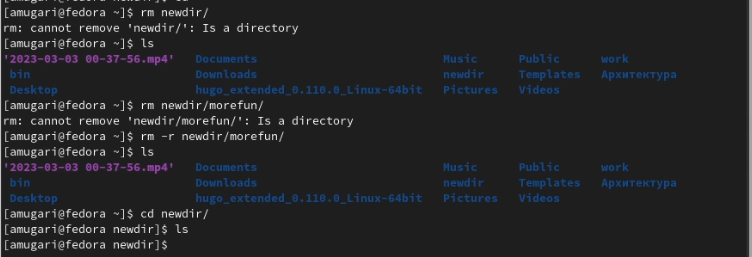{#fig:008 width=70%}
    
- затем мы удалили каталог ~/newdir/more fun из домашнего каталога и проверили, был ли каталог удален (рис. @fig:009).
    
{#fig:009 width=70%}
    
4. Здесь мы использовали команду **ls -R**, чтобы просмотреть содержимое каталогов и их подкаталогов (рис. @fig:010).

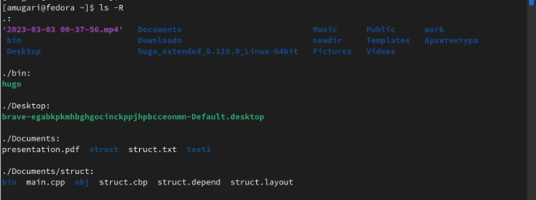{#fig:010 width=70%}

5. Используя команду man, мы определили набор опций для команды ls, которая позволяет сортировать по времени последнего изменения выходной список содержимого каталога с подробным описанием файлов, которые являются: **ls -lt** (рис. @fig:011).

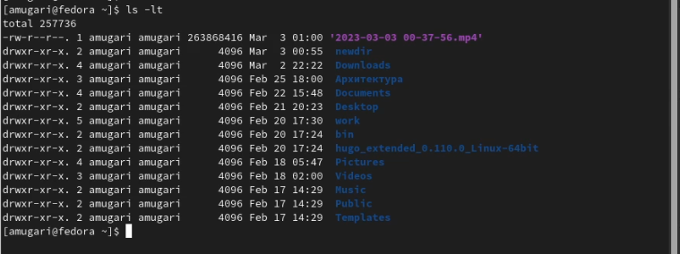{#fig:011 width=70%}

6. Используя команду **man**, мы просмотрели описание следующих команд: *cd, pwd, mkdir,rmdir, rm* (рис. @fig:012), (рис. @fig:013), (рис. @fig:014), (рис. @fig:015), (рис. @fig:016).

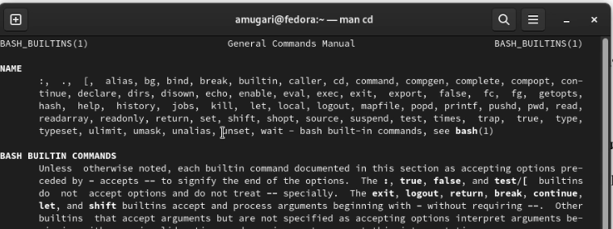{#fig:012 width=70%}

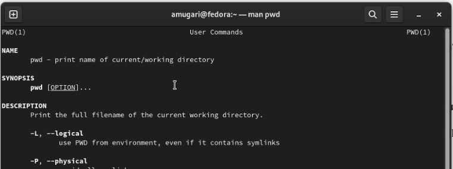{#fig:013 width=70%}

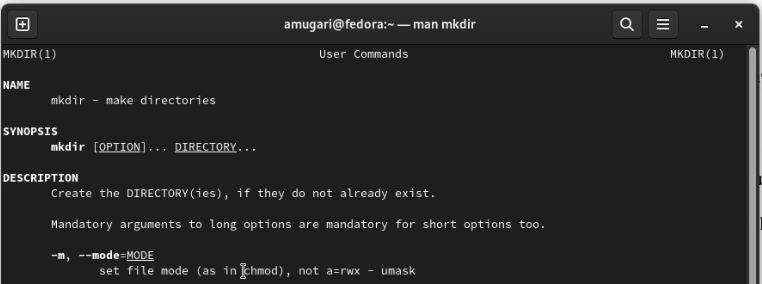{#fig:014 width=70%}

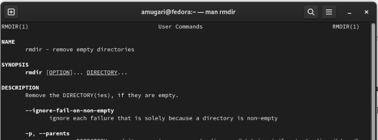{#fig:015 width=70%}

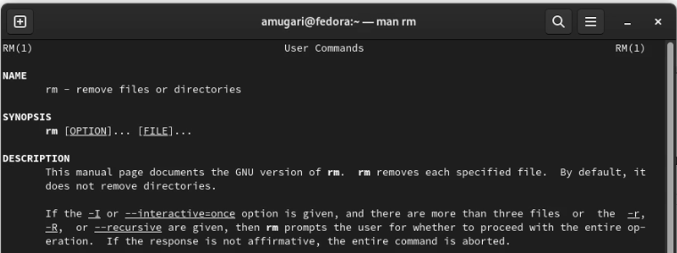{#fig:016 width=70%}

7. Используя информацию, полученную с помощью команды history, мы выполнили модификацию и выполнили команду (рис. @fig:017).

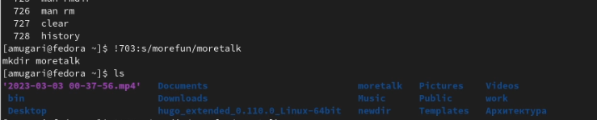{#fig:017 width=70%}
 

## Контрольные вопросы:

1. Что такое командная строка?

- Командная строка – пользовательский интерфейс, обеспечивающий взаимодействия пользователя с системой.

2. При помощи какой команды можно определить абсолютный путь текущего каталога? Приведите пример.

- Абсолютный путь текущего каталога определяется с помощью команды **pwd**.(рис. @fig:018).

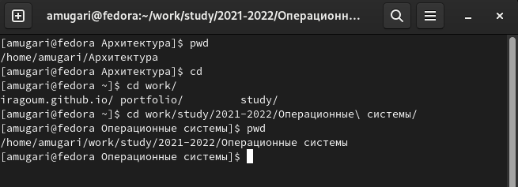{#fig:018 width=70%}

3. При помощи какой команды и каких опций можно определить только тип файлов и их имена в текущем каталоге? Приведите примеры.

- Тип файлов и их имена можно узнать с помощью команды **ls –F** (рис. @fig:019).

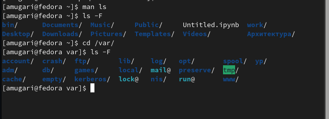{#fig:019 width=70%}

4. Каким образом отобразить информацию о скрытых файлах? Приведите примеры. 

-  Информацию о скрытых файлах можно отобразить с помощью команды ls –a. имена таких файлов начинаются с точки. С помощью команды ls –aF я получил информацию о типе файлов, в том числе скрытых. А, использовав команду ls –aFl, я получил более подробную информацию об этих файлах (рис. @fig:020).

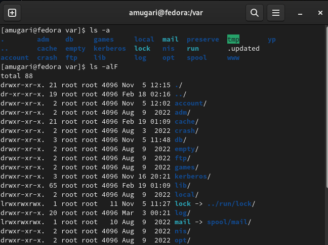{#fig:020 width=70%}

5. При помощи каких команд можно удалить файл и каталог? Можно ли это сделать одной и той же командой? Приведите примеры.

- Файл удаляется с помощью команды rm. При указании опции –r можно рекурсивно удалить каталог вместе с содержимым. Если каталог пуст, то можно использовать команду rmdir. Так же необходимо использовать опцию –i для требования запроса на подтверждение на удаление файла. (рис. @fig:021).

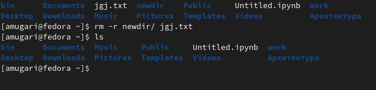{#fig:021 width=70%}

6. Каким образом можно вывести информацию о последних выполненных пользователем командах?

- Информацию о последних выполненных командах можно получить, введя команду history (рис. @fig:022).

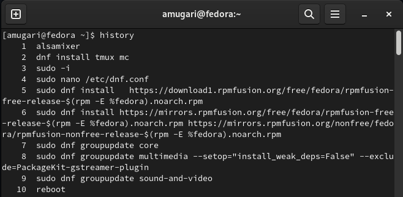{#fig:022 width=70%}

7. Как воспользоваться историей команд для их модифицированного выполнения? Приведите примеры.

- Для модифицированного выполнения команд из истории можно при помощи следующей конструкции: !<номер_команды>:s/<что_меняем>/<на_что_меняем> (рис. @fig:023).

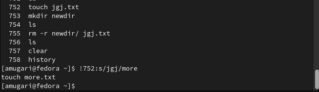{#fig:023 width=70%}

8. Приведите примеры запуска нескольких команд в одной строке (рис. @fig:024).

- **mkdir newdir;cd newdir;cd ..;rm -r newdir** 

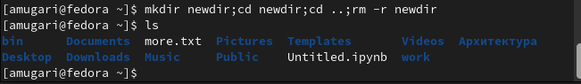{#fig:024 width=70%}

9. Дайте определение и приведите примеры символов экранирования.

- Если в заданном контексте встречаются специальные символы (типа «.», «/», «*» и т.д.), надо перед ними поставить символ экранирования \ (обратный слэш) (рис. @fig:025).

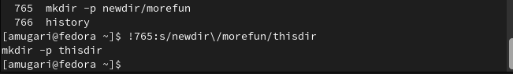{#fig:025 width=70%}

10. Охарактеризуйте вывод информации на экран после выполнения команды ls с опцией l.

В результате выполнения команды ls –l на экран выводится следующая информация о файлах и директориях:

- тип файла;

- права доступа;

- число ссылок;

- владелец;

- размер;

- дата последней ревизии;

- имя файла или каталога.

11. Что такое относительный путь к файлу? Приведите примеры использования относительного и абсолютного пути при выполнении какой-либо команды (рис. @fig:026).

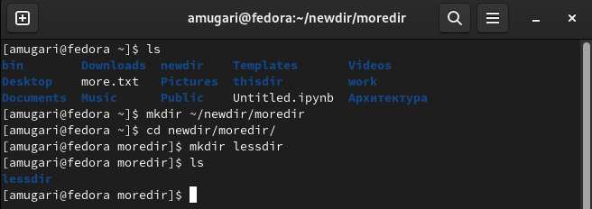{#fig:026 width=70%}

- Относительный путь к файлу – путь, начинающийся от текущей директории.

12. Как получить информацию об интересующей вас команде? 

Информацию об интересующей команде можно получить с помощью команды man в формате man <команда> (рис. @fig:027).

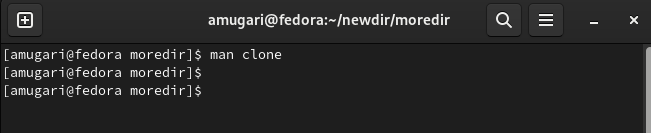{#fig:027 width=70%}

13. Какая клавиша или комбинация клавиш служит для автоматического дополнения вводимых команд?

- Клавиша **Tab** служит для автоматического дополнения вводимых команд.

    
## выводы по результатам выполнения заданий:

- выполнив эти упражнения, мы смогли применить наши теоретические знания о **командной строке** на практике и посмотреть, как их использовать в системе **UNIX**.
  
  
# Выводы, согласованные с целью работы:

- В этой лабораторной работе мы приобрели практические навыки взаимодействия пользователя с системой через командную строку.
