---
## Front matter
lang: ru-RU
title: Операционные системы
subtitle: Лабораторная работа № 5. Анализ файловой системы Linux. Команды для работы с файлами и каталогами.
author:
  - Абдеррахим Мугари.
institute:
  - Российский университет дружбы народов, Москва, Россия
  
date: 11 марта 2023

## i18n babel
babel-lang: russian
babel-otherlangs: english

## Formatting pdf
toc: false
toc-title: Содержание
slide_level: 2
aspectratio: 169
section-titles: true
theme: metropolis
header-includes:
 - \metroset{progressbar=frametitle,sectionpage=progressbar,numbering=fraction}
 - '\makeatletter'
 - '\beamer@ignorenonframefalse'
 - '\makeatother'
 
---

# Информация

## Докладчик

:::::::::::::: {.columns align=center}
::: {.column width="70%"}

  * Абдеррахим Мугари
  * Студент
  * Российский университет дружбы народов
  * [1032215692@pfur.ru](mailto:1032215692@pfur.ru)
  * <https://github.com/iragoum>

:::
::: {.column width="30%"}

:::
::::::::::::::

## Цель работы:

- Ознакомление с **файловой системой Linux**, её структурой, именами и содержанием каталогов. Приобретение практических навыков по применению команд для работы с файлами и каталогами, по управлению процессами (и работами), по проверке использования диска и обслуживанию **файловой системы**.

## Материалы и методы

- Терминал Unix.
- Файловая система.

## Ход работы: 

- Здесь у нас было две части часть, где мы должны были выполнить примеры в теоретической части, и вторая, в которой упражнения. 

## создание текстового файла и отображение его содержимого:
- На этом шаге мы использовали команду **touch** для создания текстового файла, затем с помощью команды **cat** с атрибутом **>** мы смогли добавить к нему одну строку, затем с помощью **cat** мы смогли отобразить содержимое текстового файла.

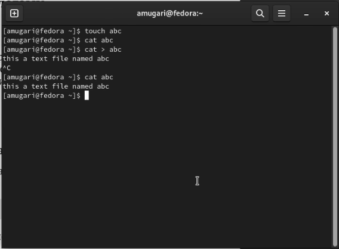{width=40%}

## Использование команд head и tail для частичного отображения текстового файла:

- Затем, используя команду **head**, мы смогли отобразить только верхнюю часть файла, где *n* - это номер строки, которую мы хотим вывести, а **tail** это чтобы образить нижнюю часть текстового файла, где *n* - это количество строк, которые мы тоже хотим вывести.

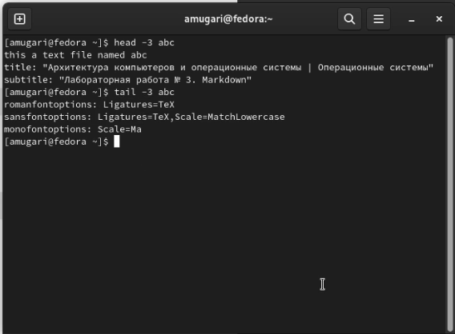{width=40%}

## Копирование содержимого текстового файла в другой файл с помощью команды cp:

- На этом шаге и с помощью команды **cp** мы смогли скопировать содержимое текстового файла в другой текстовый файл.

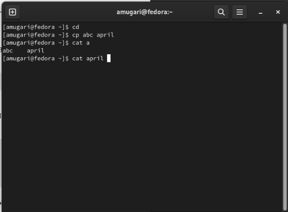{width=40%}

## копирование файлов в другой каталог:

- После этого с помощью команды **cp** мы скопировали некоторые файлы в другой каталог и создали копию файла, но с другим именем.

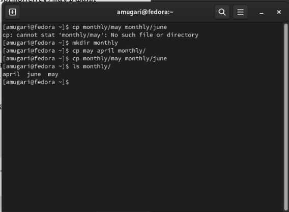{width=40%}

## копирование каталогов в другие каталоги

- на этом шаге мы создали каталог и скопировали его в другой каталог, используя команду **cp**, но мы должны были убедиться, что добавлена опция *-r*, потому что в этом случае мы работаем с каталогами.

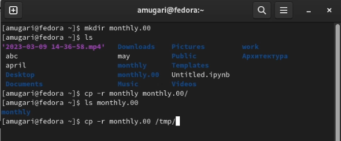{width=70%}

## переименование файла с помощью mv:

-  на этом шаге мы изменили имя файла, используя команду **mv**.

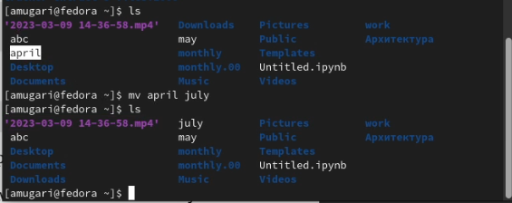{#fig:006 width=70%}

## переименование каталога с помощью mv

- После того, как мы сделали то же самое, мы изменили имя, но в данном случае для каталога, а не для файла.

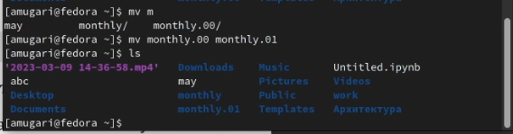{width=70%}

## перемещение каталога в другой каталог: 

- на этом шаге мы создали новый каталог, затем переместили в него другой каталог.

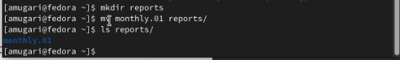{#fig:008 width=70%}

## переименование каталога, расположенного по другому пути:

- После этого мы переименовали каталог, который расположен по другому пути, чем наш .

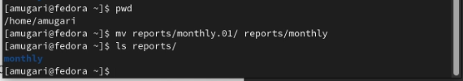{width=70%}

## Предоставление и снятие прав доступа для владельца файла

-  На этом шаге мы проверили право доступа к файлу **may** затем мы предоставили владельцу файла право на выполнение файла, и после этого мы забрали право на выполнение файла у владельца, используя команду **chmod**.

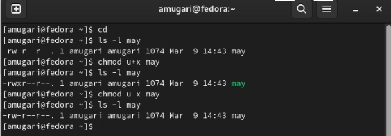{width=70%}

## Лишение права чтения каталога членов группы и других пользователей: 

- На этом шаге мы отключили доступ к чтению каталога для членов группы и для других пользователей.

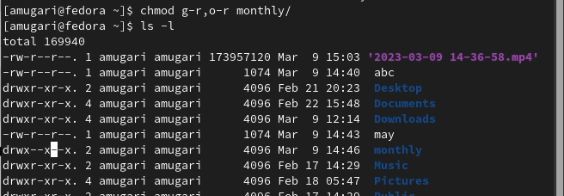{width=70%}

## предоставление права чтения текста файла членам группы:

- На этом шаге мы создали текстовый файл и предоставили членам группы право записи в файл.

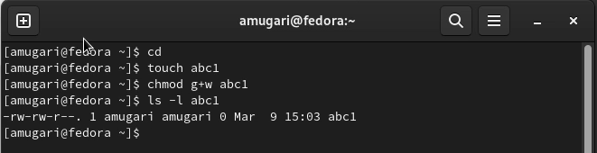{width=70%}

## Отображение файловых систем, используемых в операционной системе:

- на этом шаге мы используем команду **mount**, чтобы увидеть тип файловых систем, используемых в операционной системе.

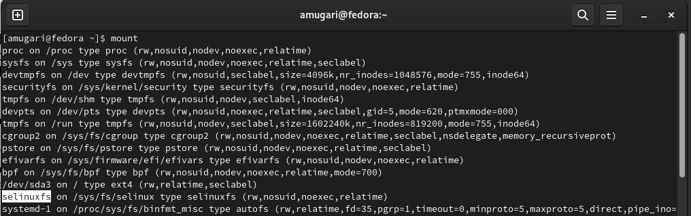{width=70%}

## Отображение устройств, смонтированных в системе:

- затем мы использовали команду **cat** для отображения подключенных устройств и их информации.

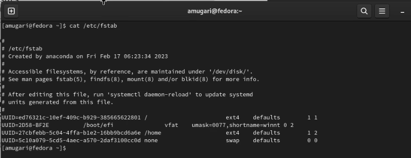{width=70%}

## определение объема доступной памяти в файловой системе:

- Чтобы определить объем свободной памяти в файловой системе, мы использовали команду **df**.

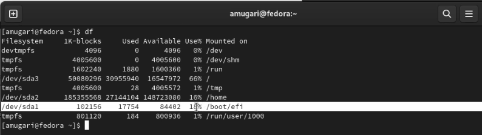{ width=70%}

## проверка работоспособности файловой системы

- Затем мы хотели проверить файловую систему и есть ли в ней какие-либо проблемы.

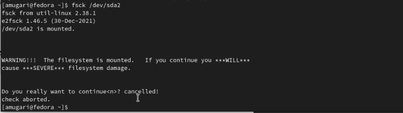{width=70%}

## Вторая часть: 

- В этой части мы выполнили упражнение, которое было дано в практической части.

## Копирование файла **io.h**:

- На этом шаге мы скопировали файл **io.h** в каталог **equipment**.

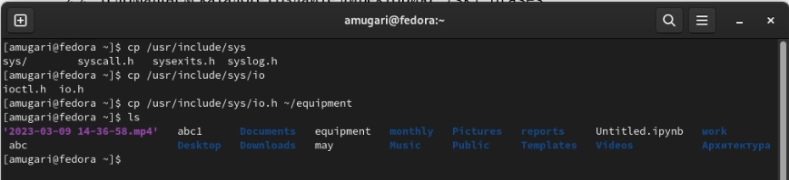{width=70%}

## Перемещение файла **equipment** во вновь созданный каталог **ski.plases

- После этого мы создали файл **ski.plases**, а затем переместили файл **equipment** в каталог **ski.plases**.

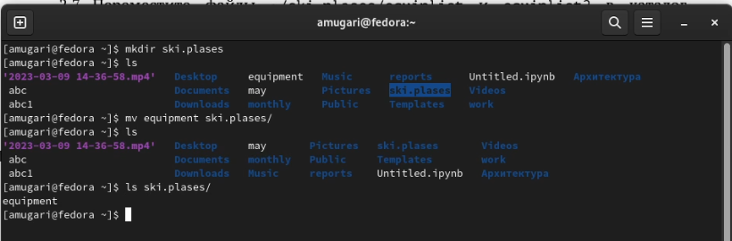{width=70%}

## Использование команд для создания и перемещения файлов и каталогов: 

- На этом шаге переименовали файл **equipment в **equiplist**, а затем мы создали новый каталог с именем **equipment** в каталоге **ski.plases**, и после этого мы переместили оба файла **equiplist** и **equiplist2** во вновь созданный создан каталог **equipment** и, наконец, мы создали новый каталог с именем **newdir**, который мы переместили в другой недавно созданный каталог под названием **plans**.

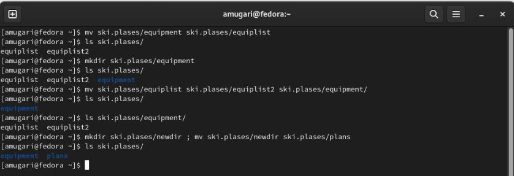{width=70%}

## создание двух каталогов и двух файлов:

- На этом шаге мы создали два каталога с именами ** australia** и **play** и два файла с именами **my_os** и **feathers**.

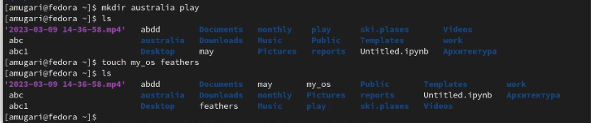{width=70%}

## изменение прав доступа к каталогу:

- Затем мы сняли право на выполнение каталога **australia** для членов группы и других пользователей.

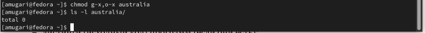{width=70%}

## изменение прав доступа к каталогу:

- после этого мы лишили прав на чтение как членов группы, так и других пользователей.

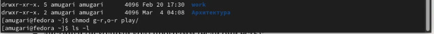{width=70%}

## изменение прав доступа к фвйлам:

- затем мы забрали право на запись в файл **my_os** и передали право на выполнение владельцу этого файла, забрали право на запись в файл **feathers** для членов группы, а затем мы вернули его им снова.

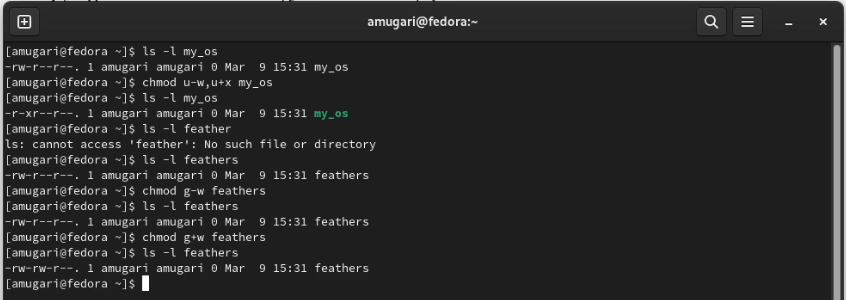{width=70%}

## Чтение содержимого файла с помощью команды **cat**

- После этого мы читаем содержимое файла */etc/passwd/*.

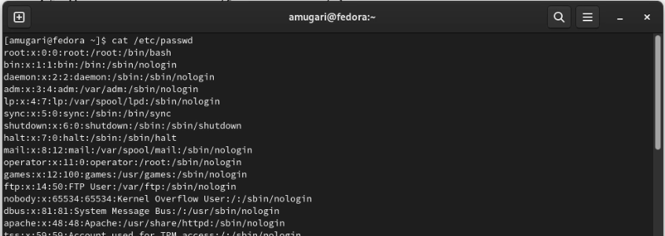{width=70%}

## Использование команд для создания и перемещения файлов и каталогов

- мы скопировали файл **feathers** в новый файл с именем **file.old** затем мы переместили вновь созданный файл в каталог **play/**.

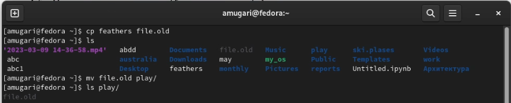{width=70%}

## Использование команд для создания и перемещения файлов и каталогов:

- после этого мы скопировали каталог **play** в другой каталог с именем **fun**, используя команду **cp** с опцией *-r* затем мы переместили каталог **fun** в каталог **play** и последнее, но не менее важное: мы переименовали каталог *play/fun* в каталог *play/game*.

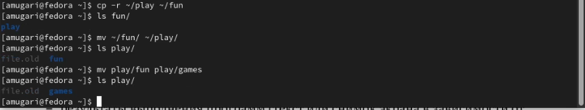{width=70%}

## изменение права доступа к файлу и попытка получить к нему доступ:

- на этом шаге мы отключили право на чтение файла *****, и когда мы попытались прочитать его, вызов был отклонен, потому что у нас больше не было доступа.

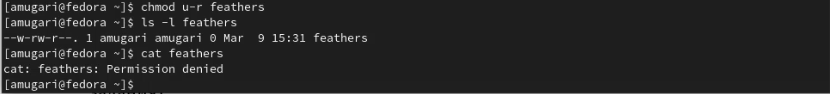{width=70%}

## изменение права доступа к каталогy:

- затем мы отобрали право на выполнение каталога **play** to у владельца.

{#fig:028 width=70%}

## изменение права доступа к каталогу:

- Затем мы попытались получить доступ к каталогу, но в этом было отказано, после чего мы вернули владельцу право на выполнение каталога и получили доступ к каталогу без каких-либо проблем.

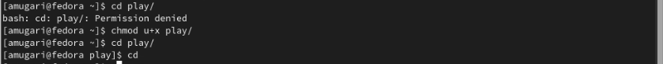{width=70%}

## Дополнительная информация о команде **mount**:

- мы проверили дополнительную информацию о командах: **mount , fsck, mkfs, kill**

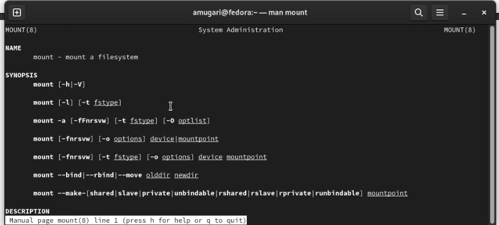{#fig:030 width=70%}

## Дополнительная информация о команде **fsck**:

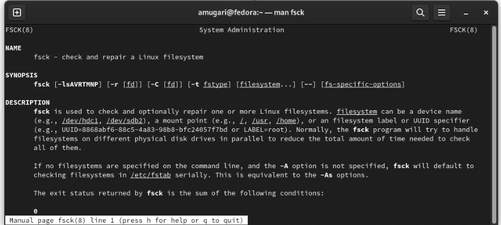{#fig:031 width=70%}

## Дополнительная информация о команде **mkfs**:

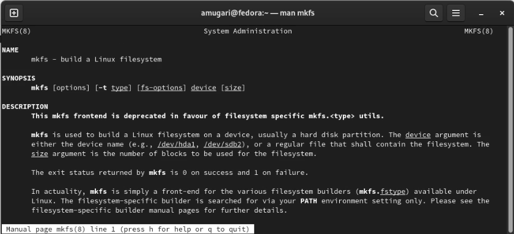{#fig:032 width=70%}

## Дополнительная информация о команде **kill**

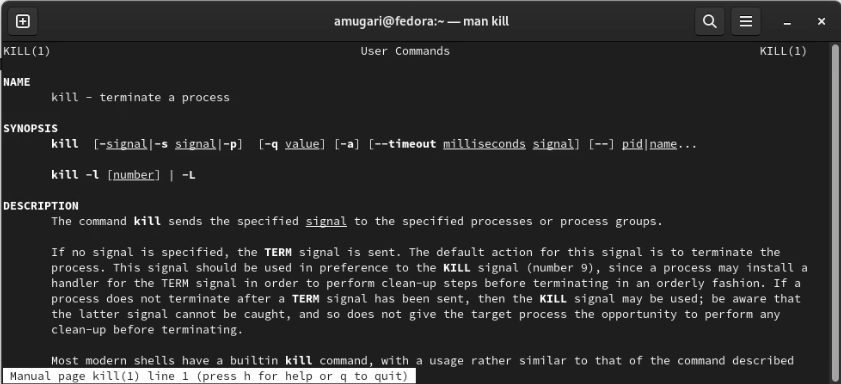{#fig:033 width=70%}

## Пример использования команды **kill**

- затем, используя команду **kill**, мы смогли остановить процесс браузера **brave**

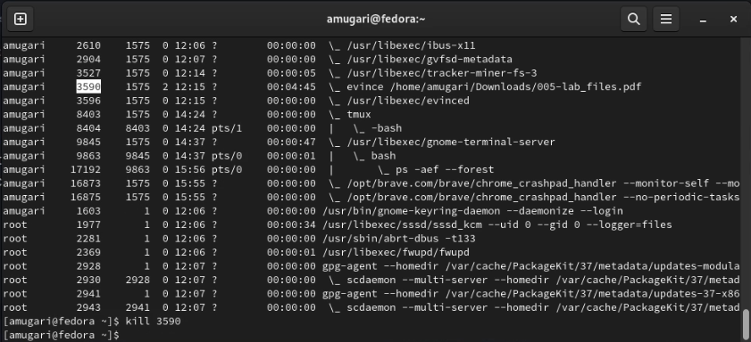{#fig:034 width=70%}

## выводы по результатам выполнения заданий:

- Благодаря упражнениям этой лабораторной работы мы смогли получить практические знания о том, как использовать команду, которая имеет дело с файлами и каталогами, а также с файловой системой
  
  
# Выводы, согласованные с целью работы:

- В этой лабораторной работе мы были ознакомлены с файловой системой **Linux**, ее структурой, именами и содержимым каталогов. Приобретение практических навыков использования команд для работы с файлами и каталогами, управления процессами (и работой), проверки использования диска и обслуживания **файловой системы**.

