---
## Front matter
title: "Архитектура компьютеров и операционные системы | Операционные системы"
subtitle: "Лабораторная работа № 5. Анализ файловой системы Linux. Команды для работы с файлами и каталогами "
author: "Мугари Абдеррахим - НКАбд-03-22"

## Generic otions
lang: ru-RU
toc-title: "Содержание"

## Bibliography
bibliography: bib/cite.bib
csl: pandoc/csl/gost-r-7-0-5-2008-numeric.csl

## Pdf output format
toc: true # Table of contents
toc-depth: 2
lof: true # List of figures
lot: true # List of tables
fontsize: 12pt
linestretch: 1.5
papersize: a4
documentclass: scrreprt
## I18n polyglossia
polyglossia-lang:
  name: russian
  options:
	- spelling=modern
	- babelshorthands=true
polyglossia-otherlangs:
  name: english
## I18n babel
babel-lang: russian
babel-otherlangs: english
## Fonts
mainfont: PT Serif
romanfont: PT Serif
sansfont: PT Sans
monofont: PT Mono
mainfontoptions: Ligatures=TeX
romanfontoptions: Ligatures=TeX
sansfontoptions: Ligatures=TeX,Scale=MatchLowercase
monofontoptions: Scale=MatchLowercase,Scale=0.9
## Biblatex
biblatex: true
biblio-style: "gost-numeric"
biblatexoptions:
  - parentracker=true
  - backend=biber
  - hyperref=auto
  - language=auto
  - autolang=other*
  - citestyle=gost-numeric
## Pandoc-crossref LaTeX customization
figureTitle: "Рис."
tableTitle: "Таблица"
listingTitle: "Листинг"
lofTitle: "Список иллюстраций"
lotTitle: "Список таблиц"
lolTitle: "Листинги"
## Misc options
indent: true
header-includes:
  - \usepackage{indentfirst}
  - \usepackage{float} # keep figures where there are in the text
  - \floatplacement{figure}{H} # keep figures where there are in the text
---

# Цель работы

- Ознакомление с **файловой системой Linux**, её структурой, именами и содержанием каталогов. Приобретение практических навыков по применению команд для работы с файлами и каталогами, по управлению процессами (и работами), по проверке использования диска и обслуживанию **файловой системы**.

# Выполнение лабораторной работы
## Первая часть:
### Команды для работы с файлами и каталогами:

1. На этом шаге мы использовали команду **touch** для создания текстового файла, затем с помощью команды **cat** с атрибутом **>** мы смогли добавить к нему одну строку, затем с помощью **cat** мы смогли отобразить содержимое текстового файла (рис. @fig:001).

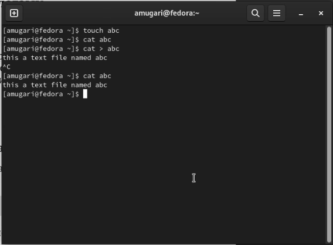{#fig:001 width=70%}

2. Затем, используя команду **head**, мы смогли отобразить только верхнюю часть файла, где *n* - это номер строки, которую мы хотим вывести, а **tail** это чтобы образить нижнюю часть текстового файла, где *n* - это количество строк, которые мы тоже хотим вывести (рис. @fig:002).

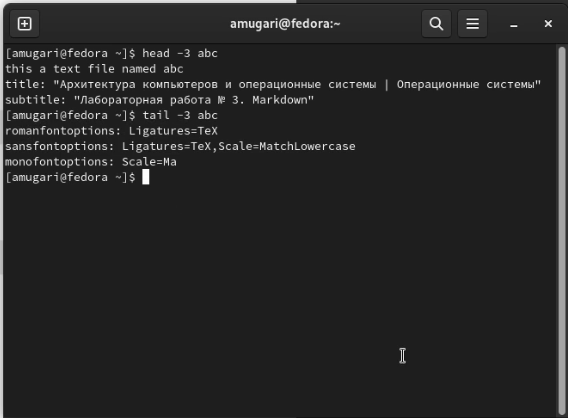{#fig:002 width=70%}

### Копирование файлов и каталогов: 

1. На этом шаге и с помощью команды **cp** мы смогли скопировать содержимое текстового файла в другой текстовый файл (рис. @fig:003).

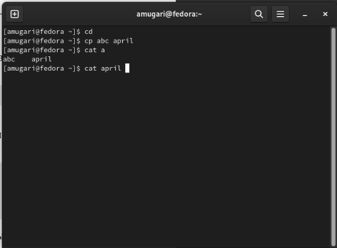{#fig:003 width=70%}

2. После этого с помощью команды **cp** мы скопировали некоторые файлы в другой каталог и создали копию файла, но с другим именем (рис. @fig:004).

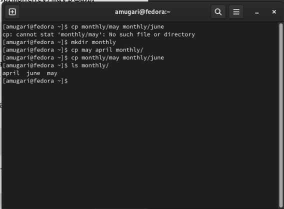{#fig:004 width=70%}

3. на этом шаге мы создали каталог и скопировали его в другой каталог, используя команду **cp**, но мы должны были убедиться, что добавлена опция *-r*, потому что в этом случае мы работаем с каталогами (рис. @fig:005).

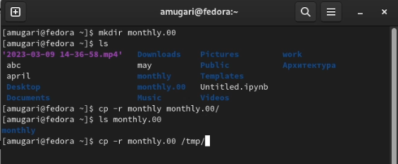{#fig:005 width=70%}

4. на этом шаге мы изменили имя файла, используя команду **mv** (рис. @fig:006).

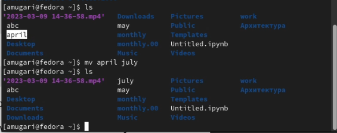{#fig:006 width=70%}

5. После того, как мы сделали то же самое, мы изменили имя, но в данном случае для каталога, а не для файла (рис. @fig:007).

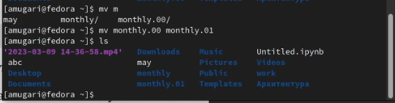{#fig:007 width=70%}

6. на этом шаге мы создали новый каталог, затем переместили в него другой каталог (рис. @fig:008).

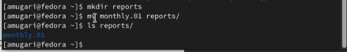{#fig:008 width=70%}

7. После этого мы переименовали каталог, который расположен по другому пути, чем наш  (рис. @fig:009).

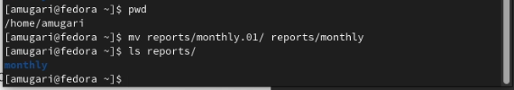{#fig:009 width=70%}

### Права доступа:

1. На этом шаге мы проверили право доступа к файлу **may** затем мы предоставили владельцу файла право на выполнение файла, и после этого мы забрали право на выполнение файла у владельца, используя команду **chmod** (рис. @fig:010).

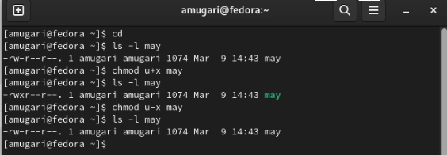{#fig:010 width=70%}

2. На этом шаге мы отключили доступ к чтению каталога для членов группы и для других пользователей (рис. @fig:011).

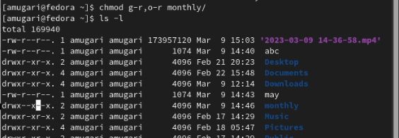{#fig:011 width=70%}

3. На этом шаге мы создали текстовый файл и предоставили членам группы право записи в файл (рис. @fig:012).

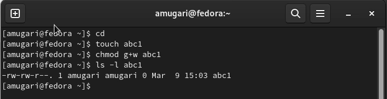{#fig:012 width=70%}

### Анализ файловой системы:

1. на этом шаге мы используем команду **mount**, чтобы увидеть тип файловых систем, используемых в операционной системе (рис. @fig:013).

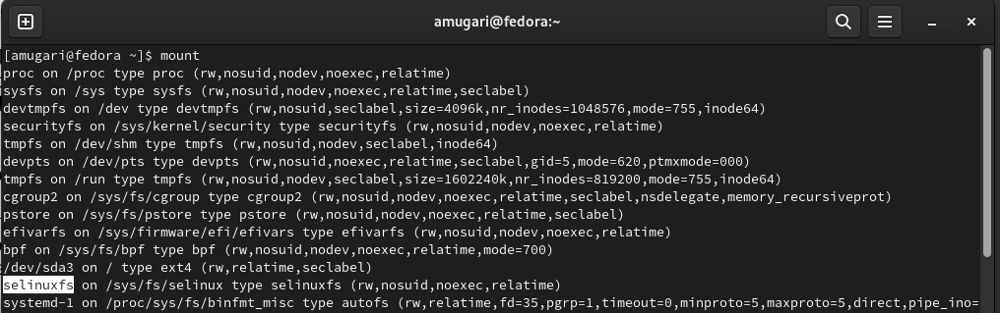{#fig:013 width=70%}

2. затем мы использовали команду **cat** для отображения подключенных устройств и их информации (рис. @fig:014).

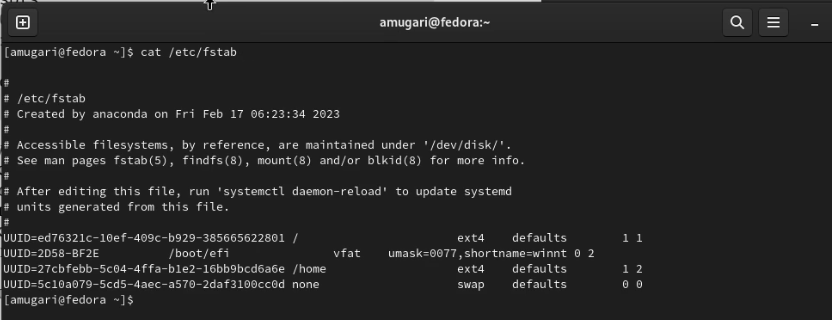{#fig:014 width=70%}

3. Чтобы определить объем свободной памяти в файловой системе, мы использовали команду **df** (рис. @fig:015).

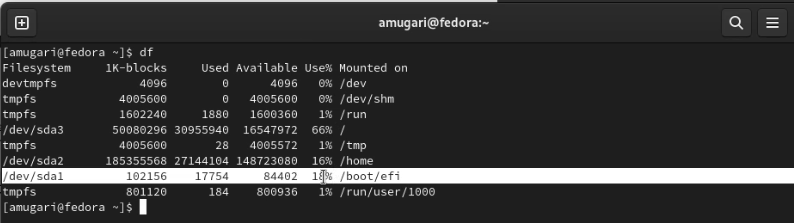{#fig:015 width=70%}

4. Затем мы хотели проверить файловую систему и есть ли в ней какие-либо проблемы (рис. @fig:016).

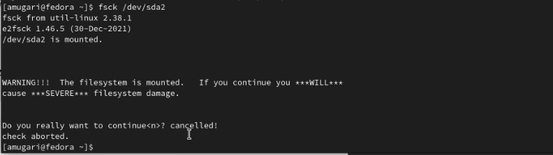{#fig:016 width=70%}

## Вторая часть: 

1. На этом шаге мы скопировали файл **io.h** в каталог **equipment** (рис. @fig:017).

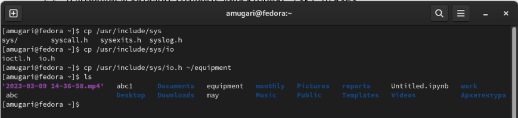{#fig:017 width=70%}

2. После этого мы создали файл **ski.plases**, а затем переместили файл **equipment** в каталог **ski.plases** (рис. @fig:018).

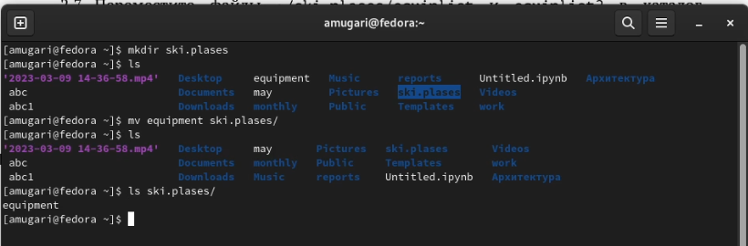{#fig:018 width=70%}

3. На этом шаге переименовали файл **equipment в **equiplist**, а затем мы создали новый каталог с именем **equipment** в каталоге **ski.plases**, и после этого мы переместили оба файла **equiplist** и **equiplist2** во вновь созданный создан каталог **equipment** и, наконец, мы создали новый каталог с именем **newdir**, который мы переместили в другой недавно созданный каталог под названием **plans** (рис. @fig:019).

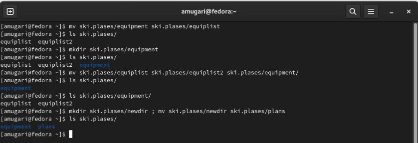{#fig:019 width=70%}

4. На этом шаге мы создали два каталога с именами ** australia** и **play** и два файла с именами **my_os** и **feathers** (рис. @fig:020).

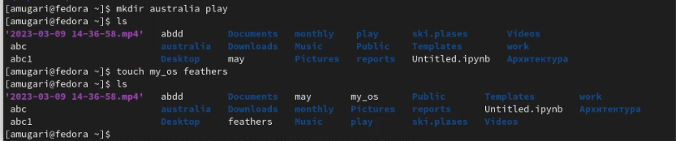{#fig:020 width=70%}

5. Затем мы сняли право на выполнение каталога **australia** для членов группы и других пользователей (рис. @fig:021).

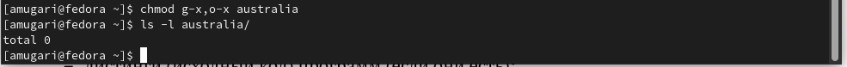{#fig:021 width=70%}

6. после этого мы лишили прав на чтение как членов группы, так и других пользователей (рис. @fig:022).

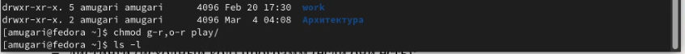{#fig:022 width=70%}

7. затем мы забрали право на запись в файл **my_os** и передали право на выполнение владельцу этого файла, забрали право на запись в файл **feathers** для членов группы, а затем мы вернули его им снова (рис. @fig:023).

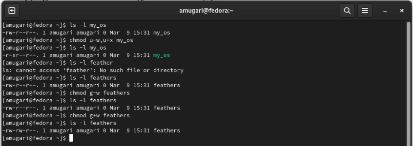{#fig:023 width=70%}

8. После этого мы читаем содержимое файла */etc/passwd/* (рис. @fig:024).

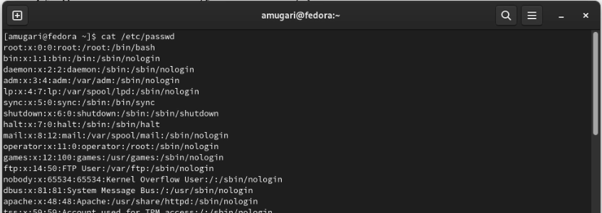{#fig:024 width=70%}

9. мы скопировали файл **feathers** в новый файл с именем **file.old** затем мы переместили вновь созданный файл в каталог **play/** (рис. @fig:025).

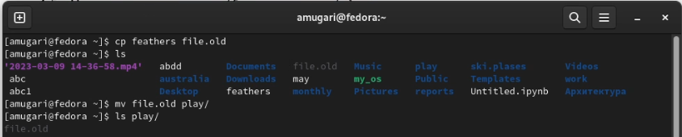{#fig:025 width=70%}

10. после этого мы скопировали каталог **play** в другой каталог с именем **fun**, используя команду **cp** с опцией *-r* затем мы переместили каталог **fun** в каталог **play** и последнее, но не менее важное: мы переименовали каталог *play/fun* в каталог *play/game* (рис. @fig:026).

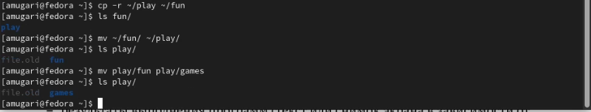{#fig:026 width=70%}

11. на этом шаге мы отключили право на чтение файла *****, и когда мы попытались прочитать его, вызов был отклонен, потому что у нас больше не было доступа (рис. @fig:027).

{#fig:027 width=70%}

12. затем мы отобрали право на выполнение каталога **play** to у владельца (рис. @fig:028).

{#fig:028 width=70%}

13. Затем мы попытались получить доступ к каталогу, но в этом было отказано, после чего мы вернули владельцу право на выполнение каталога и получили доступ к каталогу без каких-либо проблем (рис. @fig:029).

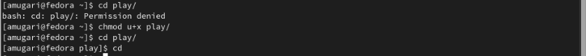{#fig:029 width=70%}

14. мы проверили дополнительную информацию о командах: **mount , fsck, mkfs, kill** (рис. @fig:030), (рис. @fig:031) (рис. @fig:032), (рис. @fig:033)

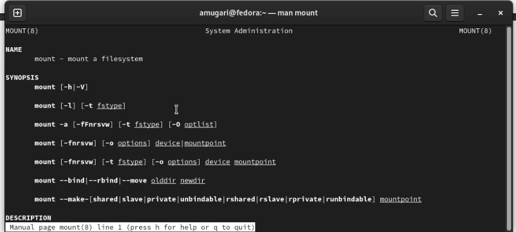{#fig:030 width=70%}

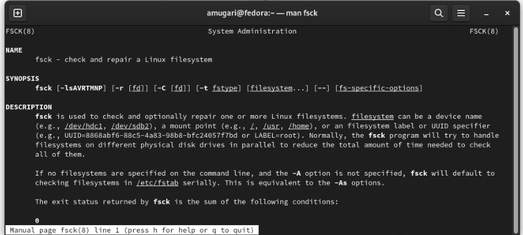{#fig:031 width=70%}

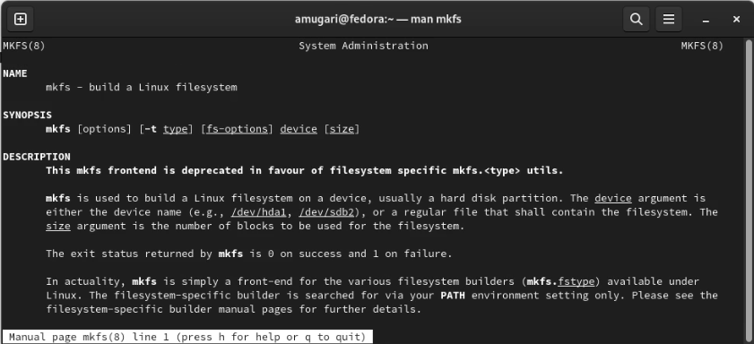{#fig:032 width=70%}

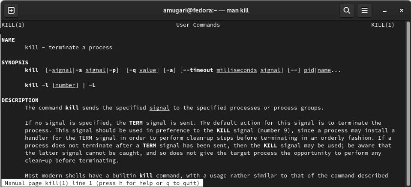{#fig:033 width=70%}

15. затем, используя команду **kill**, мы смогли остановить процесс браузера **brave** (рис. @fig:034)

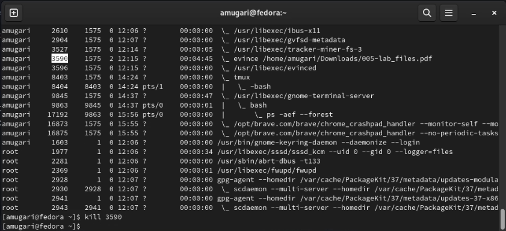{#fig:034 width=70%}

## Контрольные вопросы:

- Дайте характеристику каждой файловой системе, существующей на жёстком диске компьютера, на котором вы выполняли лабораторную работу.

- NTFS (аббревиатура от англ. new technology file system — «файловая система новой технологии») — стандартная файловая система для семейства операционных систем Windows NT фирмы Microsoft. NTFS поддерживает хранение метаданных. С целью улучшения производительности, надёжности и эффективности использования дискового пространства для хранения информации о файлах в NTFS используются специализированные структуры данных. Информация о файлах хранится в главной файловой таблице — Master File Table (MFT). NTFS поддерживает разграничение доступа к данным для различных пользователей и групп пользователей (списки контроля доступа — англ. access control lists, ACL), а также позволяет назначать дисковые квоты (ограничения на максимальный объём дискового пространства, занимаемый файлами тех или иных пользователей). Для повышения надёжности файловой системы в NTFS используется система журналирования USN. Для NTFS размер кластера по умолчанию составляет от 512 байт до 2 МБ в зависимости от размера тома и версии ОС.

- Приведите общую структуру файловой системы и дайте характеристику каждой директории первого уровня этой структуры.

- / — корневой каталог (root каталог). Содержит в себе всю иерархию системы; /bin — здесь находятся двоичные исполняемые файлы. Основные общие команды, хранящиеся отдельно от других программ в системе (прим.: pwd, ls, cat, ps);

- /boot — тут расположены файлы, используемые для загрузки системы (образ initrd, ядро vmlinuz);

- /dev — в данной директории располагаются файлы устройств (драйверов). С помощью этих файлов можно взаимодействовать с устройствами. К примеру, если это жесткий диск, можно подключить его к файловой системе. В файл принтера же можно написать напрямую и отправить задание на печать; /etc — в этой директории находятся файлы конфигураций программ. Эти файлы позволяют настраивать системы, сервисы, скрипты системных демонов;

- /home — каталог, аналогичный каталогу Users в Windows. Содержит домашние каталоги учетных записей пользователей (кроме root). При создании нового пользователя здесь создается одноименный каталог с аналогичным именем и хранит личные файлы этого пользователя;

- /lib — содержит системные библиотеки, с которыми работают программы и модули ядра;

- /lost+found — содержит файлы, восстановленные после сбоя работы системы. Система проведет проверку после сбоя и найденные файлы можно будет посмотреть в данном каталоге;

- /media — точка монтирования внешних носителей. Например, когда вы вставляете диск в дисковод, он будет автоматически смонтирован в директорию /media/cdrom;

- /mnt — точка временного монтирования. Файловые системы подключаемых устройств обычно монтируются в этот каталог для временного использования; /opt — тут расположены дополнительные (необязательные) приложения. Такие программы обычно не подчиняются принятой иерархии и хранят свои файлы в одном подкаталоге (бинарные, библиотеки, конфигурации);

- /proc — содержит файлы, хранящие информацию о запущенных процессах и о состоянии ядра ОС;

- /root — директория, которая содержит файлы и личные настройки суперпользователя;

- /run — содержит файлы состояния приложений. Например, PID-файлы или UNIX-сокеты;

- /sbin — аналогично /bin содержит бинарные файлы. Утилиты нужны для настройки и администрирования системы суперпользователем;

- /srv — содержит файлы сервисов, предоставляемых сервером (прим. FTP или Apache HTTP);

- /sys — содержит данные непосредственно о системе. Тут можно узнать информацию о ядре, драйверах и устройствах;

- /tmp — содержит временные файлы. Данные файлы доступны всем пользователям на чтение и запись. Стоит отметить, что данный каталог очищается при перезагрузке;

- /usr — содержит пользовательские приложения и утилиты второго уровня, используемые пользователями, а не системой. Содержимое доступно только для чтения (кроме root). Каталог имеет вторичную иерархию и похож на корневой;

- /var — содержит переменные файлы. Имеет подкаталоги, отвечающие за отдельные переменные. Например, логи будут храниться в /var/log, кэш в /var/cache, очереди заданий в /var/spool/ и так далее.

- Какая операция должна быть выполнена, чтобы содержимое некоторой файловой системы было доступно операционной системе?

- Монтирование тома.

- Назовите основные причины нарушения целостности файловой системы. Как устранить повреждения файловой системы?

- Отсутствие синхронизации между образом файловой системы в памяти и ее данными на диске в случае аварийного останова может привести к появлению следующих ошибок: Один блок адресуется несколькими mode (принадлежит нескольким файлам). Блок помечен как свободный, но в то же время занят (на него ссылается onode). Блок помечен как занятый, но в то же время свободен (ни один inode на него не ссылается). Неправильное число ссылок в inode (недостаток или избыток ссылающихся записей в каталогах). Несовпадение между размером файла и суммарным размером адресуемых inode блоков. Недопустимые адресуемые блоки (например, расположенные за пределами файловой системы). “Потерянные” файлы (правильные inode, на которые не ссылаются записи каталогов). Недопустимые или неразмещенные номера inode в записях каталогов.

- Как создаётся файловая система?
- mkfs - позволяет создать файловую систему Linux.

- Дайте характеристику командам для просмотра текстовых файлов.
- Cat - выводит содержимое файла на стандартное устройство вывода.

- less - постраничный просмотр файлов.

- Приведите основные возможности команды cp в Linux.
- Команда cp позволяет копировать файлы и директории в текущей директории или в другую.

- Приведите основные возможности команды mv в Linux.
- Команда mv служит для перемещения файлов и директорий в другие директории или переименование файлов и директорий.

- Что такое права доступа? Как они могут быть изменены?
- Права доступа – совокупность правил, которые определяют набор действий, разрешенных для выполнения субъектами над объектами данных. Права доступа к файлу или каталогу можно изменить, воспользовавшись командой chmod. Сделать это может владелец файла (или каталога) или пользователь с правами администратора.
    
## выводы по результатам выполнения заданий:

- Благодаря упражнениям этой лабораторной работы мы смогли получить практические знания о том, как использовать команду, которая имеет дело с файлами и каталогами, а также с файловой системой
  
  
# Выводы, согласованные с целью работы:

- В этой лабораторной работе мы были ознакомлены с файловой системой **Linux**, ее структурой, именами и содержимым каталогов. Приобретение практических навыков использования команд для работы с файлами и каталогами, управления процессами (и работой), проверки использования диска и обслуживания **файловой системы**.
