---
## Front matter
lang: ru-RU
title: Операционные системы
subtitle: Лабораторная работа № 6. Поиск файлов. Перенаправление ввода-вывода. Просмотр запущенных процессов.
author:
  - Абдеррахим Мугари.
institute:
  - Российский университет дружбы народов, Москва, Россия
  
date: 18 марта 2023

## i18n babel
babel-lang: russian
babel-otherlangs: english

## Formatting pdf
toc: false
toc-title: Содержание
slide_level: 2
aspectratio: 169
section-titles: true
theme: metropolis
header-includes:
 - \metroset{progressbar=frametitle,sectionpage=progressbar,numbering=fraction}
 - '\makeatletter'
 - '\beamer@ignorenonframefalse'
 - '\makeatother'
 
---

# Информация

## Докладчик

:::::::::::::: {.columns align=center}
::: {.column width="70%"}

  * Абдеррахим Мугари
  * Студент
  * Российский университет дружбы народов
  * [1032215692@pfur.ru](mailto:1032215692@pfur.ru)
  * <https://github.com/iragoum>

:::
::: {.column width="30%"}

:::
::::::::::::::

## Цель работы:

-  Ознакомление с инструментами поиска файлов и фильтрации текстовых данных. Приобретение практических навыков: по управлению процессами (и заданиями), по проверке использования диска и обслуживанию файловых систем.

## Материалы и методы

- Терминал Unix.
- Файловая система.

## Ход работы: 

## проверка правильности названия нашей учетной записи:

- Прежде всего мы проверили правильность названия нашей учетной записи 

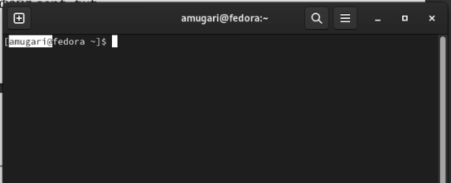{ width=70%}

## добавление имен файлов, расположенных в определенных каталогах, в текстовый файл :

- Затем мы написали в **file.txt** имена файлов, содержащихся в каталоге */etc*. затем добавил имена файлов, содержащихся в нашем домашнем каталоге, в тот же файл.

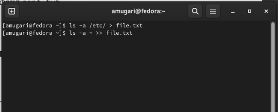{width=70%}

## вывод имен всех файлов из file.txt , имеющий расширение .conf:

- Мы выводим имена всех файлов из **file.txt** , имеющий расширение .conf

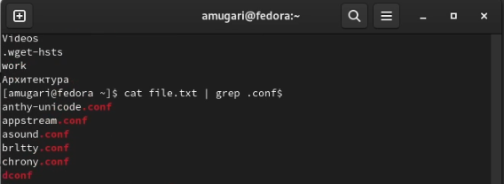{width=70%}

## запись файлов с расширением.conf в новый текстовый файл conf.txt

- затем записал их в новый текстовый файл conf.txt

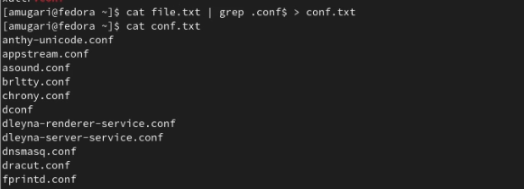{width=70%}

## Определение того, какие файлы в нашем домашнем каталоге имеют имена, начинающиесяс символа **c**, с использованием различных методов

- здесь мы определили, какие файлы в нашем домашнем каталоге имеют имена, начинающиеся с символа **c**, используя различные методы

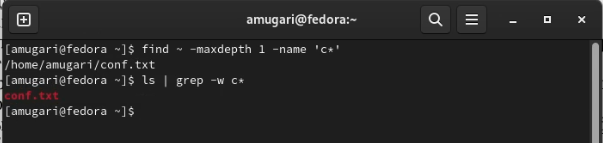{width=70%}

## Отображение имен файлов из каталога /etc, начинающихсяс символа h

- затем мы отобразили имена файлов из каталога /etc, начинающиеся с символа **c** 

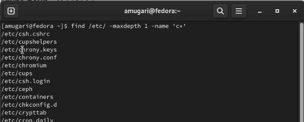{width=70%}

## запуск процесса в фоновом режиме, который будет записывать данные в файл ~/log file

- здесь мы запустили процесс в фоновом режиме, который будет записывать данные в файл ~/log file

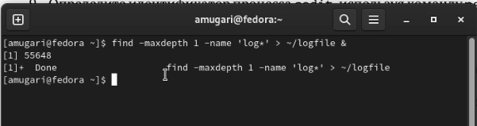{width=70%}

## удаление файла ~/logfile

- Затем мы удалили файл **~/logfile**

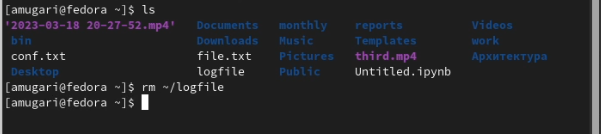{width=70%}

## запуск редактора gedit из консоли в фоновом режиме с помощью **&**

- здесь мы запустили редактор gedit из консоли в фоновом режиме, используя **&**

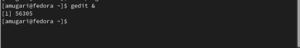{width=70%}

## определение идентификатора процесса gedit различными способами

- затем мы определили **идентификатор процесса gedit** с помощью команды ps, конвейера и фильтра grep 

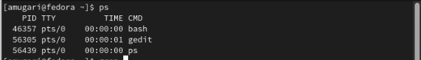{width=70%}

## определение идентификатора процесса gedit различными способами

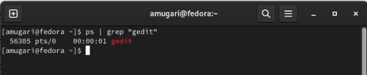{width=70%}

## завершение процесса gedit

- после того, как мы прочитали справку **(man) команды kill**, мы смогли завершить процесс **gedit**

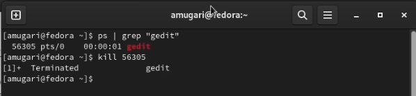{width=70%}

## выполнение команд **df и du**

-  на этом шаге мы выполнили команды **df и du**, прочитав дополнительные сведения с помощью **man**

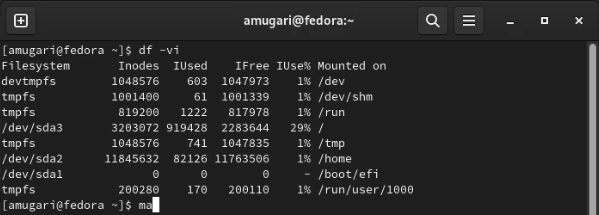{ width=70%}

## выполнение команд **df и du**

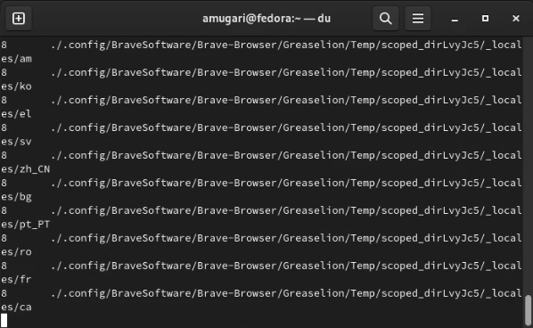{width=70%}

## выводит имена всех каталогов, которые находятся в вашем домашнем каталоге:

- наконец, мы вывели имена всех каталогов, которые находятся в нашем домашнем каталоге

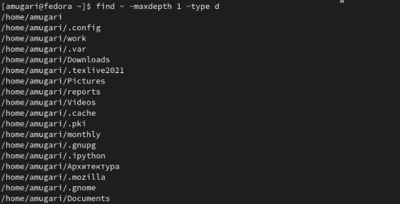{width=70%}

## выводы по результатам выполнения заданий:

- В этой лабораторной работе мы узнали, как использовать инструменты для поиска файлов и фильтрации текстовых данных, как использовать инструменты для отслеживания и завершения задач, выполняемых в фоновом режиме.
  
  
# Выводы, согласованные с целью работы:

- Ознакомление с инструментами поиска файлов и фильтрации текстовых данных. Приобретение практических навыков: по управлению процессами (и заданиями), по проверке использования диска и обслуживанию файловых систем.

