---
## Front matter
title: "Архитектура компьютеров и операционные системы | Операционные системы"
subtitle: "Лабораторная работа № 6. Поиск файлов. Перенаправление ввода-вывода. Просмотр запущенных процессов "
author: "Мугари Абдеррахим - НКАбд-03-22"

## Generic otions
lang: ru-RU
toc-title: "Содержание"

## Bibliography
bibliography: bib/cite.bib
csl: pandoc/csl/gost-r-7-0-5-2008-numeric.csl

## Pdf output format
toc: true # Table of contents
toc-depth: 2
lof: true # List of figures
lot: true # List of tables
fontsize: 12pt
linestretch: 1.5
papersize: a4
documentclass: scrreprt
## I18n polyglossia
polyglossia-lang:
  name: russian
  options:
	- spelling=modern
	- babelshorthands=true
polyglossia-otherlangs:
  name: english
## I18n babel
babel-lang: russian
babel-otherlangs: english
## Fonts
mainfont: PT Serif
romanfont: PT Serif
sansfont: PT Sans
monofont: PT Mono
mainfontoptions: Ligatures=TeX
romanfontoptions: Ligatures=TeX
sansfontoptions: Ligatures=TeX,Scale=MatchLowercase
monofontoptions: Scale=MatchLowercase,Scale=0.9
## Biblatex
biblatex: true
biblio-style: "gost-numeric"
biblatexoptions:
  - parentracker=true
  - backend=biber
  - hyperref=auto
  - language=auto
  - autolang=other*
  - citestyle=gost-numeric
## Pandoc-crossref LaTeX customization
figureTitle: "Рис."
tableTitle: "Таблица"
listingTitle: "Листинг"
lofTitle: "Список иллюстраций"
lotTitle: "Список таблиц"
lolTitle: "Листинги"
## Misc options
indent: true
header-includes:
  - \usepackage{indentfirst}
  - \usepackage{float} # keep figures where there are in the text
  - \floatplacement{figure}{H} # keep figures where there are in the text
---

# Цель работы

- Ознакомление с инструментами поиска файлов и фильтрации текстовых данных. Приобретение практических навыков: по управлению процессами (и заданиями), по проверке использования диска и обслуживанию файловых систем.

# Выполнение лабораторной работы : 

1. Прежде всего мы проверили правильность названия нашей учетной записи (рис. @fig:001)

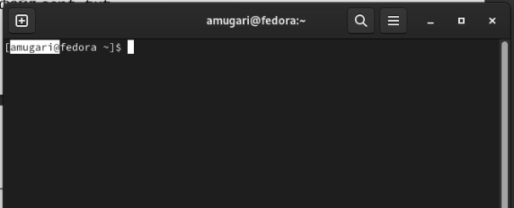{#fig:001 width=70%}

2. Затем мы написали в **file.txt** имена файлов, содержащихся в каталоге */etc*. затем добавил имена файлов, содержащихся в нашем домашнем каталоге, в тот же файл.(рис. @fig:002)

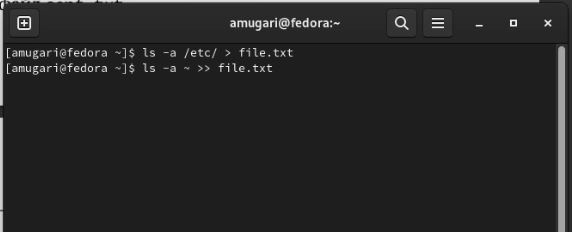{#fig:002 width=70%}

3. Мы выводим имена всех файлов из **file.txt** , имеющий расширение .conf (рис. @fig:003)

{#fig:003 width=70%}

- затем записал их в новый текстовый файл conf.txt (рис. @fig:004)

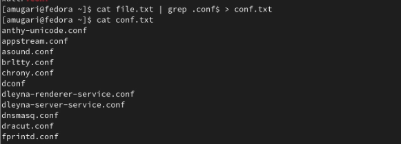{#fig:004 width=70%}

4. здесь мы определили, какие файлы в нашем домашнем каталоге имеют имена, начинающиеся с символа **c**, используя различные методы (рис. @fig:005)

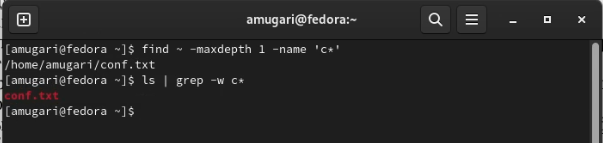{#fig:005 width=70%}

5. затем мы отобразили имена файлов из каталога /etc, начинающиеся с символа **c** (рис. @fig:006)

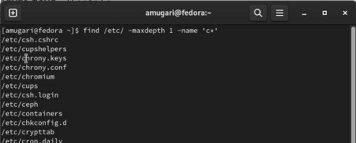{#fig:006 width=70%}

6. здесь мы запустили процесс в фоновом режиме, который будет записывать данные в файл ~/log file (рис. @fig:007)

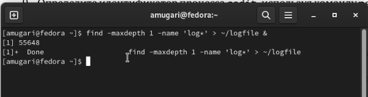{#fig:007 width=70%}

7. Затем мы удалили файл **~/logfile** (рис. @fig:008)

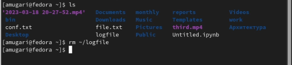{#fig:008 width=70%}

8. здесь мы запустили редактор gedit из консоли в фоновом режиме, используя **&** (рис. @fig:009)

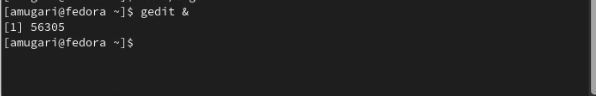{#fig:009 width=70%}

9. затем мы определили **идентификатор процесса gedit** с помощью команды ps, конвейера и фильтра grep (рис. @fig:010) (рис. @fig:011)

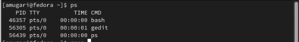{#fig:010 width=70%}

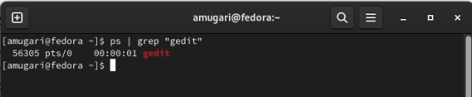{#fig:011 width=70%}

10. после того, как мы прочитали справку **(man) команды kill**, мы смогли завершить процесс **gedit** (рис. @fig:012)

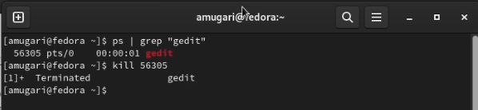{#fig:012 width=70%}

11.  на этом шаге мы выполнили команды **df и du**, прочитав дополнительные сведения с помощью **man** (рис. @fig:013) (рис. @fig:014)

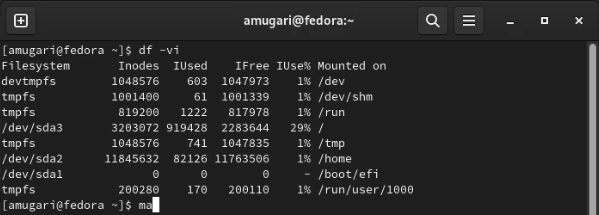{#fig:013 width=70%}

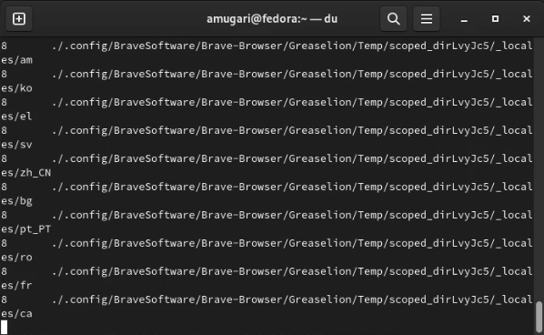{#fig:014 width=70%}

12. наконец, мы вывели имена всех каталогов, которые находятся в нашем домашнем каталоге (рис. @fig:015)

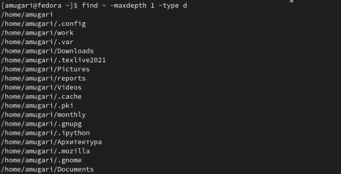{#fig:015 width=70%}

## Контрольные вопросы:

# Контрольные вопросы 

1. Какие потоки ввода вывода вы знаете?

– stdin — стандартный поток ввода (по умолчанию: клавиатура), файловый дескриптор 0;

– stdout — стандартный поток вывода (по умолчанию: консоль), файловый дескриптор 1;

– stderr — стандартный поток вывод сообщений об ошибках (по умолчанию: консоль), файловый дескриптор 2.

2. Объясните разницу между операцией > и >>.

“>” - это открывает файл на перезапись, когда “>>” открывает файл на дозапись.

3. Что такое конвейер?

Конвейер – это направление вывода на вход для следующей команды.

4. Что такое процесс? Чем это понятие отличается от программы?

Процесс - это исполняемая программа. Программа - это набор инструкций, которые выполняют определенную задачу при выполнении компьютером, в то время как процесс является экземпляром выполняемой компьютерной программы. Таким образом, в этом главное отличие программы и процесса.

5. Что такое PID и GID?

PID: это идентификатор процесса (PID) процесса, который вы вызываете.
GID: идентификатор группы. Все группы Linux определяются GID (идентификаторами групп). GID хранятся в файле / etc / groups.

6. Что такое задачи и какая команда позволяет ими управлять?

Любую выполняющуюся в консоли команду или внешнюю программу можно запустить в фоновом режиме. Для этого следует в конце имени команды указать знак амперсанда &. Например: gedit &

7. Найдите информацию об утилитах top и htop. Каковы их функции?

Top - отобразить запущенные процессы, используемые ими ресурсы и другую полезную информацию (с автоматическим обновлением данных).

Htop - показывает динамический список системных процессов, список обычно выравнивается по использованию ЦПУ. В отличие от top, htop показывает все процессы в системе. Также показывает время непрерывной работы, использование процессоров и памяти. Htop часто применяется в тех случаях, когда информации даваемой утилитой top недостаточно, например при поиске утечек памяти в процессах.

8. Назовите и дайте характеристику команде поиска файлов. Приведите примеры использования этой команды.

Команда find используется для поиска и отображения на экран имён файлов, соответствующих заданной строке символов. Формат команды: **find путь [-опции]**

{#fig:006 width=70%}

9. Можно ли по контексту (содержанию) найти файл? Если да, то как?

Да, воспользовавшись командой grep. Формат команды: grep строка имя_файла.

10. Как определить объем свободной памяти на жёстком диске?

Для определения объёма свободного пространства на файловой системе можно воспользоваться командой df, которая выведет на экран список всех файловых систем в соответствии с именами устройств, с указанием размера и точки монтирования.

11. Как определить объем вашего домашнего каталога?

Команда du показывает число килобайт, используемое каждым файлом или каталогом.

12. Как удалить зависший процесс?

Команда kill служит для завершения процесса.

## выводы по результатам выполнения заданий:

- В этой лабораторной работе мы узнали, как использовать инструменты для поиска файлов и фильтрации текстовых данных, как использовать инструменты для отслеживания и завершения задач, выполняемых в фоновом режиме.
  
  
# Выводы, согласованные с целью работы:

- Ознакомление с инструментами поиска файлов и фильтрации текстовых данных. Приобретение практических навыков: по управлению процессами (и заданиями), по проверке использования диска и обслуживанию файловых систем.
