---
## Front matter
lang: ru-RU
title: Операционные системы
subtitle: Лабораторная работа №7. Командная оболочка Midnight Commander.
author:
  - Абдеррахим Мугари.
institute:
  - Российский университет дружбы народов, Москва, Россия
  
date: 18 марта 2023

## i18n babel
babel-lang: russian
babel-otherlangs: english

## Formatting pdf
toc: false
toc-title: Содержание
slide_level: 2
aspectratio: 169
section-titles: true
theme: metropolis
header-includes:
 - \metroset{progressbar=frametitle,sectionpage=progressbar,numbering=fraction}
 - '\makeatletter'
 - '\beamer@ignorenonframefalse'
 - '\makeatother'
 
---

# Информация

## Докладчик

:::::::::::::: {.columns align=center}
::: {.column width="70%"}

  * Абдеррахим Мугари
  * Студент
  * Российский университет дружбы народов
  * [1032215692@pfur.ru](mailto:1032215692@pfur.ru)
  * <https://github.com/iragoum>

:::
::: {.column width="30%"}

:::
::::::::::::::

## Цель работы:

-  Освоение основных возможностей командной оболочки Midnight Commander. Приобретение навыков практической работы по просмотру каталогов и файлов; манипуляций с ними.

## Материалы и методы

- Терминал Unix.
- Файловая система.
- омандная оболочка Midnight Commander.

## Ход работы:

## изучение информации о mc:

- Здесь мы изучили информацию о **mc**, вызвав **man mc** из командной строки.

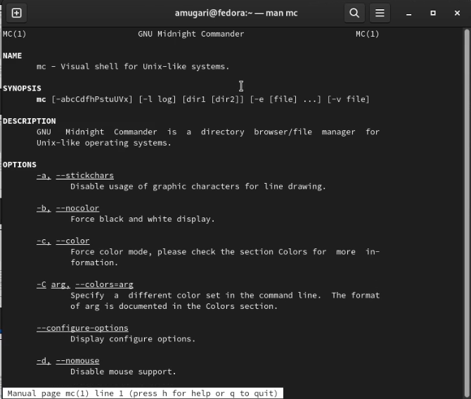{width=50%}

- Затем мы запустили **mc** из командной строки и изучили его структуру и меню.

## запуск **mc** из командной строки и изучение его структуры и меню:

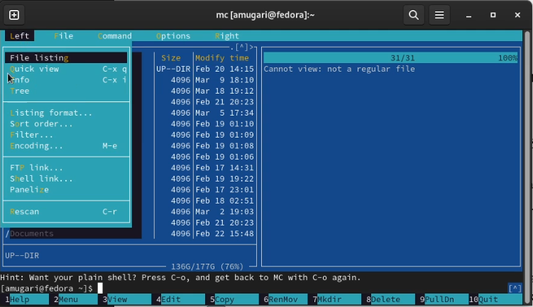{width=50%}

# Затем мы выполнили несколько операций в **mc **, используя клавиши управления, которые являются : 

## выделение/отмена выделения файлов:

- мы выбирали и отменяли выбор определенных файлов и каталогов с помощью **shift + стрелка (вверх или вниз)**

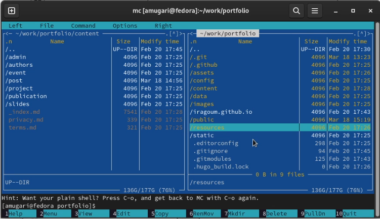{width=50%}

## копирование файлов/перемещение файлов :

- затем мы скопировали и переместили файлы 

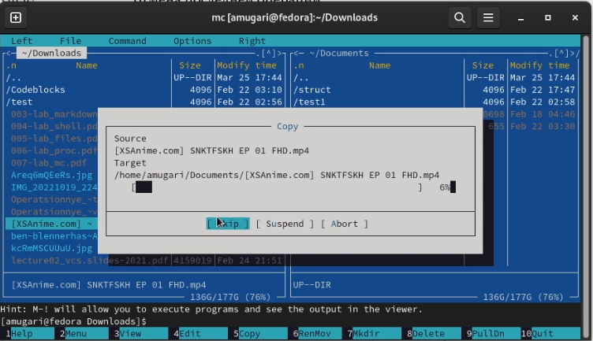{width=50%}

## копирование файлов/перемещение файлов :

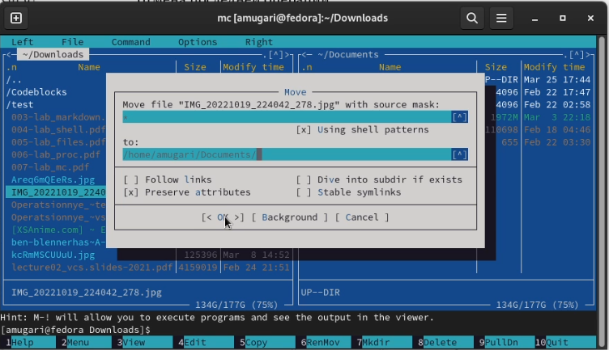{width=50%}

## получение информации о размере и правах доступа к файлам и/или каталогам :

- После этого мы получили информацию о размере и правах доступа к файлам и/или каталогам

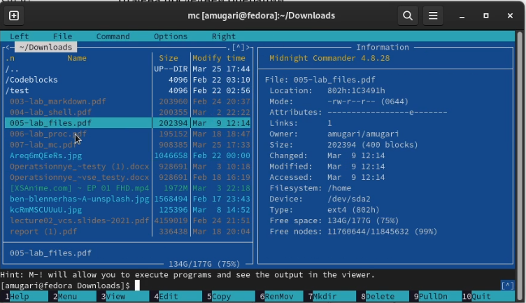{width=50%}

## Выполнение основных команд меню правой панели : 

- здесь я выполнил команды главного меню правой панели.

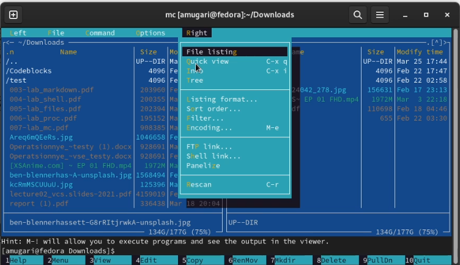{width=50%}

# Используя возможности подменю "Файл" , мы запустили:

## просмотр содержимого текстового файла

- просмотр содержимого текстового файла 

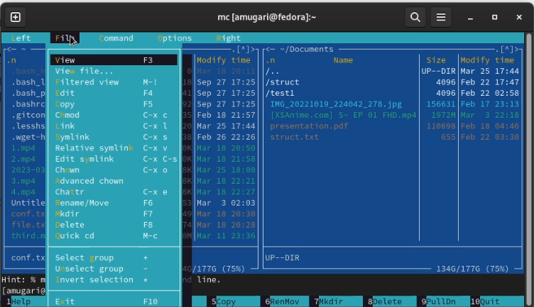{width=50%}

## редактирование содержимого текстового файла:

- я отредактировал содержимое текстового файла, но без сохранения результатов редактирования

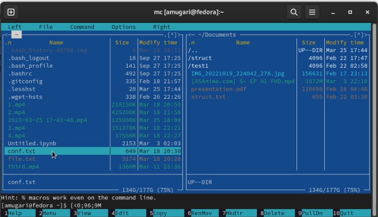{width=50%}

## создание каталога:

- затем я создал каталог

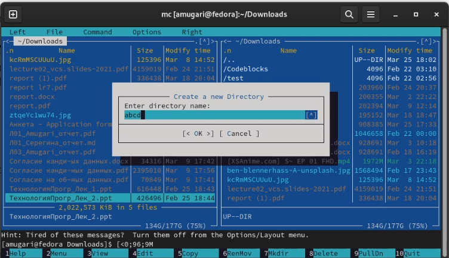{width=50%}

## копирование в файлов в созданный каталог : 

- затем мы скопировали некоторые файлы во вновь созданный каталог.

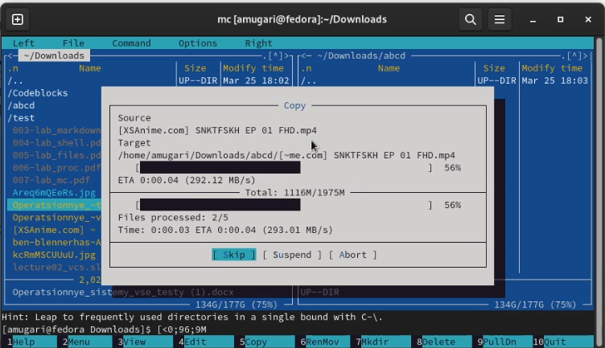{width=50%}

# С помощью соответствующих средств подменю **Команда** осуществите:

## поиск в файловой системе файла:

- Здесь мы искали файлы, имеющие расширение **.c или .cpp** и содержащие в своем содержимом строку **main**

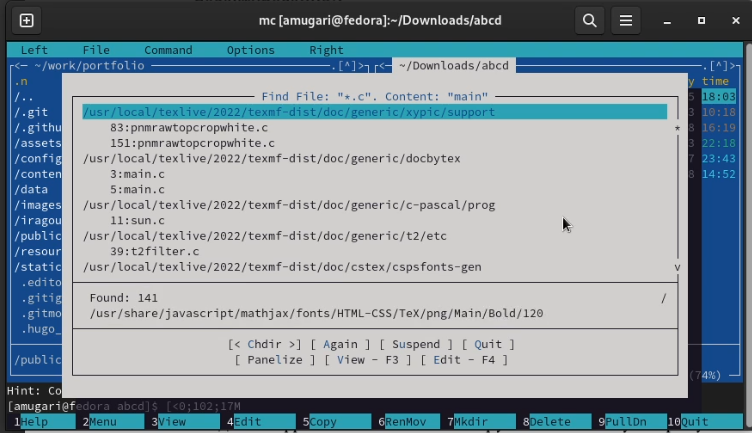{width=50%}

## выбор и повторение одной из предыдущих команд

- после этого мы выбрали и повторили одну из предыдущих команд

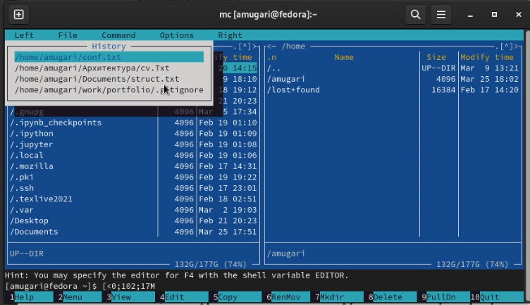{width=50%}

## переход в домашний каталог :

- после этого мы перешли в домашний каталог

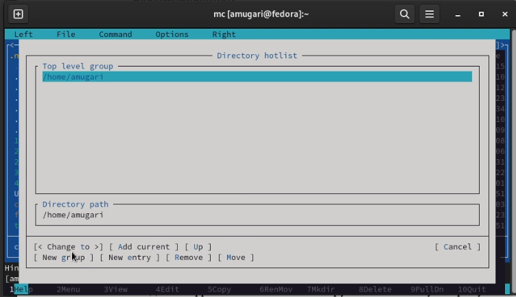{width=50%}

## анализ файла меню и файла расширений :

- анализ файла меню и файла расширений 

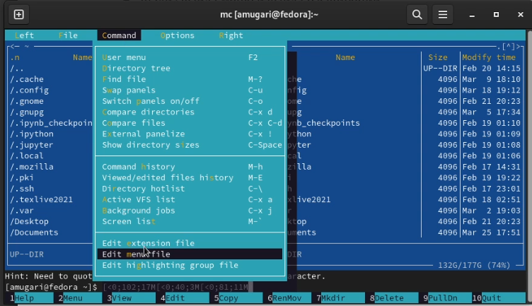{width=50%}

## анализ файла меню и файла расширений :

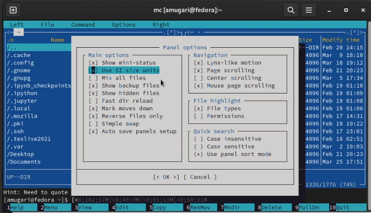{width=50%}

# Задание по встроенному редактору mc

## Создание текстового файла **text.txt** :

- Здесь я создал текстовый файл **text.txt**

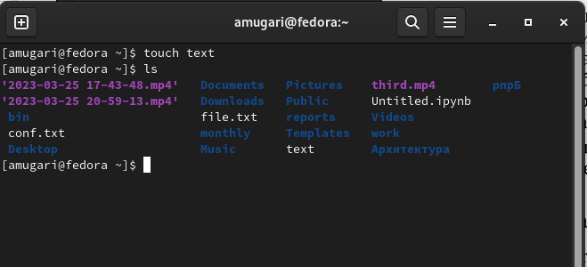{width=50%}

## открытие файла с помощью встроенного редактора mc :

- затем я открыл этот файл с помощью встроенного редактора mc

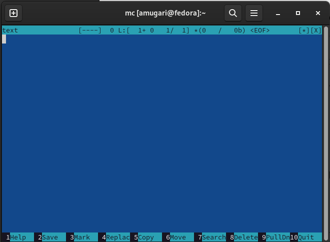{width=50%}

## вставка небольшого фрагмента скопированного текста :

- после этого я вставил небольшой фрагмент скопированного текста

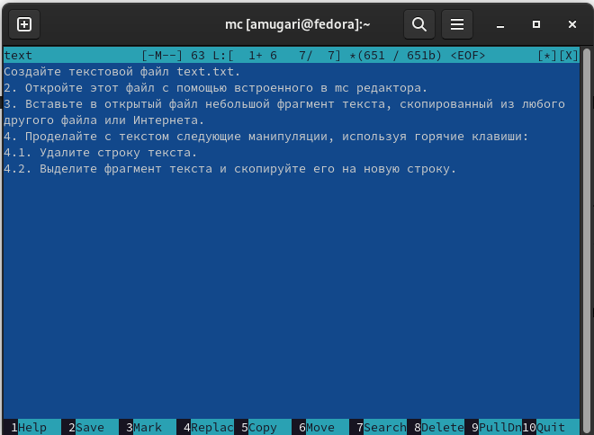{width=50%}

## удаление строки текста: 

- затем мы удалили строку текста.

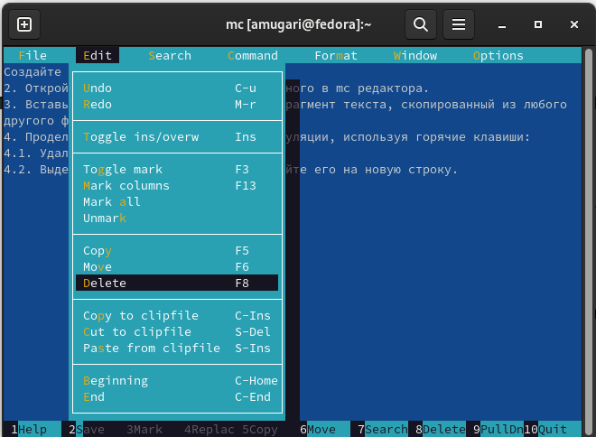{ width=50%}

## Bыделение фрагмента текста и копирование его на новую строку :

- здесь мы выделили фрагмент текста и скопировали его в новую строку

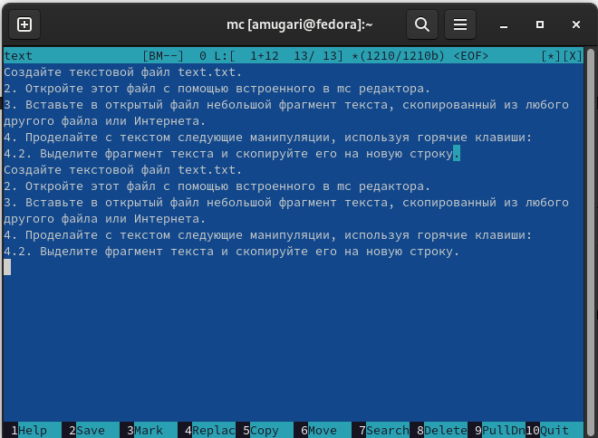{width=50%}

## сохранение файла :

- здесь мы сохранили файл

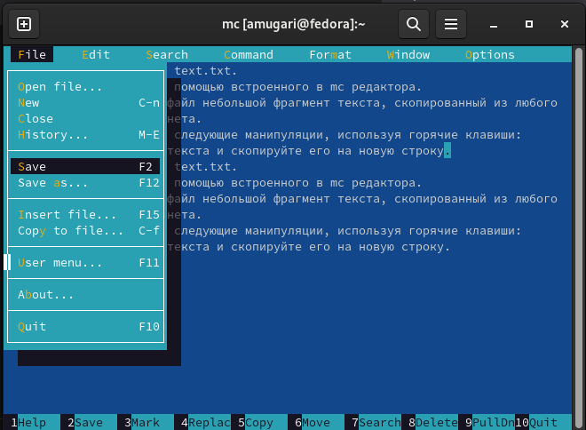{width=50%}

## отмена последнего действия :

- после этого мы отменили последнее действие 

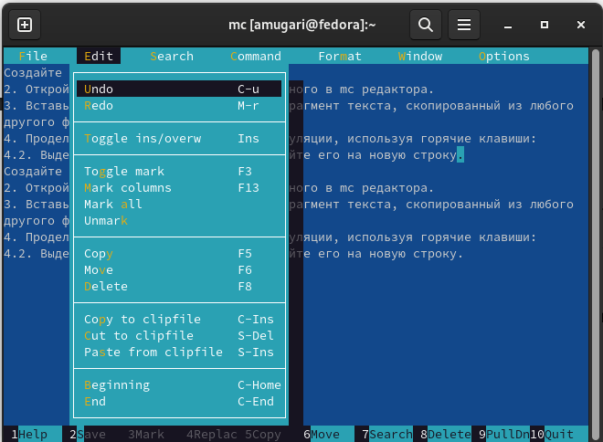{width=50%}

## ввод некоторого текста в и и в начале файла :

- на этом шаге мы перешли к концу абзаца, ввели некоторый текст, затем мы перешли к началу текста и ввели некоторый текст

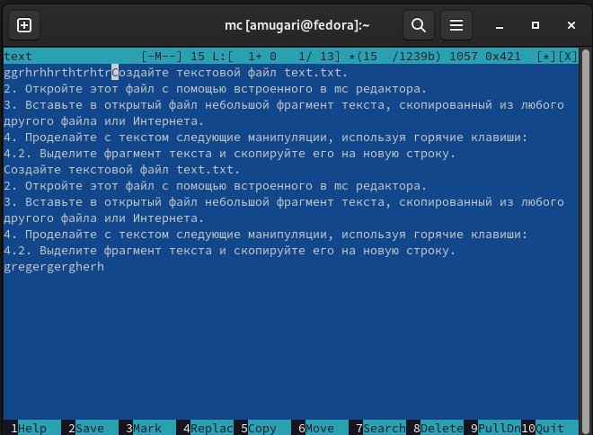{width=50%}

## сохранение и закрытие файла:

- здесь мы сохранили и закрыли файл

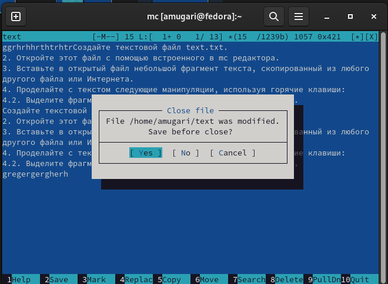{width=50%}

## открытие текстового файла с исходным кодом на языке c :

- затем мы открыли файл с исходным текстом на языке си

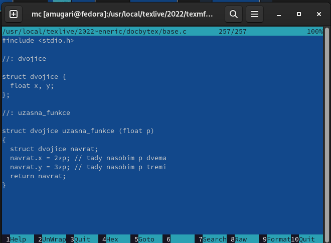{width=50%}

## включение подсветки синтаксиса : 

- Используя меню редактора, мы включили подсветку синтаксиса

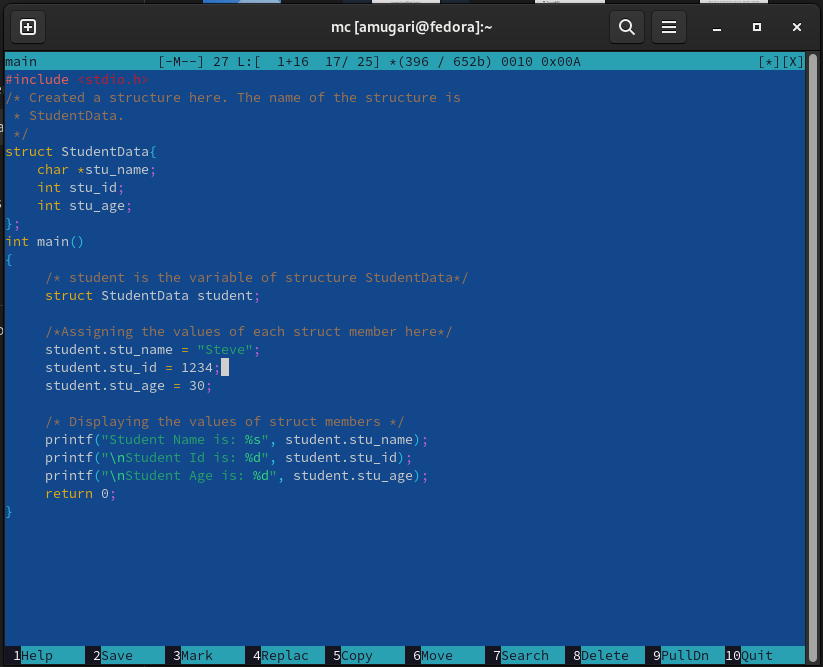{width=50%}

## выводы по результатам выполнения заданий:

- выполняя эту лабораторную работу, мы получили практические навыки использования mc и работы с файловой системой.
  
# Выводы, согласованные с целью работы:

- Освоение основных возможностей командной оболочки Midnight Commander. Приоб-
ретение навыков практической работы по просмотру каталогов и файлов; манипуляций
с ними.
