---
## Front matter
title: "Архитектура компьютеров и операционные системы | Операционные системы"
subtitle: "Лабораторная работа № 7. Командная оболочка Midnight Commander "
author: "Мугари Абдеррахим - НКАбд-03-22"

## Generic otions
lang: ru-RU
toc-title: "Содержание"

## Bibliography
bibliography: bib/cite.bib
csl: pandoc/csl/gost-r-7-0-5-2008-numeric.csl

## Pdf output format
toc: true # Table of contents
toc-depth: 2
lof: true # List of figures
lot: true # List of tables
fontsize: 12pt
linestretch: 1.5
papersize: a4
documentclass: scrreprt
## I18n polyglossia
polyglossia-lang:
  name: russian
  options:
	- spelling=modern
	- babelshorthands=true
polyglossia-otherlangs:
  name: english
## I18n babel
babel-lang: russian
babel-otherlangs: english
## Fonts
mainfont: PT Serif
romanfont: PT Serif
sansfont: PT Sans
monofont: PT Mono
mainfontoptions: Ligatures=TeX
romanfontoptions: Ligatures=TeX
sansfontoptions: Ligatures=TeX,Scale=MatchLowercase
monofontoptions: Scale=MatchLowercase,Scale=0.9
## Biblatex
biblatex: true
biblio-style: "gost-numeric"
biblatexoptions:
  - parentracker=true
  - backend=biber
  - hyperref=auto
  - language=auto
  - autolang=other*
  - citestyle=gost-numeric
## Pandoc-crossref LaTeX customization
figureTitle: "Рис."
tableTitle: "Таблица"
listingTitle: "Листинг"
lofTitle: "Список иллюстраций"
lotTitle: "Список таблиц"
lolTitle: "Листинги"
## Misc options
indent: true
header-includes:
  - \usepackage{indentfirst}
  - \usepackage{float} # keep figures where there are in the text
  - \floatplacement{figure}{H} # keep figures where there are in the text
---

# Цель работы

- Освоение основных возможностей командной оболочки Midnight Commander. Приобретение навыков практической работы по просмотру каталогов и файлов; манипуляций с ними.

# Выполнение лабораторной работы : 

1. Здесь мы изучили информацию о **mc**, вызвав **man mc** из командной строки (рис. @fig:001).

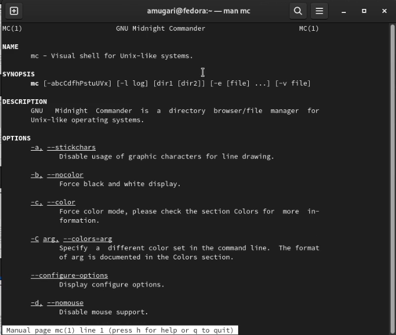{#fig:001 width=70%}

2. Затем мы запустили **mc** из командной строки и изучили его структуру и меню(рис. @fig:002).

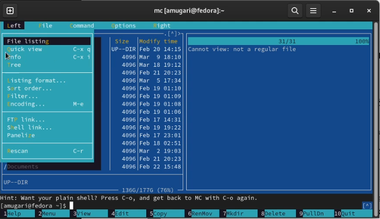{#fig:002 width=70%}

3. Затем мы выполнили несколько операций в **mc **, используя клавиши управления, которые являются : 

- мы выбирали и отменяли выбор определенных файлов и каталогов с помощью **shift + стрелка (вверх или вниз)** (рис. @fig:003)

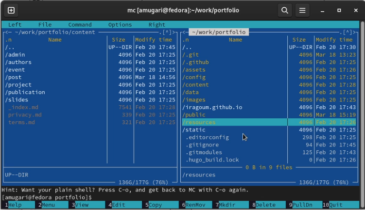{#fig:003 width=70%}

- затем мы скопировали и переместили файлы (рис. @fig:004) (рис. @fig:005)

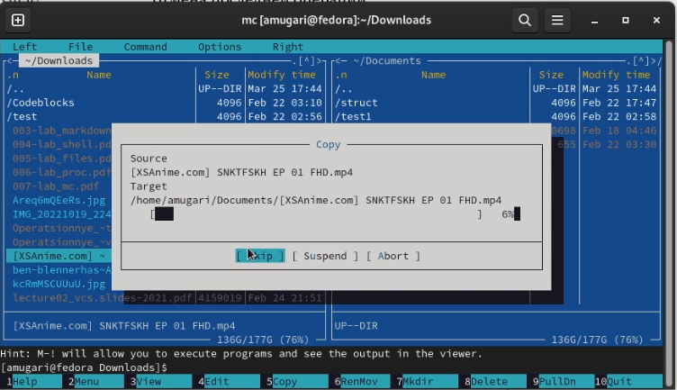{#fig:004 width=70%}

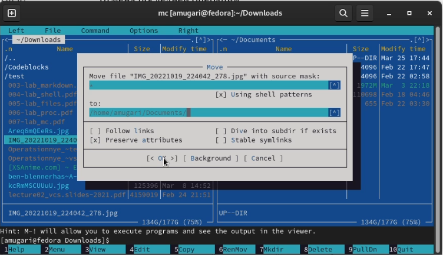{#fig:005 width=70%}

- После этого мы получили информацию о размере и правах доступа к файлам и/или каталогам (рис. @fig:006)

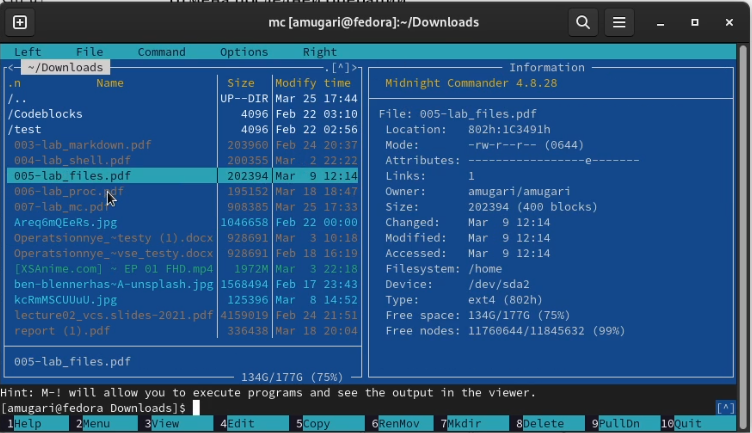{#fig:006 width=70%}

4. здесь я выполнил команды главного меню правой панели. (рис. @fig:007)

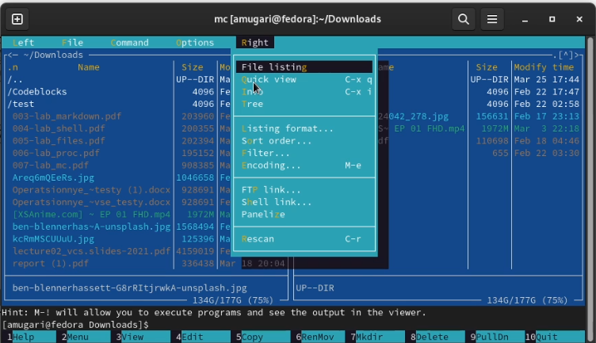{#fig:007 width=70%}

5. Используя возможности подменю "Файл" , мы запустили:

- просмотр содержимого текстового файла (рис. @fig:008)

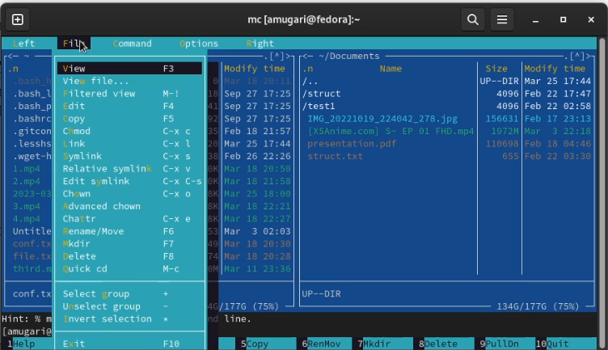{#fig:008 width=70%}

- я отредактировал содержимое текстового файла, но без сохранения результатов редактирования (рис. @fig:009)

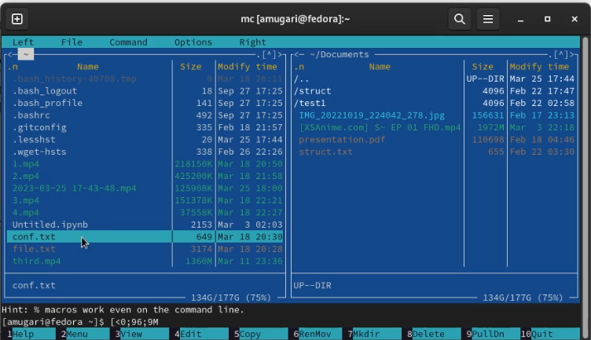{#fig:009 width=70%}

- затем я создал каталог (рис. @fig:010)

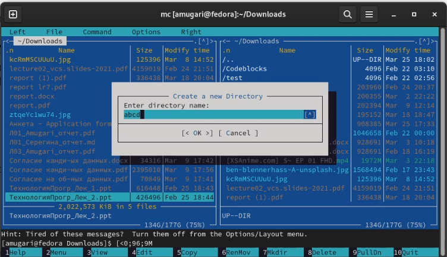{#fig:010 width=70%}

- затем мы скопировали некоторые файлы во вновь созданный каталог (рис. @fig:011)

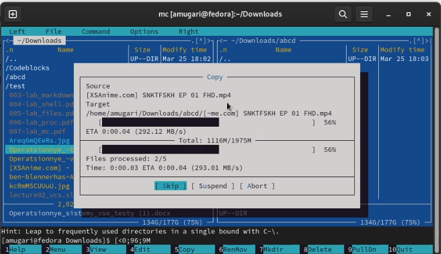{#fig:011 width=70%}

6. С помощью соответствующих средств подменю Команда осуществите:

- Здесь мы искали файлы, имеющие расширение **.c или .cpp** и содержащие в своем содержимом строку **main** (рис. @fig:012)

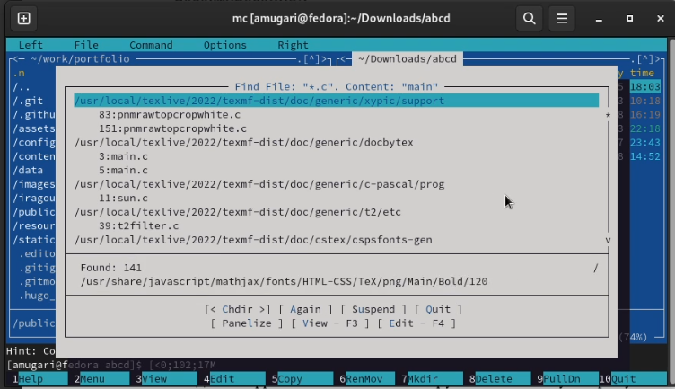{#fig:012 width=70%}

- после этого мы выбрали и повторили одну из предыдущих команд (рис. @fig:013)

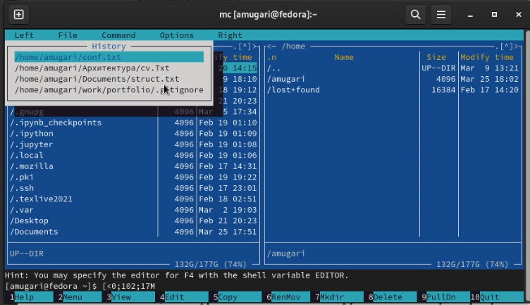{#fig:013 width=70%}

- после этого мы перешли в домашний каталог (рис. @fig:014)

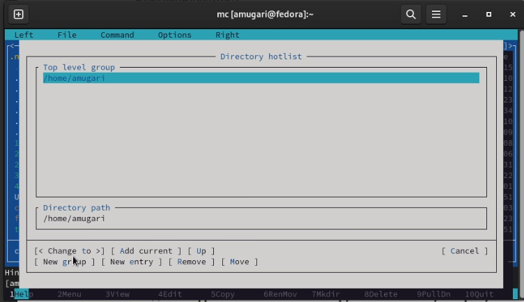{#fig:014 width=70%}

- анализ файла меню и файла расширений (рис. @fig:015) (рис. @fig:016)

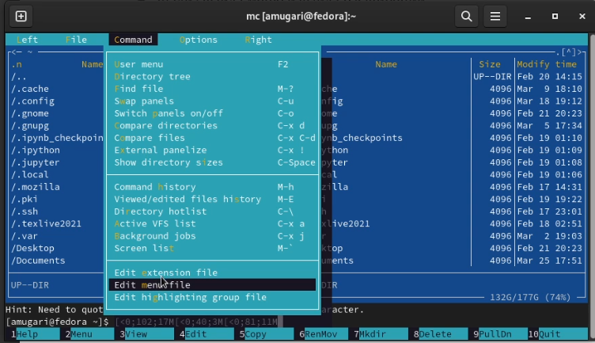{#fig:015 width=70%}

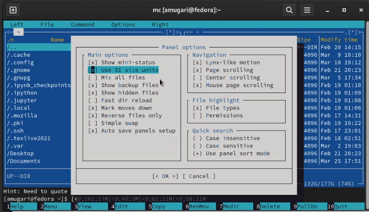{#fig:016 width=70%}

7. Задание по встроенному редактору mc

- Здесь я создал текстовый файл **text.txt** (рис. @fig:017)

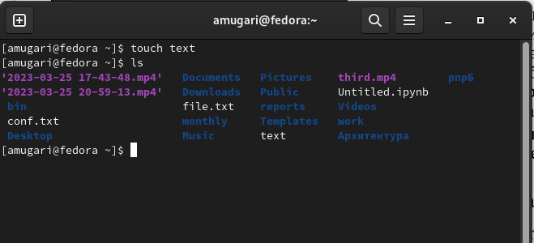{#fig:017 width=70%}

- затем я открыл этот файл с помощью встроенного редактора mc (рис. @fig:018)

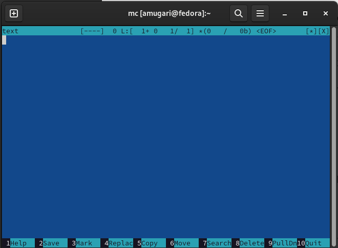{#fig:018 width=70%}

- после этого я вставил небольшой фрагмент скопированного текста (рис. @fig:019)

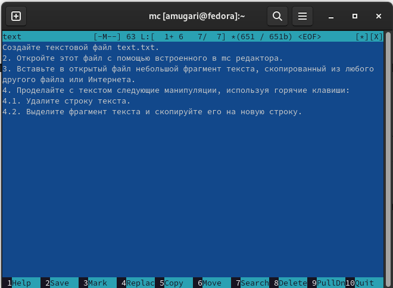{#fig:019 width=70%}

- затем мы удалили строку текста. (рис. @fig:020)

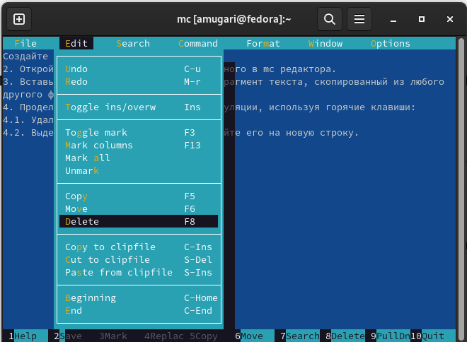{#fig:020 width=70%}

- здесь мы выделили фрагмент текста и скопировали его в новую строку (рис. @fig:021)

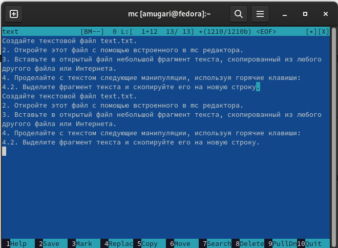{#fig:021 width=70%}

- здесь мы сохранили файл (рис. @fig:022)

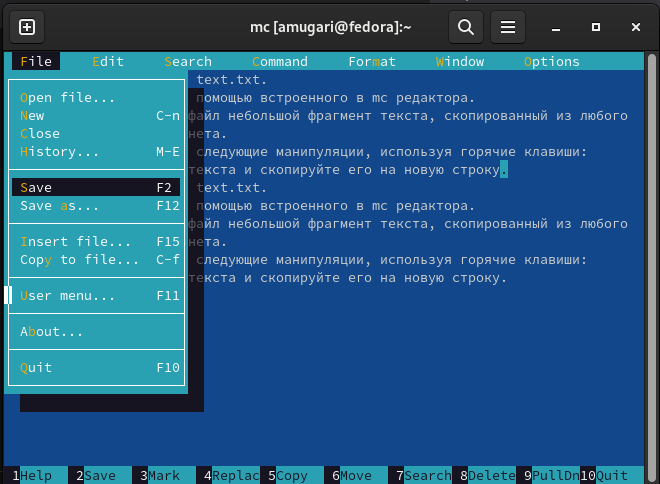{#fig:022 width=70%}

- после этого мы отменили последнее действие (рис. @fig:023)

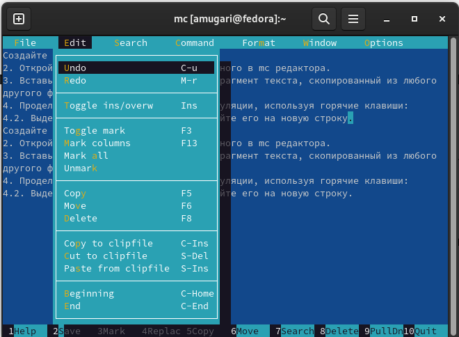{#fig:023 width=70%}

- на этом шаге мы перешли к концу абзаца, ввели некоторый текст, затем мы перешли к началу текста и ввели некоторый текст (рис. @fig:024)

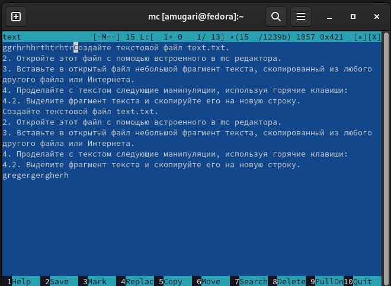{#fig:024 width=70%}

- здесь мы сохранили и закрыли файл (рис. @fig:025)

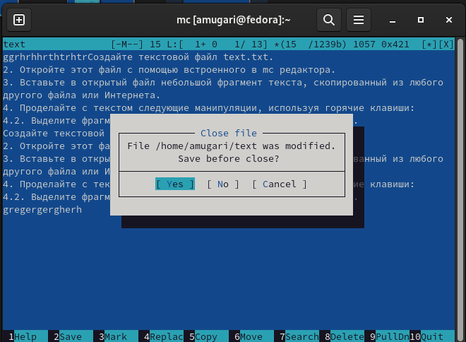{#fig:025 width=70%}

- затем мы открыли файл с исходным текстом на языке си (рис. @fig:026)

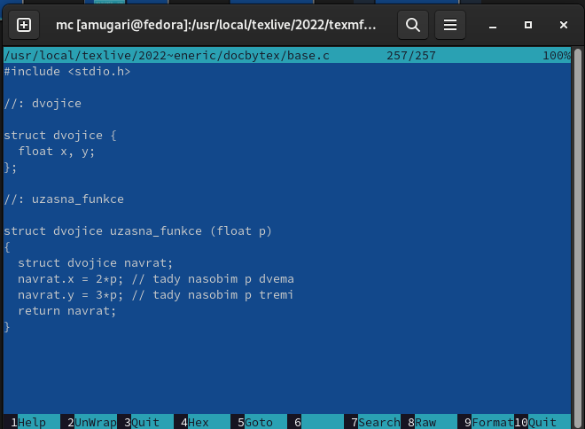{#fig:026 width=70%}

- Используя меню редактора, мы включили подсветку синтаксиса (рис. @fig:027)

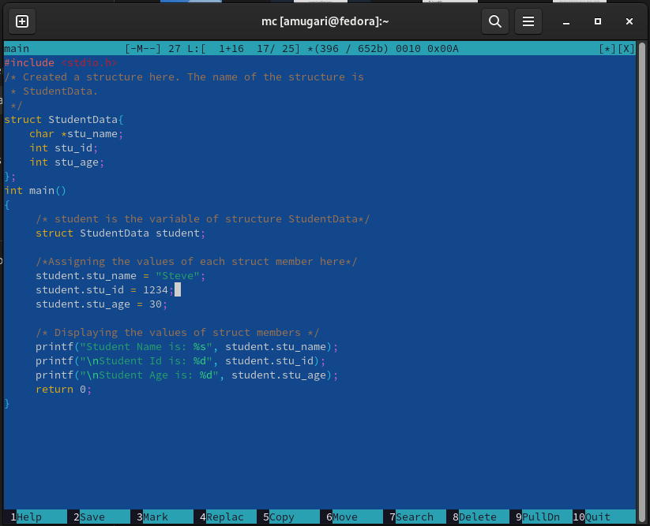{#fig:027 width=70%}

## Контрольные вопросы:

1. Какие режимы работы есть в mc. Охарактеризуйте их.
mc - визуальная файловая оболочка для UNIX/Linux систем, аналог Far, Norton Commander, но оболочки в Linux несравненно богаче. На языке командной оболочки можно писать небольшие программы для выполнения ряда последовательных операций с файлами и содержащимися в них данными.

Команда Переставить панели (Ctrl+U) меняет местами содержимое правой и левой панелей.

По команде Сравнить каталоги (Ctrl-X,D) сравнивается содержимое каталогов, отображаемых на левой и правой панелях.

Помимо того, что может задаваться формат вывода на панель списка файлов, любую панель можно перевести в один из следующих режимов Режим "Информация". В этом режиме на панель выводится информация о подсвеченном в другой панели файле и о текущей файловой системе.

Режим "Дерево". В режиме отображения дерева каталогов в одной из панелей выводится графическое изображение структуры дерева каталогов.

Меню «Левая панель» и «Правая панель» позволяют оперировать режимами отображения панелей.

Формат списка бывает:

Стандартный – вывод списка файлов и каталогов по умолчанию;

Ускоренный – имена файла или каталогов; Расширенный – атрибуты, владелец, группа и размер;

Определённый пользователем – имя, размер и атрибуты; Быстрый просмотр – выполняет быстрый просмотр содержимого панели.

Информация – выдает всю имеющуюся информацию о файле или каталоге.

Порядок сортировки – бывает: без сортировки, по имени, расширенный, время правки, время правки, время доступа, время изменение атрибута, размер, узел.

2. Какие операции с файлами можно выполнить как с помощью команд shell, так и с помощью меню (комбинаций клавиш) mc? Приведите несколько примеров.
Командные интерпретатор Shell и оболочка Midnight Commander имеют похожую структуру и многие одинаковые команды можно выполнить в обоих оболочках:

Например, Системная информация, Копирование, Поиск

3. Опишите структура меню левой (или правой) панели mc, дайте характеристику командам.
Подпункты меню:

Список файлов показывает файлы в домашнем каталоге.

Быстрый просмотр позволяет выполнить быстрый просмотр содержимого панели.

Информация позволяет посмотреть информацию о файле или каталоге

В меню каждой (левой или правой) панели можно выбрать

Формат списка: стандартный, ускоренный, расширенный и определённый пользователем.

Порядок сортировки позволяет задать критерии сортировки при выводе списка файлов и каталогов: без сортировки, по имени, расширенный, время правки, время доступа, время изменения атрибута, размер, узел.

4. Опишите структура меню Файл mc, дайте характеристику командам.
Просмотр (F3) позволяет посмотреть содержимое текущего файла без возможности редактирования.

Просмотр вывода команды (М + !) функция запроса команды с параметрами.

Правка (F4) открывает текущий (или выделенный) файл для его редактирования.

Копирование (F5) осуществляет копирование одного или нескольких файлов или каталогов в указанное пользователем во всплывающем окне место.

Права доступа (Ctrl-x c) позволяет изменить права доступа к одному или нескольким файлам или каталогам.

Переименование (F6) позволяет переименовать один или несколько файлов или каталогов.

Создание каталога (F7) позволяет создать каталог.

Удалить (F8) позволяет удалить один или несколько файлов или каталогов.
Выход (F10) завершает работу mc.

5. Опишите структура меню Команда mc, дайте характеристику командам.
Подпункты меню:

Дерево каталогов отображает структуру каталогов системы.

Поиск файла выполняет поиск файлов по заданным параметрам.

Переставить панели меняет местами левую и правую панели.

Сравнить каталоги ( Ctrl-x d ) сравнивает содержимое двух каталогов.

Размеры каталогов отображает размер и время изменения каталога (по умол- чанию в mc размер каталога корректно не отображается).

История командной строки выводит на экран список ранее выполненных в оболочке команд.

Каталоги быстрого доступа ( Ctrl-\ ) при вызове выполняется быстрая смена текущего каталога на один из заданного списка. Восстановление файлов позволяет восстановить файлы на файловых систе- мах ext2 и ext3.
Редактировать файл расширений позволяет задать с помощью определённого синтаксиса действия при запуске файлов с определённым расширением (напри- мер, какое программного обеспечение запускать для открытия или редактирова- ния файлов с расширением .c или .cpp).

Редактировать файл меню позволяет отредактировать контекстное меню поль- зователя, вызываемое по клавише F2 . Редактировать файл расцветки имён позволяет подобрать оптимальную для пользователя расцветку имён файлов в зависимости от их типа.

6. Опишите структура меню Настройки mc, дайте характеристику командам.
Подпункты меню:

Конфигурация позволяет скорректировать настройки работы с панелями.

Внешний вид и Настройки панелей определяет элементы, отображаемые при вызове mc, а также цветовое выделение.

Биты символов задаёт формат обработки информации локальным термина- лом.

Подтверждение позволяет установить или убрать вывод окна с запросом подтверждения действий при операциях удаления и перезаписи файлов, а также при выходе из программы.

7. Назовите и дайте характеристику встроенным командам mc.
F1 – Вызов контекстно-зависимой подсказки.

F2 – Вызов пользовательского меню с возможностью создания and/or.

F3 – dfgПросмотр содержимого файла, на который указывает подсветка в активной панели.

F4 – Вызов встроенного в mc редактора для изменения содержания файла, на который указывает подсветка в активной панели.

F5 – Копирование одного или нескольких файлов, отмеченных в первой (активной) панели, в каталог, отображаемый на второй панели.

F6 – Перенос одного или нескольких файлов, отмеченных в первой панели, в каталог, отображаемый на второй панели.

F7 – Создание подкаталога в каталоге, отображаемом в активной панели.

F8 – Удаление одного или нескольких файлов, отмеченных в первой панели файлов.

F9 – Вызов меню mc.

F10 – Выход из mc.

8. Назовите и дайте характеристику командам встроенного редактора mc.
Ctrl+y – удалить строку.

Ctrl+u – отмена последней операции.

Ins – вставка/замена.

F7 – поиск.

Shift+F7 – повтор последней операции поиска.

F4 – замена файла.

F3 – первое нажатие – начало выделения, второе – окончание выделения.

F5 – копировать выделенный фрагмент

F6 – переместить выделенный фрагмент.

F8 – удалить выделенный фрагмент.

F2 – записать изменения в файл.

F10 – выйти из редактора.

9. Дайте характеристику средствам mc, которые позволяют создавать меню, определяемые пользователем.
Один из четырех форматов списка в Midnight Commander –пользовательский, определённый самим пользователем позволяет ему редактировать меню любого из двух списков. А меню пользователя – это меню, состоящее из команд, определенных пользователем. При вызове меню используется файл ~/.mc.menu. Если такого файла нет, то по умолчанию используется системный файл меню /usr/lib/mc/mc.menu. Все строки в этих файлах , начинающиеся с пробела или табуляции, являются командами, которые выполняются при выборе записи.

10. Дайте характеристику средствам mc, которые позволяют выполнять действия, определяемые пользователем, над текущим файлом. Когда мы выделяем файл не являющегося исполняемым, Midnight Commander сравнивает расширение выбранного файла с расширениями, прописанными в «файле расширений» ~/ mc.ext. Если в файле расширений найдется подраздел, задающий процедуры обработки файлов с данным расширением, то обработка файла производится в соответствии с заданными в этом подразделе командами и файлами: файл помощи для MC.
/usr/lib/mc.hlp файл расширений, используемый по умолчанию. /usr/lib/mc/mc.ext файл расширений, конфигурации редактора. $HOME/.mc.ext системный инициализационный файл. /usr/lib/mc/mc.ini фаил который содержит основные установки. /usr/lib/mc/mc.lib инициализационный файл пользователя. Если он существует, то системный файл mc.ini игнорируется. $HOME/.mc.ini этот файл содержит подсказки, отображаемые в нижней части экрана. /usr/lib/mc/mc.hint системный файл меню MC, используемый по умолчанию. /usr/lib/mc/mc.menu файл меню пользователя. Если он существует, то системный файл меню игнорируется. $HOME/.mc.menu инициализационный файл пользователя. Если он существует, то системный файл mc.ini игнорируется. $HOME/.mc.tree

## выводы по результатам выполнения заданий:

- выполняя эту лабораторную работу, мы получили практические навыки использования mc и работы с файловой системой.
  
# Выводы, согласованные с целью работы:

- Освоение основных возможностей командной оболочки Midnight Commander. Приоб-
ретение навыков практической работы по просмотру каталогов и файлов; манипуляций
с ними.
