---
## Front matter
title: "Архитектура компьютеров и операционные системы | Операционные системы"
subtitle: "Лабораторная работа № 8. Текстовой редактор vi "
author: "Мугари Абдеррахим - НКАбд-03-22"

## Generic otions
lang: ru-RU
toc-title: "Содержание"

## Bibliography
bibliography: bib/cite.bib
csl: pandoc/csl/gost-r-7-0-5-2008-numeric.csl

## Pdf output format
toc: true # Table of contents
toc-depth: 2
lof: true # List of figures
lot: true # List of tables
fontsize: 12pt
linestretch: 1.5
papersize: a4
documentclass: scrreprt
## I18n polyglossia
polyglossia-lang:
  name: russian
  options:
	- spelling=modern
	- babelshorthands=true
polyglossia-otherlangs:
  name: english
## I18n babel
babel-lang: russian
babel-otherlangs: english
## Fonts
mainfont: PT Serif
romanfont: PT Serif
sansfont: PT Sans
monofont: PT Mono
mainfontoptions: Ligatures=TeX
romanfontoptions: Ligatures=TeX
sansfontoptions: Ligatures=TeX,Scale=MatchLowercase
monofontoptions: Scale=MatchLowercase,Scale=0.9
## Biblatex
biblatex: true
biblio-style: "gost-numeric"
biblatexoptions:
  - parentracker=true
  - backend=biber
  - hyperref=auto
  - language=auto
  - autolang=other*
  - citestyle=gost-numeric
## Pandoc-crossref LaTeX customization
figureTitle: "Рис."
tableTitle: "Таблица"
listingTitle: "Листинг"
lofTitle: "Список иллюстраций"
lotTitle: "Список таблиц"
lolTitle: "Листинги"
## Misc options
indent: true
header-includes:
  - \usepackage{indentfirst}
  - \usepackage{float} # keep figures where there are in the text
  - \floatplacement{figure}{H} # keep figures where there are in the text
---

# Цель работы

- Познакомиться с операционной системой Linux. Получить практические навыки работы с редактором vi, установленным по умолчанию практически во всех дистрибутивах.

# Выполнение лабораторной работы : 

## Задание 1. Создание нового файла с использованием vi

1. я создал и переместился каталог с именем ~/work/os/lab06(рис. @fig:001).

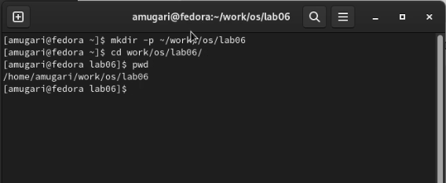{#fig:001 width=70%}

2. затем я вызвал vi и создал файл hello.sh (рис. @fig:002).

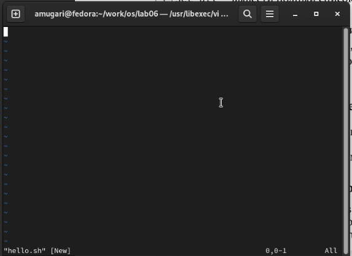{#fig:002 width=70%}

3. после этого я нажал клавишу **i** и ввел текст (рис. @fig:003).

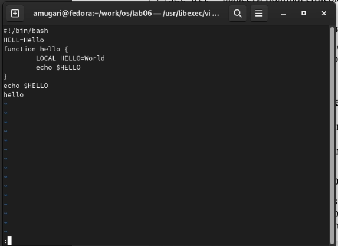{#fig:003 width=70%}

4. затем я нажал **Esc**, чтобы переключиться в **командный режим**, и нажал клавишу **:** для переключения в режим последней строки, наконец, я ввел **w** для сохранения и **q** для выхода из **редактора vi** и нажал **Enter** (рис. @fig:004).

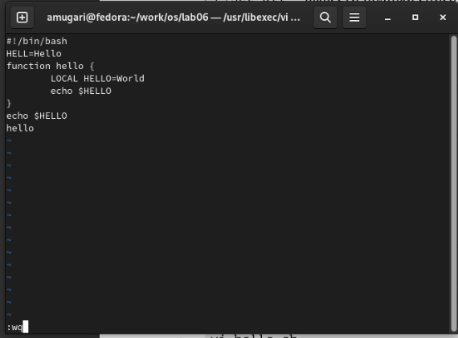{#fig:004 width=70%}

5. на этом шаге мы сделали **hello.sh** исполняемым файлом (рис. @fig:005).

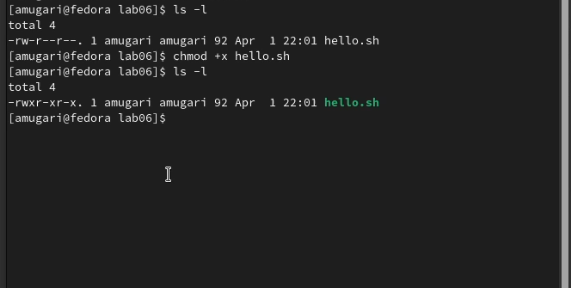{#fig:005 width=70%}

## Задание 2. Редактирование существующего файла

1.  мы вызвали vi, чтобы отредактировать файл **hello.sh** (рис. @fig:006).

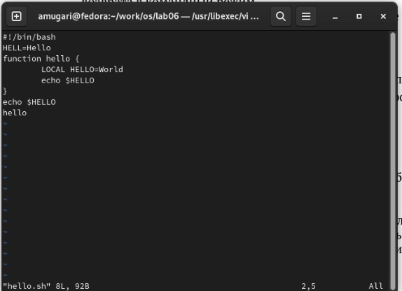{#fig:006 width=70%}

2. мы поместили курсор в конец слова **HELL** второй строки (рис. @fig:007).

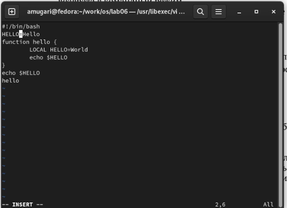{#fig:007 width=70%}

3. после этого мы переключились в **режим вставки** и заменили на **HELLO**, добавив букву **o**. затем мы нажали **Esc**, чтобы вернуться в **командный режим** (рис. @fig:008).

{#fig:008 width=70%}

4. затем мы поместили курсор на четвертую строку и стерли слово **LOCAL** с помощью команды **dw** (рис. @fig:009).

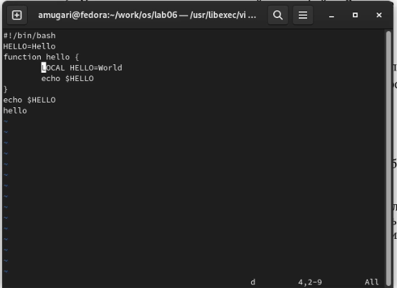{#fig:009 width=70%}

5. мы переключились в **режим вставки** и набрали следующий текст: **local**, затем нажали **Esc**, чтобы вернуться в **командный режим** (рис. @fig:010).

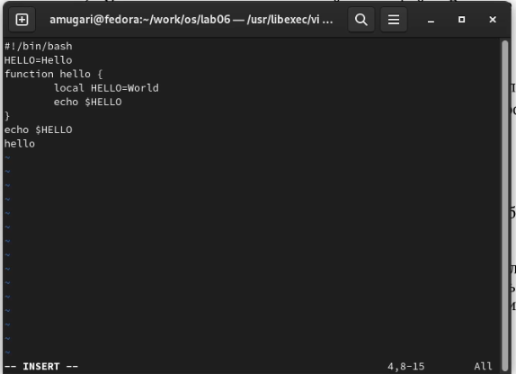{#fig:010 width=70%}

6. на этом шаге я поместил курсор на последнюю строку файла, нажав на клавишу **G** (рис. @fig:011).

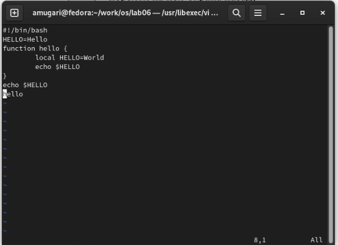{#fig:011 width=70%}

7. затем я вставил после него строку, содержащую следующий текст: **echo $HELLO** (рис. @fig:012).

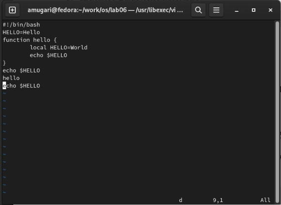{#fig:012 width=70%}

8. после этого мы нажали **ESC** для перехода в **командный режим** (рис. @fig:013)

{#fig:013 width=70%}

9. затем я удалил последнюю строку, используя команду **dd** (рис. @fig:014)

{#fig:014 width=70%}

10. Затем я отменил последнюю команду, и это было сделано нажатием на клавишу **u** (рис. @fig:015)

{#fig:015 width=70%}

11. наконец, я ввел символ **:**, чтобы переключиться в режим **последней строки**, затем я ввел **w**, чтобы сохранить изменения, и **q**, чтобы выйти из файла. (рис. @fig:016)

{#fig:016 width=70%}

## Контрольные вопросы:
1. Дайте краткую характеристику режимам работы редактора vi.
Редактор vi имеет три режима работы:

   – командный режим - предназначен для ввода команд редактирования и навигации по редактируемому файлу;
   
   – режим вставки - предназначен для ввода содержания редактируемого файла;
   
   – режим последней (или командной) строки - используется для записи изменений в файл и выхода из редактора.
2. Как выйти из редактора, не сохраняя произведённые изменения?
Для того, чтобы выйти из редактора, не сохраняя произведенные изменения в режиме последней строки нужно ввести q!

3. Назовите и дайте краткую характеристику командам позиционирования.
0 (ноль) - перейти в начало строки;

$ - перейти в конец строки;

G - перейти в конец файла;

nG - перейти на строку номер n.

4. Что для редактора vi является словом?
Для редактора vi слово - это строка символов, которая может включать в себя буквы, цифры и символы подчеркивания.

5. Каким образом из любого места редактируемого файла перейти в начало (конец) файла?
0 (ноль) - переход в начало строки;

$ - переход в конец строки;

G - переход в конец файла;

n G - переход на строку с номером n.

6. Назовите и дайте краткую характеристику основным группам команд редактирования.
Вставка текста:

а - вставить текст после курсора;

А - вставить текст в конец строки;

i - вставить текст перед курсором;

ni - вставить текст n раз;

I - вставить текст в начало строки.

Вставка строки:

о - вставить строку под курсором;

О - вставить строку над курсором.

Удаление текста:

x - удалить один символ в буфер;

dw - удалить одно слово в буфер;

d$ - удалить в буфер текст от курсора до конца строки;

d0 - удалить в буфер текст от начала строки до позиции курсора;

dd - удалить в буфер одну строку;

ndd - удалить в буфер n строк.

Отмена и повтор произведённых изменений:

u - отменить последнее изменение;

. - повторить последнее изменение.

Копирование текста в буфер:

Y - скопировать строку в буфер;

nY - скопировать n строк в буфер;

yw - скопировать слово в буфер.

Вставка текста из буфера:

p - вставить текст из буфера после курсора;

P - вставить текст из буфера перед курсором.

Замена текста:

cw - заменить слово;

ncw - заменить n слов;

c$ - заменить текст от курсора до конца строки;

r - заменить слово;

R - заменить текст.

Поиск текста

/ текст - произвести поиск вперёд по тексту указанной строки символов текст;

? текст - произвести поиск назад по тексту указанной строки символов текст.

7. Необходимо заполнить строку символами $. Каковы ваши действия?
c$ — заменить текст от курсора до конца строки

8. Как отменить некорректное действие, связанное с процессом редактирования?
u - отмена последнего действия

9. Назовите и дайте характеристику основным группам команд режима последней строки.
Копирование и перемещение текста:

: n, m d - удалить строки с n по m;

: i,j m k - переместить строки с i по j, начиная со строки k;

: i,j t k - копировать строки с i по j в строку k;

: i,j w имя-файла - записать строки с i по j в файл с именем имя-файла.

Запись в файл и выход из редактора:

: w - записать изменённый текст в файл, не выходя из vi;

: w имя-файла - записать изменённый текст в новый файл с именем имя-файла;

: w! имя-файла - записать изменённый текст в файл с именем имя файла;

: wq - записать изменения в файл и выйти из vi;

: q - выйти из редактора vi;

: q! - выйти из редактора без записи;

: e! - вернуться в командный режим, отменив все изменения, произведённые со времени последней записи.

10. Как определить, не перемещая курсора, позицию, в которой заканчивается строка?
$ - быстро перемещает курсор в конец строки.

11. Выполните анализ опций редактора vi (сколько их, как узнать их назначение и т.д.).
Опции редактора Vi позволяют настроить рабочую среду.

Для задания опций используется команда set (в режиме последней строки):

: set all - вывести полный список опций;

: set nu - вывести номера строк;

: set list - вывести невидимые символы;

: set ic - не учитывать при поиске, является ли символ прописным или строчным.

12. Как определить режим работы редактора vi?
В режиме вставки внизу окна отображется слово «insert» или «вставка», в режиме последней строки - двоеточие, а в командном режиме не отображается ничего.

13. Постройте граф взаимосвязи режимов работы редактора vi.(рис. @fig:017)

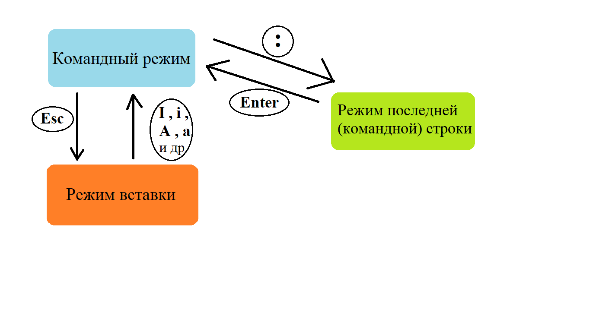{#fig:017 width=70%}

## выводы по результатам выполнения заданий:

- Выполняя эти упражнения, мы получили практические навыки использования **vi editor** каковы его полезные сочетания клавиш
  
# Выводы, согласованные с целью работы:

- Познакомиться с операционной системой Linux. Получить практические навыки работы с редактором vi, установленным по умолчанию практически во всех дистрибутивах.
