---
## Front matter
lang: ru-RU
title: Операционные системы
subtitle: Лабораторная работа №9. Текстовой редактор emacs.
author:
  - Абдеррахим Мугари.
institute:
  - Российский университет дружбы народов, Москва, Россия
  
date: 8 апреля 2023

## i18n babel
babel-lang: russian
babel-otherlangs: english

## Formatting pdf
toc: false
toc-title: Содержание
slide_level: 2
aspectratio: 169
section-titles: true
theme: metropolis
header-includes:
 - \metroset{progressbar=frametitle,sectionpage=progressbar,numbering=fraction}
 - '\makeatletter'
 - '\beamer@ignorenonframefalse'
 - '\makeatother'
 
---

# Информация

## Докладчик

:::::::::::::: {.columns align=center}
::: {.column width="70%"}

  * Абдеррахим Мугари
  * Студент
  * Российский университет дружбы народов
  * [1032215692@pfur.ru](mailto:1032215692@pfur.ru)
  * <https://github.com/iragoum>

:::
::: {.column width="30%"}

:::
::::::::::::::

## Цель работы:

-  ознакомиться с операционной системой Linux. Получить практические навыки работы с редактором Emacs.

## Материалы и методы

- Терминал Unix.
- Файловая система.
- Текстовой редактор emacs .

## Ход работы:

## запуск emacs:

- запуск emacs из терминала в серверном режиме

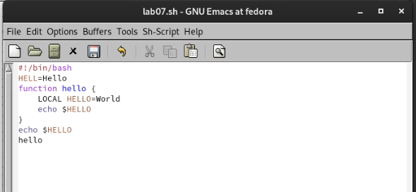{width=70%}

## Создание файла **lab07.sh**:

- Создание файла **lab07.sh** используя комбинацию Ctrl-x Ctrl-f (Cx Cf) и вставка кода в файл

{width=50%}

## Сохранение файла **lab07.sh**:

- Сохранение файла с помощью Ctrl-x Ctrl-s (C-x C-s)

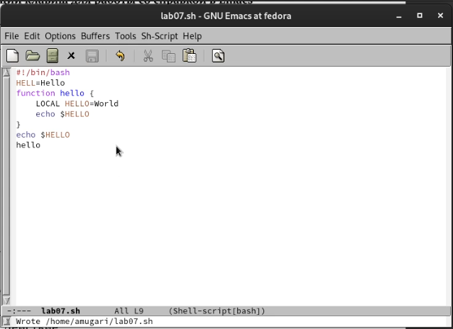{width=50%}

## Вырезание целой строки:

- Вырезание целой строки (с помощью -k) одной командой

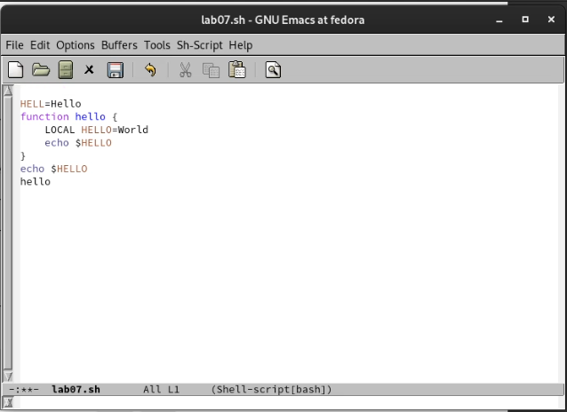{width=50%}

## Вставка строки в конец файла:

- Вставка этой строки в конец файла (C-y)

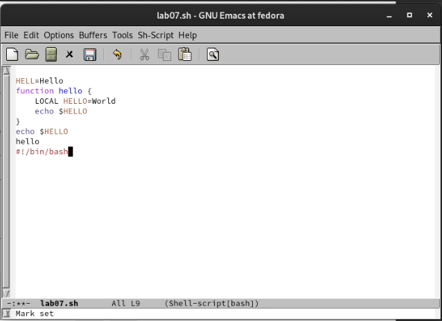{ width=50%}

## Выделение текстовой области  

- Выделение текстовой области (C-пробел)

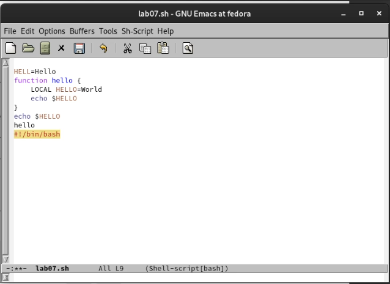{width=50%}

## Копирование области в буфер обмена и вставка этой области в конец файла

- Копирование области в буфер обмена (M-w) и вставка этой области в конец файла

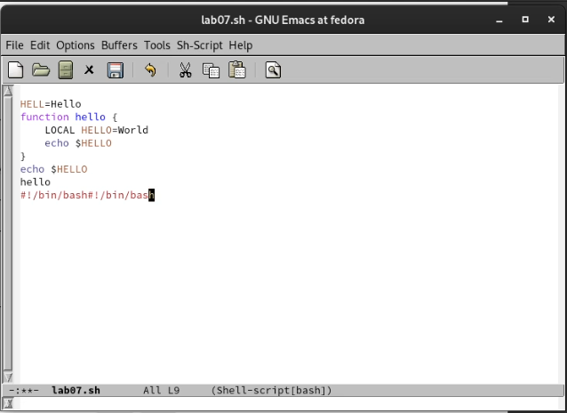{ width=50%}

## область выделения и разрез и отмена последнего действия :

- область выделения и разрез (C-w) и отмена последнего действия (C-/)

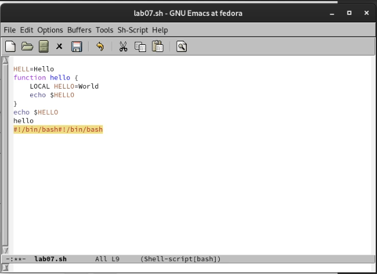{width=50%}

## Отображение списка активных буферов на экране

- Отображение списка активных буферов на экране 

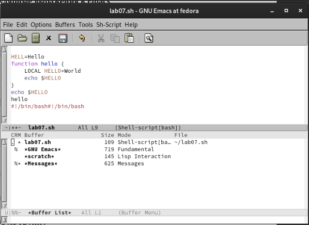{width=50%}

## Закрытие окна :

- Закрытие окна (C-x-0)

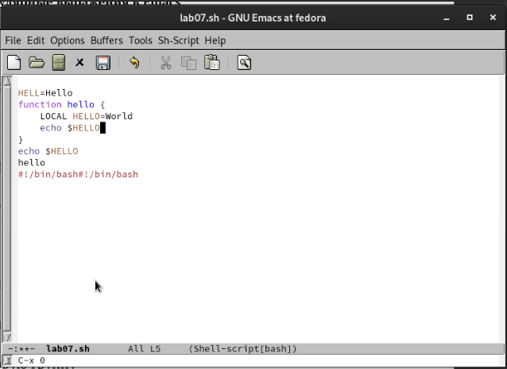{width=50%}

## переключение между буферами, без отображения их списка на экране 

- снова переключение между буферами, но без отображения их списка на экране (C-x b)

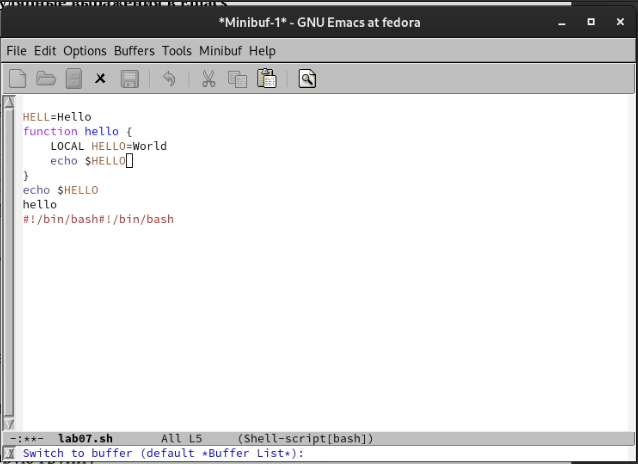{width=50%}

## Разделение рамки на 4 части и отображение текста на них:

- Разделение рамки на 4 части и отображение текста на них

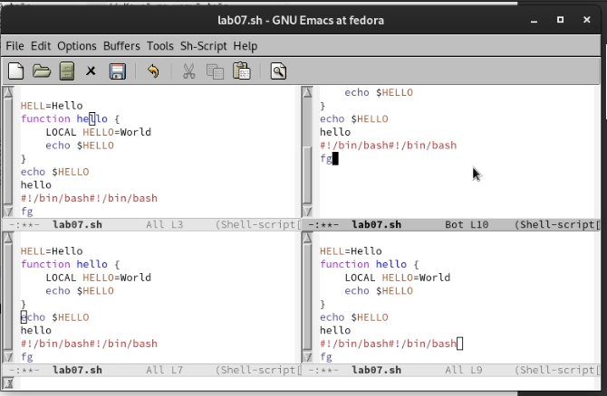{ width=50%}

## Переключение в режим поиска и поиск нескольких слов :

- Переключение в режим поиска (C-s) и поиск нескольких слов, присутствующих в тексте

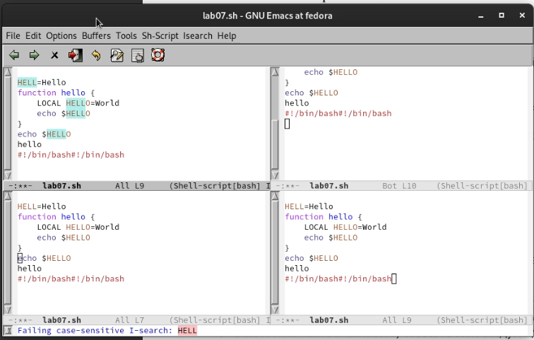{width=50%}

## переключение в режим поиска и замены : 

- Переключение в режим поиска и замены (M-%), ввод текста, который необходимо найти и заменить

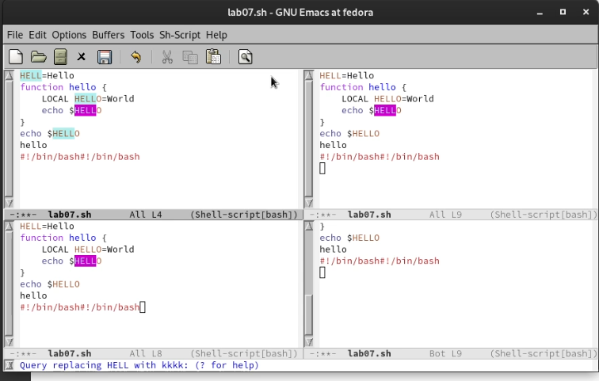{width=50%}

## использование другой системы поиска и замены :

- нажав M-s, мы воспользовались другой системой поиска и замены

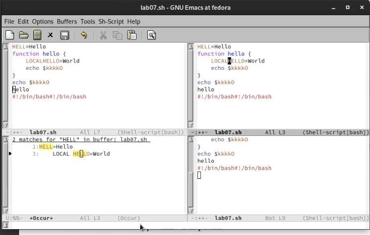{width=50%}

## выводы по результатам выполнения заданий:

- В этой лабораторной работе мы узнали, как использовать **emacs** и каких масштабов мы можем достичь с его помощью
  
# Выводы, согласованные с целью работы:

- Познакомиться с операционной системой Linux. Получить практические навыки работы с редактором Emacs.
