---
## Front matter
title: "Архитектура компьютеров и операционные системы | Операционные системы"
subtitle: "Лабораторная работа № 9. Текстовой редактор emacs"
author: "Мугари Абдеррахим - НКАбд-03-22"

## Generic otions
lang: ru-RU
toc-title: "Содержание"

## Bibliography
bibliography: bib/cite.bib
csl: pandoc/csl/gost-r-7-0-5-2008-numeric.csl

## Pdf output format
toc: true # Table of contents
toc-depth: 2
lof: true # List of figures
lot: true # List of tables
fontsize: 12pt
linestretch: 1.5
papersize: a4
documentclass: scrreprt
## I18n polyglossia
polyglossia-lang:
  name: russian
  options:
	- spelling=modern
	- babelshorthands=true
polyglossia-otherlangs:
  name: english
## I18n babel
babel-lang: russian
babel-otherlangs: english
## Fonts
mainfont: PT Serif
romanfont: PT Serif
sansfont: PT Sans
monofont: PT Mono
mainfontoptions: Ligatures=TeX
romanfontoptions: Ligatures=TeX
sansfontoptions: Ligatures=TeX,Scale=MatchLowercase
monofontoptions: Scale=MatchLowercase,Scale=0.9
## Biblatex
biblatex: true
biblio-style: "gost-numeric"
biblatexoptions:
  - parentracker=true
  - backend=biber
  - hyperref=auto
  - language=auto
  - autolang=other*
  - citestyle=gost-numeric
## Pandoc-crossref LaTeX customization
figureTitle: "Рис."
tableTitle: "Таблица"
listingTitle: "Листинг"
lofTitle: "Список иллюстраций"
lotTitle: "Список таблиц"
lolTitle: "Листинги"
## Misc options
indent: true
header-includes:
  - \usepackage{indentfirst}
  - \usepackage{float} # keep figures where there are in the text
  - \floatplacement{figure}{H} # keep figures where there are in the text
---

# Цель работы

- Познакомиться с операционной системой Linux. Получить практические навыки работы с редактором Emacs.

# Выполнение лабораторной работы : 

- запуск emacs из терминала в серверном режиме (рис. @fig:001)

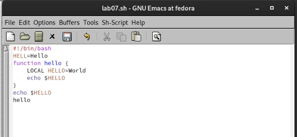{#fig:001 width=70%}

- Создание файла **lab07.sh** используя комбинацию Ctrl-x Ctrl-f (Cx Cf) и вставка кода в файл (рис. @fig:002)

{#fig:002 width=70%}

- Сохранение файла с помощью Ctrl-x Ctrl-s (C-x C-s) (рис. @fig:003)

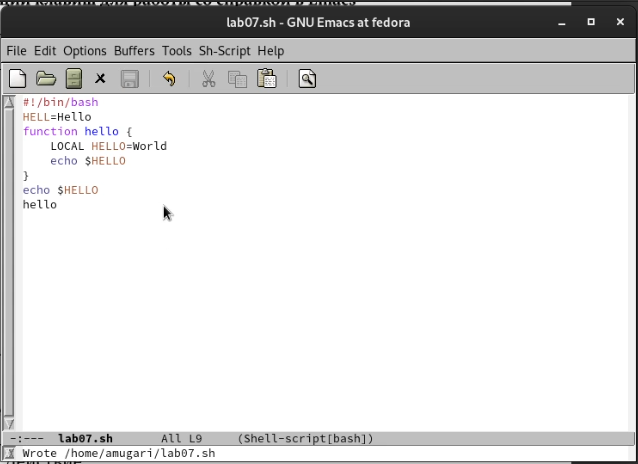{#fig:003 width=70%}

- Вырезание целой строки (с помощью -k) одной командой (рис. @fig:004)

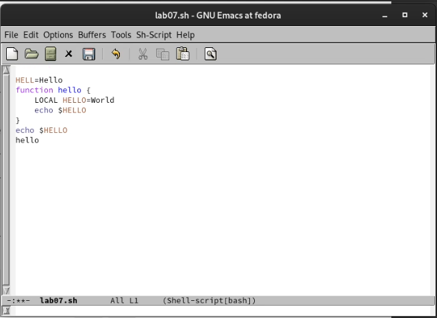{#fig:004 width=70%}

- Вставка этой строки в конец файла (C-y) (рис. @fig:005)

{#fig:005 width=70%}

- Выделение текстовой области (C-пробел) (рис. @fig:006)

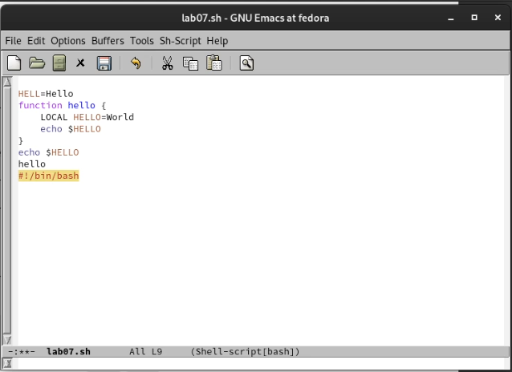{#fig:006 width=70%}

- Копирование области в буфер обмена (M-w) и вставка этой области в конец файла (рис. @fig:007)

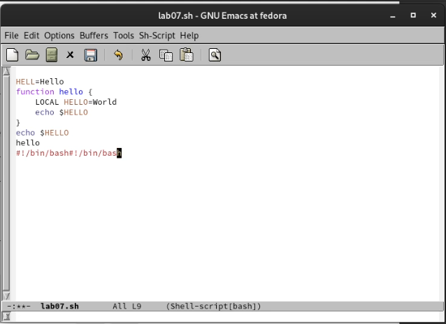{#fig:007 width=70%}

- область выделения и разрез (C-w) и отмена последнего действия (C-/) (рис. @fig:008)

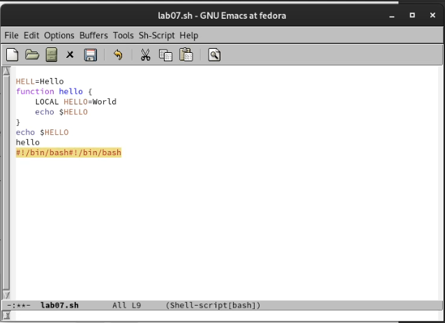{#fig:008 width=70%}

- Отображение списка активных буферов на экране (рис. @fig:009)

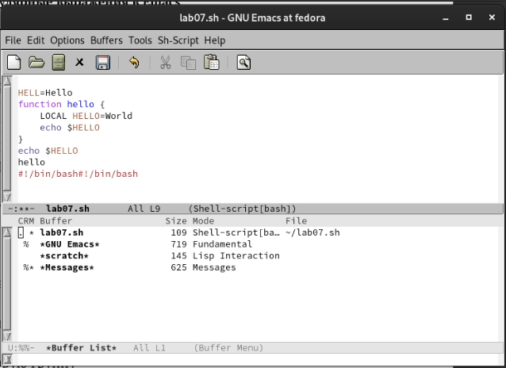{#fig:009 width=70%}

- Закрытие окна (C-x-0) (рис. @fig:010)

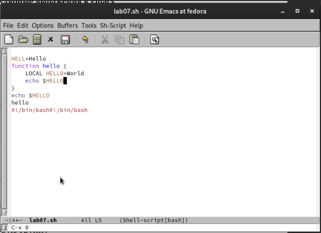{#fig:010 width=70%}

- снова переключение между буферами, но без отображения их списка на экране (C-x b) (рис. @fig:011)

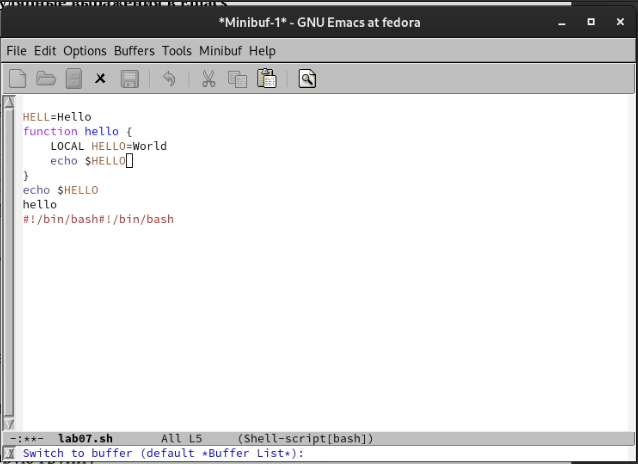{#fig:011 width=70%}

- Разделение рамки на 4 части и отображение текста на них (рис. @fig:012)

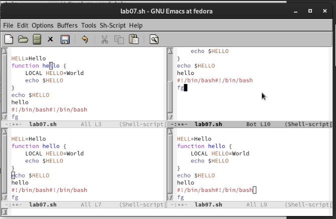{#fig:012 width=70%}

- Переключение в режим поиска (C-s) и поиск нескольких слов, присутствующих в тексте (рис. @fig:013)

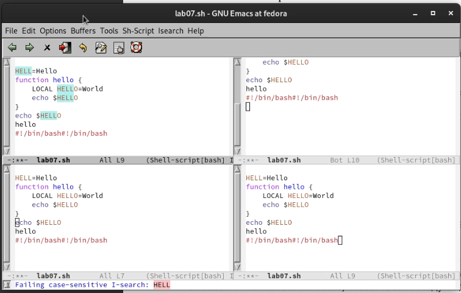{#fig:013 width=70%}

- Переключение в режим поиска и замены (M-%), ввод текста, который необходимо найти и заменить (рис. @fig:014)

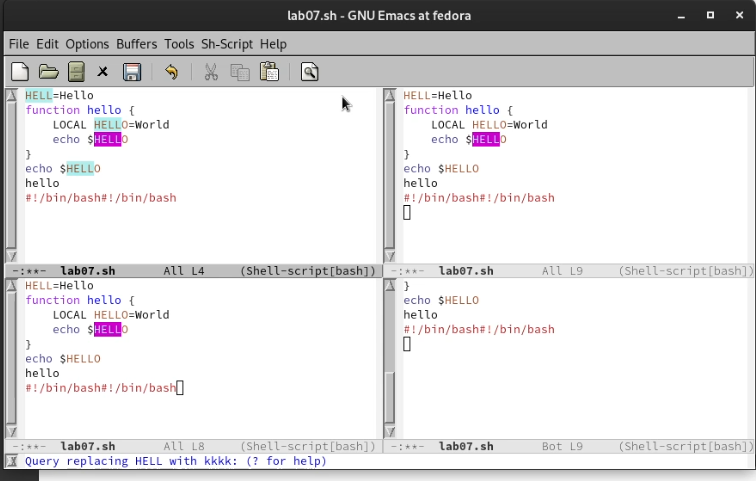{#fig:014 width=70%}

- нажав M-s, мы воспользовались другой системой поиска и замены (рис. @fig:015)

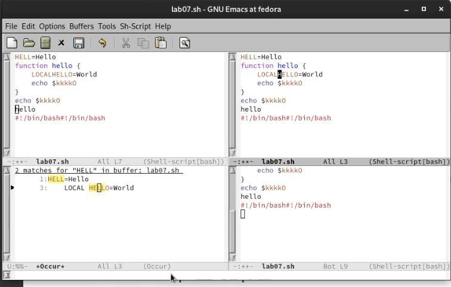{#fig:015 width=70%}

## Контрольные вопросы:

## выводы по результатам выполнения заданий:

- В этой лабораторной работе мы узнали, как использовать **emacs** и каких масштабов мы можем достичь с его помощью
  
# Выводы, согласованные с целью работы:

- Познакомиться с операционной системой Linux. Получить практические навыки работы с редактором Emacs.
