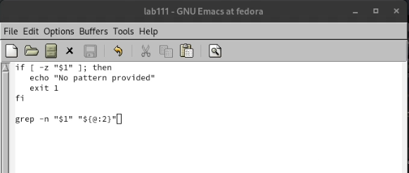
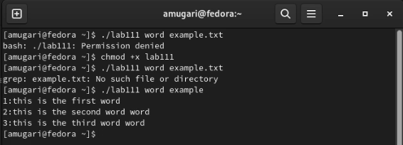
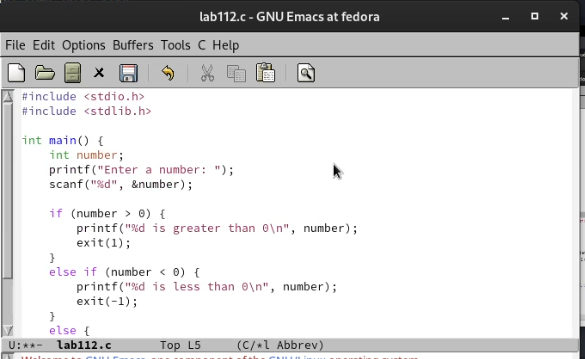
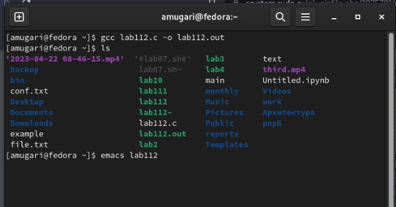
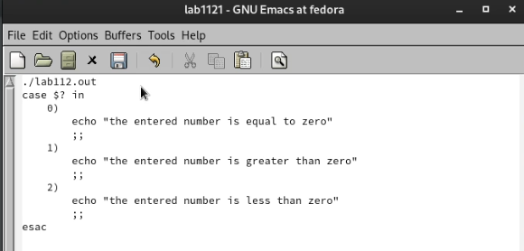
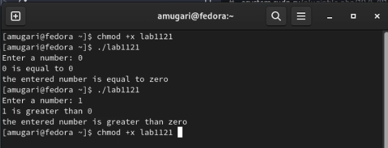
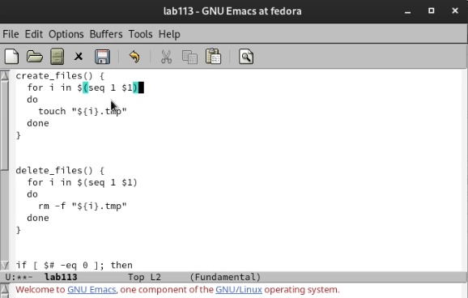
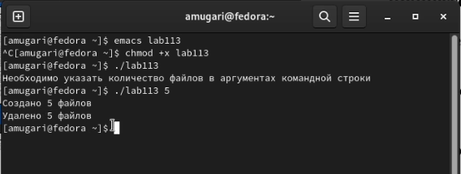
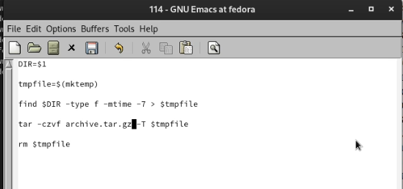
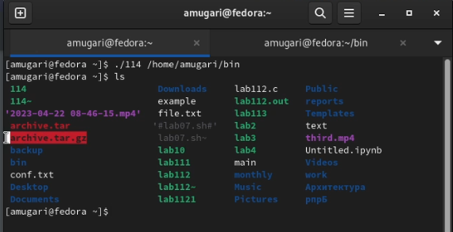

---
## Front matter
lang: ru-RU
title: Операционные системы
subtitle: Лабораторная работа № 11. Программирование в командном процессоре ОС UNIX. Ветвления и циклы.
author:
  - Абдеррахим Мугари.
institute:
  - Российский университет дружбы народов, Москва, Россия
  
date: 22 апреля 2023

## i18n babel
babel-lang: russian
babel-otherlangs: english

## Formatting pdf
toc: false
toc-title: Содержание
slide_level: 2
aspectratio: 169
section-titles: true
theme: metropolis
header-includes:
 - \metroset{progressbar=frametitle,sectionpage=progressbar,numbering=fraction}
 - '\makeatletter'
 - '\beamer@ignorenonframefalse'
 - '\makeatother'
 
---

# Информация

## Докладчик

:::::::::::::: {.columns align=center}
::: {.column width="70%"}

  * Абдеррахим Мугари
  * Студент
  * Российский университет дружбы народов
  * [1032215692@pfur.ru](mailto:1032215692@pfur.ru)
  * <https://github.com/iragoum>

:::
::: {.column width="30%"}

:::
::::::::::::::

## Цель работы:

- Изучить основы программирования в оболочке ОС UNIX. Научится писать более сложные командные файлы с использованием логических управляющих конструкций и циклов.

## Материалы и методы

- Терминал Unix.
- Файловая система.
- Текстовой редактор emacs .

## Ход работы:

## Написание первой программы:

- Прежде всего, я написал программу, которая ищет шаблон в файле и отображает каждую строку, содержащую его, с указанием ее номера

{width=70%}

## изменение прав доступа и выполнение программы :

- после этого мне пришлось изменить права доступа к файлу, содержащему код, и добавить к нему выполнение, и после этого я запустил код, и он заработал

{width=70%}

## Написание второй программы : 

- затем здесь мне пришлось написать программу на C, которая вводит число и определяет, больше ли оно нуля, меньше нуля или равно нулю. Затем программа завершается с помощью функции exit(n), передавая информацию о коде завершения в

оболочку.

{width=40%}

## компиляция кода, написанного на C :

- после написания кода колледжа мне пришлось скомпилировать его перед выполнением

{width=70%}

## Написание командного файла :

- затем я написал командный файл, который должен вызвать эту программу и, проанализировав ее с помощью команды **$?**, выдать сообщение о том, какое число было введено.

{width=70%}

## изменение прав доступа и выполнение программы :

- здесь я изменил право доступа к командному файлу, а затем выполнил его для вызова другой программы, написанной на C, где я протестировал три возможные ситуации, и это сработало

{width=70%}

## написание третьего программы: 

- затем я написал код, который создает указанное количество файлов, пронумерованных последовательно от 1 до N. Количество файлов , которые должны быть созданы, передается в качестве аргументов командной строки. Один и тот же командный

файл должен иметь возможность удалять все созданные им файлы (если они существуют). 

{width=40%}

## изменение прав доступа и выполнение программы :

- затем мне пришлось изменить права доступа к коду и выполнить программу, и все работало нормально 

{width=70%}

## написание четвертой программы :

- здесь я написал код, который использует команду **tar** для архивирования всех файлов в указанном каталоге. Меняем его таким образом, чтобы упаковывались только те файлы, которые были изменены менее недели назад (с помощью команды

find)

{width=55%}

## изменение прав доступа и выполнение программы :

- наконец, я изменил права доступа и выполнил файл, и все заработало, как и должно быть

{width=70%}

## выводы по результатам выполнения заданий:

- В ходе этой лабораторной работы у меня была возможность научиться программировать в операционной системе UNIX и приобрести практические навыки написания сложного кода с использованием логических управляющих структур и циклов.
  
# Выводы, согласованные с целью работы:

- Изучить основы программирования в оболочке ОС UNIX. Научится писать более сложные командные файлы с использованием логических управляющих конструкций и циклов.
