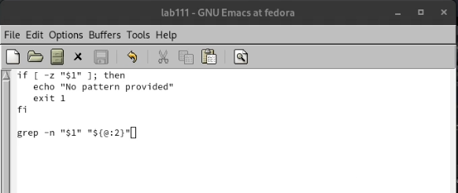
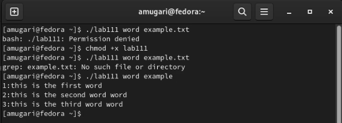
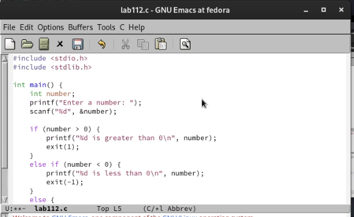
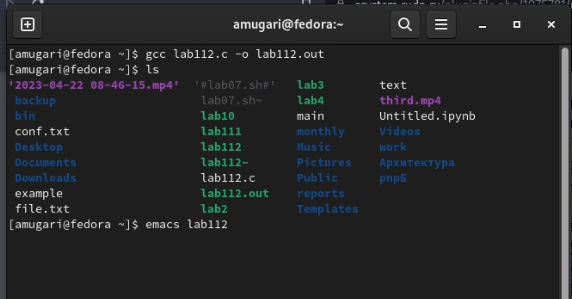
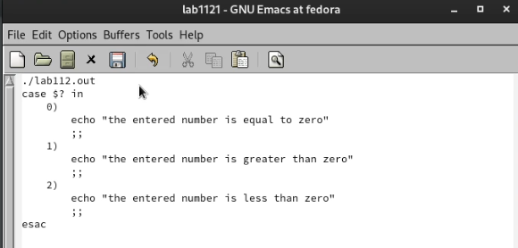
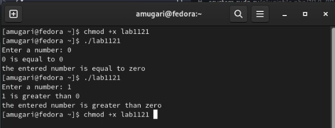
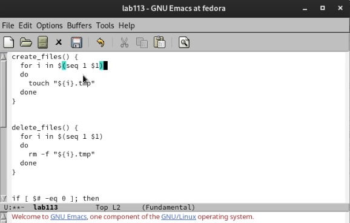
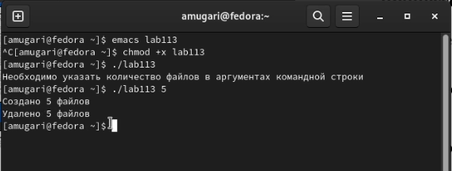
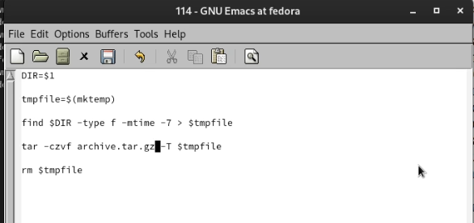
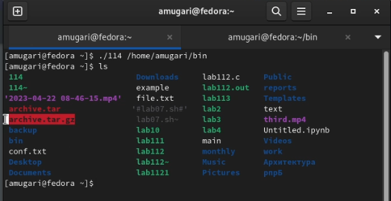

---
## Front matter
title: "Архитектура компьютеров и операционные системы | Операционные системы"
subtitle: "Лабораторная работа № 11. Программирование в командном процессоре ОС UNIX. Ветвления и циклы"
author: "Мугари Абдеррахим - НКАбд-03-22"

## Generic otions
lang: ru-RU
toc-title: "Содержание"

## Bibliography
bibliography: bib/cite.bib
csl: pandoc/csl/gost-r-7-0-5-2008-numeric.csl

## Pdf output format
toc: true # Table of contents
toc-depth: 2
lof: true # List of figures
lot: true # List of tables
fontsize: 12pt
linestretch: 1.5
papersize: a4
documentclass: scrreprt
## I18n polyglossia
polyglossia-lang:
  name: russian
  options:
	- spelling=modern
	- babelshorthands=true
polyglossia-otherlangs:
  name: english
## I18n babel
babel-lang: russian
babel-otherlangs: english
## Fonts
mainfont: PT Serif
romanfont: PT Serif
sansfont: PT Sans
monofont: PT Mono
mainfontoptions: Ligatures=TeX
romanfontoptions: Ligatures=TeX
sansfontoptions: Ligatures=TeX,Scale=MatchLowercase
monofontoptions: Scale=MatchLowercase,Scale=0.9
## Biblatex
biblatex: true
biblio-style: "gost-numeric"
biblatexoptions:
  - parentracker=true
  - backend=biber
  - hyperref=auto
  - language=auto
  - autolang=other*
  - citestyle=gost-numeric
## Pandoc-crossref LaTeX customization
figureTitle: "Рис."
tableTitle: "Таблица"
listingTitle: "Листинг"
lofTitle: "Список иллюстраций"
lotTitle: "Список таблиц"
lolTitle: "Листинги"
## Misc options
indent: true
header-includes:
  - \usepackage{indentfirst}
  - \usepackage{float} # keep figures where there are in the text
  - \floatplacement{figure}{H} # keep figures where there are in the text
---

# Цель работы

- Изучить основы программирования в оболочке ОС UNIX. Научится писать более сложные командные файлы с использованием логических управляющих конструкций и циклов.

# Выполнение лабораторной работы : 

- Прежде всего, я написал программу, которая ищет шаблон в файле и отображает каждую строку, содержащую его, с указанием ее номера (рис. @fig:001)

{#fig:001 width=70%}

- после этого мне пришлось изменить права доступа к файлу, содержащему код, и добавить к нему выполнение, и после этого я запустил код, и он заработал (рис. @fig:002)

{#fig:002 width=70%}

- затем здесь мне пришлось написать программу на C, которая вводит число и определяет, больше ли оно нуля, меньше нуля или равно нулю. Затем программа завершается с помощью функции exit(n), передавая информацию о коде завершения в

оболочку.(рис. @fig:003)

{#fig:003 width=70%}

- после написания кода колледжа мне пришлось скомпилировать его перед выполнением (рис. @fig:004)

{#fig:004 width=70%}

- затем я написал командный файл, который должен вызвать эту программу и, проанализировав ее с помощью команды **$?**, выдать сообщение о том, какое число было введено. (рис. @fig:005)

{#fig:005 width=70%}

- здесь я изменил право доступа к командному файлу, а затем выполнил его для вызова другой программы, написанной на C, где я протестировал три возможные ситуации, и это сработало (рис. @fig:006)

{#fig:006 width=70%}

- затем я написал код, который создает указанное количество файлов, пронумерованных последовательно от 1 до N. Количество файлов , которые должны быть созданы, передается в качестве аргументов командной строки. Один и тот же командный

файл должен иметь возможность удалять все созданные им файлы (если они существуют). (рис. @fig:007)

{#fig:007 width=70%}

- затем мне пришлось изменить права доступа к коду и выполнить программу, и все работало нормально (рис. @fig:008)

{#fig:008 width=70%}

- здесь я написал код, который использует команду **tar** для архивирования всех файлов в указанном каталоге. Меняем его таким образом, чтобы упаковывались только те файлы, которые были изменены менее недели назад (с помощью команды

find) (рис. @fig:009)

{#fig:009 width=70%}

- наконец, я изменил права доступа и выполнил файл, и все заработало, как и должно быть (рис. @fig:010)

{#fig:010 width=70%}

## Контрольные вопросы:

1. Команда getopts в UNIX-подобных операционных системах используется для анализа аргументов командной строки, переданных в скрипт. Она обрабатывает короткие опции, заданные после символа "-" и длинные опции, заданные после символа "--". 
2. Эта команда позволяет программисту легко определять и обрабатывать опции и аргументы, переданные в командной строке. Метасимволы в UNIX используются для генерации имен файлов и для манипуляции с файловой системой. Например, символ звездочки (*) используется для обозначения любого количества любых символов в имени файла, а символ вопросительного знака (?) используется для обозначения любого одного символа в имени файла.

3. Операторы управления действиями в UNIX-подобных системах включают в себя операторы условного выполнения (if, case), операторы циклов (for, while, until) и операторы перенаправления ввода-вывода (>, >>, <, <<).

4. Для прерывания цикла в UNIX используются операторы break и continue. Оператор break прерывает выполнение цикла и переходит к следующей инструкции после цикла, а оператор continue прерывает текущую итерацию цикла и переходит к следующей итерации.

5. Команда false возвращает ненулевое значение и используется для проверки скриптов на ошибки, а команда true возвращает нулевое значение и используется для явной инициализации переменных и для создания бесконечных циклов.

6. Данная строка проверяет наличие файла в директории man$s/ с именем, состоящим из переменной $i и переменной $s, и если файл существует, то скрипт продолжает выполнение.

7. Конструкция while выполняет цикл, пока условие истинно, а конструкция until выполняет цикл, пока условие ложно. То есть, пока условие в while истинно, цикл будет выполняться, а в until, пока условие ложно. Также, в while цикл будет выполняться, если условие истинно с самого начала, а в until - если условие ложно.

## выводы по результатам выполнения заданий:

- В ходе этой лабораторной работы у меня была возможность научиться программировать в операционной системе UNIX и приобрести практические навыки написания сложного кода с использованием логических управляющих структур и циклов.
  
# Выводы, согласованные с целью работы:

- Изучить основы программирования в оболочке ОС UNIX. Научится писать более сложные командные файлы с использованием логических управляющих конструкций и циклов.
