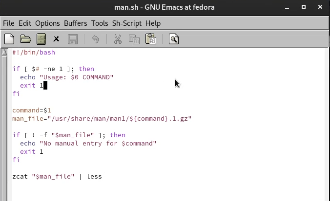

---
## Front matter
lang: ru-RU
title: Операционные системы
subtitle: Лабораторная работа № 12. Программирование в командном процессоре ОС UNIX. Расширенное программирование.
author:
  - Абдеррахим Мугари.
institute:
  - Российский университет дружбы народов, Москва, Россия
  
date: 29 апреля 2023

## i18n babel
babel-lang: russian
babel-otherlangs: english

## Formatting pdf
toc: false
toc-title: Содержание
slide_level: 2
aspectratio: 169
section-titles: true
theme: metropolis
header-includes:
 - \metroset{progressbar=frametitle,sectionpage=progressbar,numbering=fraction}
 - '\makeatletter'
 - '\beamer@ignorenonframefalse'
 - '\makeatother'
 
---

# Информация

## Докладчик

:::::::::::::: {.columns align=center}
::: {.column width="70%"}

  * Абдеррахим Мугари
  * Студент
  * Российский университет дружбы народов
  * [1032215692@pfur.ru](mailto:1032215692@pfur.ru)
  * <https://github.com/iragoum>

:::
::: {.column width="30%"}

:::
::::::::::::::

## Цель работы:

- Изучить основы программирования в оболочке ОС UNIX. Научиться писать более сложные командные файлы с использованием логических управляющих конструкций и циклов.

## Материалы и методы

- Терминал Unix.
- Файловая система.
- Текстовой редактор emacs .

## Ход работы:

## Написание первой программы:

- Здесь я написал файл bash, реализующий упрощенный механизм семафора. Командный файл должен некоторое время t1 ждать освобождения ресурса, выдавая сообщение об этом, и после ожидания его освобождения использовать его в течение некоторого времени t2<>t1, также предоставляя информацию о том, что ресурс используется соответствующим командным файлом (процессом)

## Написание первой программы:

{width=100%}

## выполнение первой программы

- Здесь я выполнил код первой программы, и она заработала так, как и должна была работать 

{#fig:002 width=55%}

## Написание второй программы

- После этого я написал скрипт bash, который использует содержимое map log /usr/share/man/man1. Он содержит архивы текстовых файлов, содержащих справку по большинству программ и команд, установленных в системе, а затем отображает справку по выбранной команде 

{width=40%}

## выполнение второй программы

- после этого я выполнил код скрипта, чтобы проверить справку команды cp, и он показал мне справку этой команды 

{ width=50%}

## Написание третьей программы]

- и, наконец, используя переменную **$random**, я написал программу, которая генерирует случайный латинский алфавит

{ width=55%}

## выполнение третьей программы

- а потом я выполнил программу, и все заработало

{width=70%}

## выводы по результатам выполнения заданий:

- В ходе этой лабораторной работы у меня была возможность научиться программировать в операционной системе UNIX и приобрести практические навыки написания сложного кода с использованием логических управляющих структур и циклов.
  
# Выводы, согласованные с целью работы:

- Изучить основы программирования в оболочке ОС UNIX. Научится писать более сложные командные файлы с использованием логических управляющих конструкций и циклов.
