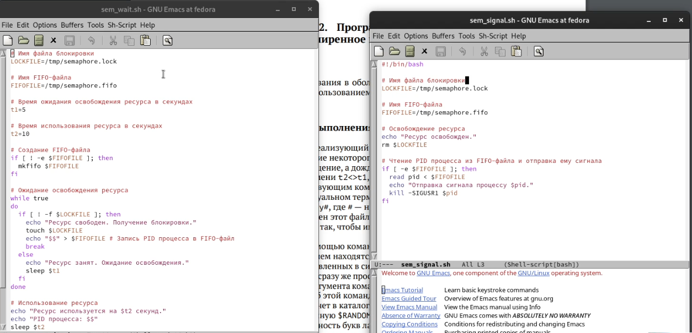
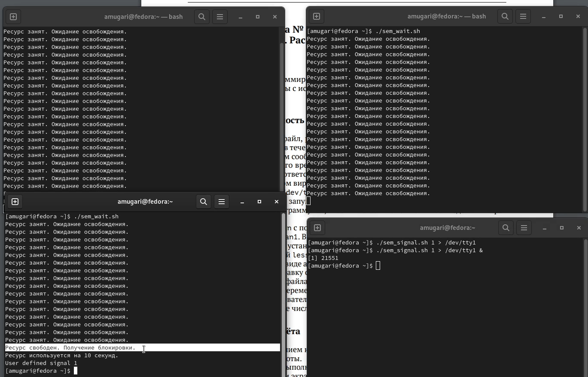
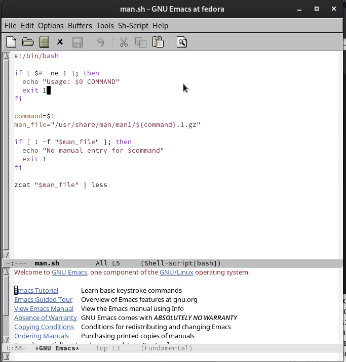
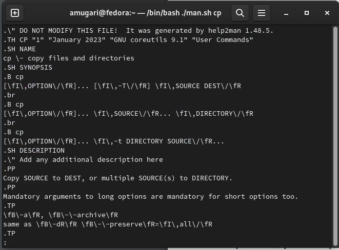
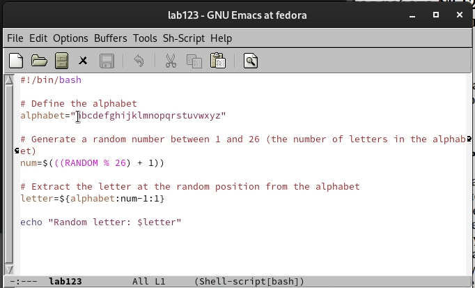
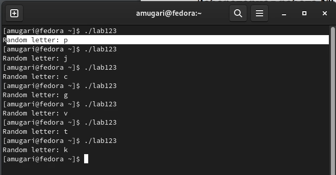

---
## Front matter
title: "Архитектура компьютеров и операционные системы | Операционные системы"
subtitle: "Лабораторная работа № 12. Программирование в командном процессоре ОС UNIX. Расширенное программирование"
author: "Мугари Абдеррахим - НКАбд-03-22"

## Generic otions
lang: ru-RU
toc-title: "Содержание"

## Bibliography
bibliography: bib/cite.bib
csl: pandoc/csl/gost-r-7-0-5-2008-numeric.csl

## Pdf output format
toc: true # Table of contents
toc-depth: 2
lof: true # List of figures
lot: true # List of tables
fontsize: 12pt
linestretch: 1.5
papersize: a4
documentclass: scrreprt
## I18n polyglossia
polyglossia-lang:
  name: russian
  options:
	- spelling=modern
	- babelshorthands=true
polyglossia-otherlangs:
  name: english
## I18n babel
babel-lang: russian
babel-otherlangs: english
## Fonts
mainfont: PT Serif
romanfont: PT Serif
sansfont: PT Sans
monofont: PT Mono
mainfontoptions: Ligatures=TeX
romanfontoptions: Ligatures=TeX
sansfontoptions: Ligatures=TeX,Scale=MatchLowercase
monofontoptions: Scale=MatchLowercase,Scale=0.9
## Biblatex
biblatex: true
biblio-style: "gost-numeric"
biblatexoptions:
  - parentracker=true
  - backend=biber
  - hyperref=auto
  - language=auto
  - autolang=other*
  - citestyle=gost-numeric
## Pandoc-crossref LaTeX customization
figureTitle: "Рис."
tableTitle: "Таблица"
listingTitle: "Листинг"
lofTitle: "Список иллюстраций"
lotTitle: "Список таблиц"
lolTitle: "Листинги"
## Misc options
indent: true
header-includes:
  - \usepackage{indentfirst}
  - \usepackage{float} # keep figures where there are in the text
  - \floatplacement{figure}{H} # keep figures where there are in the text
---

# Цель работы

- Изучить основы программирования в оболочке ОС UNIX. Научиться писать более сложные командные файлы с использованием логических управляющих конструкций и циклов.

# Выполнение лабораторной работы : 

- Здесь я написал файл bash, реализующий упрощенный механизм семафора. Командный файл должен некоторое время t1 ждать освобождения ресурса, выдавая сообщение об этом, и после ожидания его освобождения использовать его в течение некоторого времени t2<>t1, также предоставляя информацию о том, что ресурс используется соответствующим командным файлом (процессом) (рис. @fig:001)

{#fig:001 width=100%}

- Здесь я выполнил код первой программы, и она заработала так, как и должна была работать (рис. @fig:002)

{#fig:002 width=100%}

- После этого я написал скрипт bash, который использует содержимое map log /usr/share/man/man1. Он содержит архивы текстовых файлов, содержащих справку по большинству программ и команд, установленных в системе, а затем отображает справку по выбранной команде (рис. @fig:003)

{#fig:003 width=70%}

- после этого я выполнил код скрипта, чтобы проверить справку команды cp, и он показал мне справку этой команды (рис. @fig:004)

{#fig:004 width=70%}

- и, наконец, используя переменную **$random**, я написал программу, которая генерирует случайный латинский алфавит (рис. @fig:005)

{#fig:005 width=70%}

- а потом я выполнил программу, и все заработало (рис. @fig:006)

{#fig:006 width=70%}

## Контрольные вопросы:

1. Синтаксическая ошибка в строке: необходимо заключить $1 в двойные кавычки, чтобы избежать проблем с пробелами в аргументах. Также необходимо добавить скобки вокруг условия: while [ "$1" != "exit" ]

2. Для объединения нескольких строк в одну можно использовать оператор конкатенации . (точка) или просто перенос строки с использованием обратного слеша \.

3. Утилита seq предназначена для генерации последовательностей чисел. Она принимает три аргумента: начальное значение, конечное значение и шаг. Можно реализовать аналогичный функционал с помощью цикла for или while в bash.

4. Результат вычисления выражения $((10/3)) будет равен 3. При делении целых чисел результат округляется в меньшую сторону.

5. Bash и zsh - это обе командные оболочки Unix. Основные отличия между ними заключаются в том, что zsh предоставляет больше возможностей для автодополнения, расширенную подсветку синтаксиса и более продвинутые возможности встроенного языка программирования.

6. Синтаксис данной конструкции верен. Это цикл for, который использует арифметическое выражение для задания начального значения, условия продолжения цикла и шага.

7. Bash - это язык сценариев оболочки Unix. Он имеет синтаксис, похожий на язык программирования C, и предназначен для автоматизации задач командной строки. Он удобен для написания скриптов для автоматизации рутинных задач и не требует специальных знаний программирования. Преимущества bash включают простоту использования, мощные возможности текстовой обработки и доступность на большинстве Unix-подобных систем. Недостатки bash включают ограниченные возможности встроенного языка программирования и ограниченную поддержку многопоточности. В сравнении с другими языками программирования, такими как Python или Ruby, bash не так мощен и не предоставляет таких возможностей для разработки крупномасштабных приложений.

## выводы по результатам выполнения заданий:

- В ходе этой лабораторной работы у меня была возможность научиться программировать в операционной системе UNIX и приобрести практические навыки написания сложного кода с использованием логических управляющих структур и циклов.
  
# Выводы, согласованные с целью работы:

- Изучить основы программирования в оболочке ОС UNIX. Научиться писать более сложные командные файлы с использованием логических управляющих конструкций и циклов.

