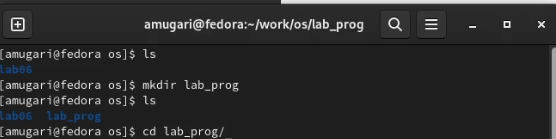
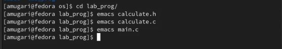
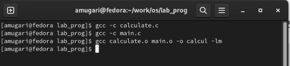
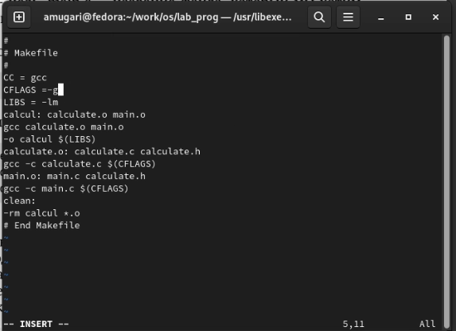
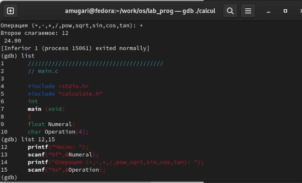
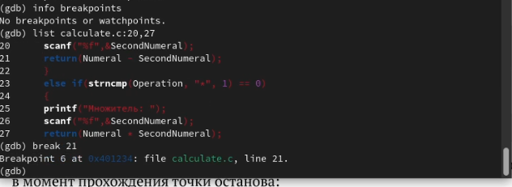
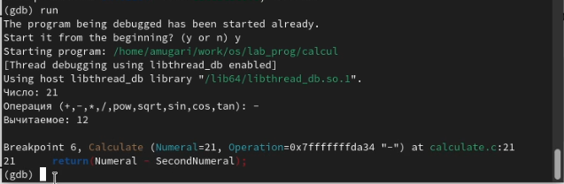
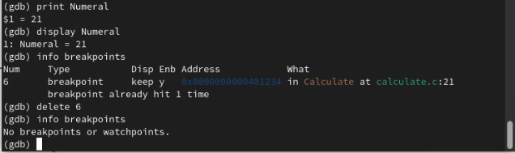
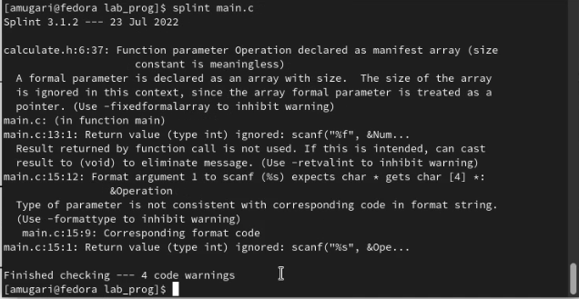

---
## Front matter
lang: ru-RU
title: Операционные системы
subtitle: Лабораторная работа № 13. Средства, применяемые при разработке программного обеспечения в ОС типа UNIX/Linux.
author:
  - Абдеррахим Мугари.
institute:
  - Российский университет дружбы народов, Москва, Россия
  
date: 7 мая 2023

## i18n babel
babel-lang: russian
babel-otherlangs: english

## Formatting pdf
toc: false
toc-title: Содержание
slide_level: 2
aspectratio: 169
section-titles: true
theme: metropolis
header-includes:
 - \metroset{progressbar=frametitle,sectionpage=progressbar,numbering=fraction}
 - '\makeatletter'
 - '\beamer@ignorenonframefalse'
 - '\makeatother'
 
---

# Информация

## Докладчик

:::::::::::::: {.columns align=center}
::: {.column width="70%"}

  * Абдеррахим Мугари
  * Студент
  * Российский университет дружбы народов
  * [1032215692@pfur.ru](mailto:1032215692@pfur.ru)
  * <https://github.com/iragoum>

:::
::: {.column width="30%"}

:::
::::::::::::::

## Цель работы:

- Приобрести простейшие навыки разработки, анализа, тестирования и отладки приложений в ОС типа UNIX/Linux на примере создания на языке программирования С калькулятора с простейшими функциями.

## Материалы и методы

- Терминал Unix.
- Файловая система.
- Текстовой редактор emacs .
- vi редактор

## Ход работы:

## создание подкаталога: 

- Сначала в домашнем каталоге я создал подкаталог *~/work/os/lab_prog* 

{width=70%}

## создание файлов программы:

- затем я создал в нем три файла: **calculate.h, calculate.c, main.c** и поместил в них код

{width=70%}

## компиляция файлов :

- затем я скомпилировал программу, используя gcc

{width=70%}

## Cоздание Makefile

- затем я создал **Makefile** и добавил его скрипт

{width=40%}

## запуск программы и управление кодом : 

- после этого я запустил программу и отобразил заголовок **main.c**, а также отобразил строки между 12 и 15 из **main.c**

## запуск программы и управление кодом : 

{width=70%}

## добавление точки останова :

- затем я проверил, что в файле calculate.c нет точек остановки, а затем добавил точку остановкм в строку **21**

{width=70%}

## проверка функционирования точки останова : 

- после этого я повторно запустил файл и убедился, что программа остановится на 21 строке, и это сработало

{ width=70%}

## проверка значения операнда :

- после этого я проверил правильность значения первого операнда этой операции

{width=70%}

## роанализировать коды файлов calculate.c и main.c :

- наконец, используя утилиту splint, попытался проанализировать коды файлов calculate.c
и main.c. 

{#fig:009 width=70%}

## роанализировать коды файлов calculate.c и main.c :

{#fig:010 width=70%}

## выводы по результатам выполнения заданий:

-  Приобрести простейшие навыки разработки, анализа, тестирования и отладки приложений в ОС типа UNIX/Linux на примере создания на языке программирования С калькулятора с простейшими функциями.
  
# Выводы, согласованные с целью работы:

- Приобрести простейшие навыки разработки, анализа, тестирования и отладки приложений в ОС типа UNIX/Linux на примере создания на языке программирования С калькулятора с простейшими функциями.
