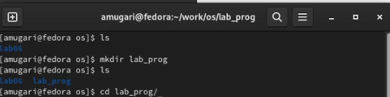
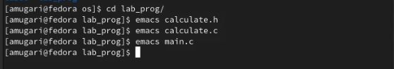
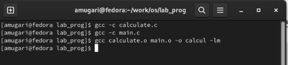
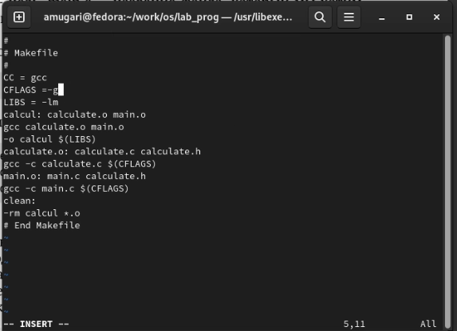
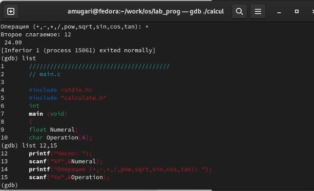
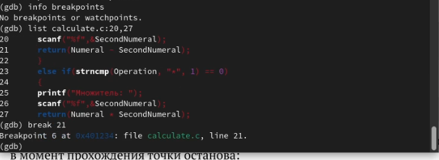
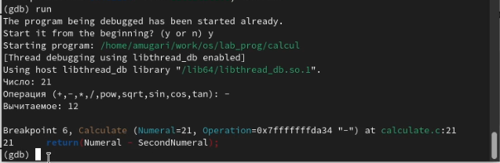
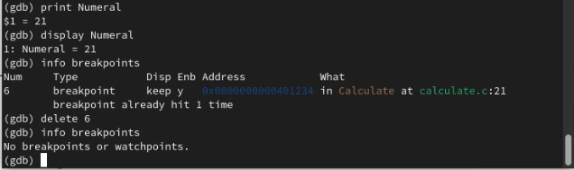
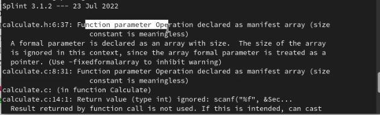
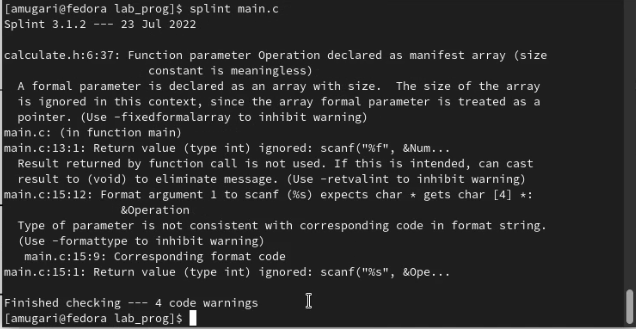

---
## Front matter
title: "Архитектура компьютеров и операционные системы | Операционные системы"
subtitle: "Лабораторная работа № 13. редства, применяемые при разработке программного обеспечения в ОС типа UNIX/Linux"
author: "Мугари Абдеррахим - НКАбд-03-22"

## Generic otions
lang: ru-RU
toc-title: "Содержание"

## Bibliography
bibliography: bib/cite.bib
csl: pandoc/csl/gost-r-7-0-5-2008-numeric.csl

## Pdf output format
toc: true # Table of contents
toc-depth: 2
lof: true # List of figures
lot: true # List of tables
fontsize: 12pt
linestretch: 1.5
papersize: a4
documentclass: scrreprt
## I18n polyglossia
polyglossia-lang:
  name: russian
  options:
	- spelling=modern
	- babelshorthands=true
polyglossia-otherlangs:
  name: english
## I18n babel
babel-lang: russian
babel-otherlangs: english
## Fonts
mainfont: PT Serif
romanfont: PT Serif
sansfont: PT Sans
monofont: PT Mono
mainfontoptions: Ligatures=TeX
romanfontoptions: Ligatures=TeX
sansfontoptions: Ligatures=TeX,Scale=MatchLowercase
monofontoptions: Scale=MatchLowercase,Scale=0.9
## Biblatex
biblatex: true
biblio-style: "gost-numeric"
biblatexoptions:
  - parentracker=true
  - backend=biber
  - hyperref=auto
  - language=auto
  - autolang=other*
  - citestyle=gost-numeric
## Pandoc-crossref LaTeX customization
figureTitle: "Рис."
tableTitle: "Таблица"
listingTitle: "Листинг"
lofTitle: "Список иллюстраций"
lotTitle: "Список таблиц"
lolTitle: "Листинги"
## Misc options
indent: true
header-includes:
  - \usepackage{indentfirst}
  - \usepackage{float} # keep figures where there are in the text
  - \floatplacement{figure}{H} # keep figures where there are in the text
---

# Цель работы

- Приобрести простейшие навыки разработки, анализа, тестирования и отладки приложений в ОС типа UNIX/Linux на примере создания на языке программирования С калькулятора с простейшими функциями.

# Выполнение лабораторной работы : 

- Сначала в домашнем каталоге я создал подкаталог *~/work/os/lab_prog* (рис. @fig:001)

{#fig:001 width=70%}

- затем я создал в нем три файла: **calculate.h, calculate.c, main.c** и поместил в них код (рис. @fig:002)

{#fig:002 width=70%}

- затем я скомпилировал программу, используя gcc  (рис. @fig:003)

{#fig:003 width=70%}

- затем я создал **Makefile** и добавил его скрипт (рис. @fig:004)

{#fig:004 width=70%}

- после этого я запустил программу и отобразил заголовок **main.c**, а также отобразил строки между 12 и 15 из **main.c** (рис. @fig:005)

{#fig:005 width=70%}

- затем я проверил, что в файле calculate.c нет точек остановки, а затем добавил точку остановкм в строку **21** (рис. @fig:006)

{#fig:006 width=70%}

- после этого я повторно запустил файл и убедился, что программа остановится на 21 строке, и это сработало (рис. @fig:007)

{#fig:007 width=70%}

- после этого я проверил правильность значения первого операнда этой операции (рис. @fig:008)

{#fig:008 width=70%}

- наконец, используя утилиту splint, попытался проанализировать коды файлов calculate.c
и main.c. (рис. @fig:009) (рис. @fig:010)

{#fig:009 width=70%}

{#fig:010 width=70%}

## Контрольные вопросы:

## выводы по результатам выполнения заданий:

- Приобрести простейшие навыки разработки, анализа, тестирования и отладки приложений в ОС типа UNIX/Linux на примере создания на языке программирования С калькулятора с простейшими функциями.
  
# Выводы, согласованные с целью работы:

- Приобрести простейшие навыки разработки, анализа, тестирования и отладки приложений в ОС типа UNIX/Linux на примере создания на языке программирования С калькулятора с простейшими функциями.

