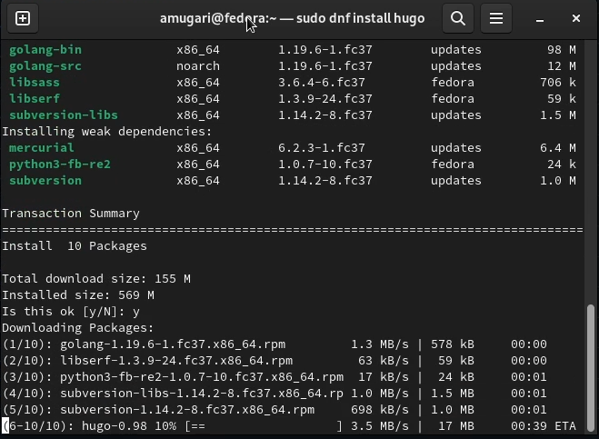
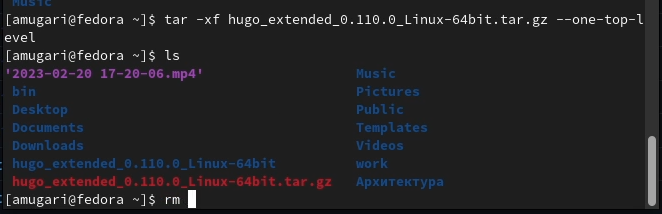
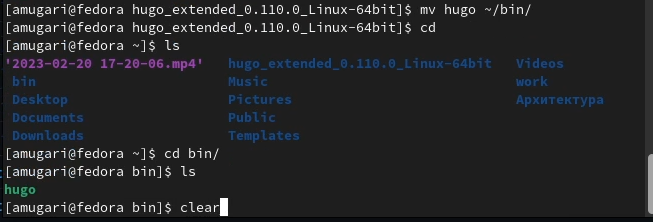

---
## Front matter
title: "Архитектура компьютеров и операционные системы. Раздел | Операционные системы"
subtitle: "Индивидуальный проект | Этап 1"
author: "Мугари Абдеррахим | НКАбд-03-22"

## Generic otions
lang: ru-RU
toc-title: "Содержание"

## Bibliography
bibliography: bib/cite.bib
csl: pandoc/csl/gost-r-7-0-5-2008-numeric.csl

## Pdf output format
toc: true # Table of contents
toc-depth: 2
lof: true # List of figures
lot: true # List of tables
fontsize: 12pt
linestretch: 1.5
papersize: a4
documentclass: scrreprt
## I18n polyglossia
polyglossia-lang:
  name: russian
  options:
	- spelling=modern
	- babelshorthands=true
polyglossia-otherlangs:
  name: english
## I18n babel
babel-lang: russian
babel-otherlangs: english
## Fonts
mainfont: PT Serif
romanfont: PT Serif
sansfont: PT Sans
monofont: PT Mono
mainfontoptions: Ligatures=TeX
romanfontoptions: Ligatures=TeX
sansfontoptions: Ligatures=TeX,Scale=MatchLowercase
monofontoptions: Scale=MatchLowercase,Scale=0.9
## Biblatex
biblatex: true
biblio-style: "gost-numeric"
biblatexoptions:
  - parentracker=true
  - backend=biber
  - hyperref=auto
  - language=auto
  - autolang=other*
  - citestyle=gost-numeric
## Pandoc-crossref LaTeX customization
figureTitle: "Рис."
tableTitle: "Таблица"
listingTitle: "Листинг"
lofTitle: "Список иллюстраций"
lotTitle: "Список таблиц"
lolTitle: "Листинги"
## Misc options
indent: true
header-includes:
  - \usepackage{indentfirst}
  - \usepackage{float} # keep figures where there are in the text
  - \floatplacement{figure}{H} # keep figures where there are in the text
---

# Цель работы

- Размещение заготовки для личного веб-сайта на страницах Github с помощью **Hugo go**.

# Задание

* Установить необходимое программное обеспечение.
* Скачать шаблон темы сайта.
* Разместить его на хостинге git.
* Подключение репозитория к вложенной папке.

# Выполнение лабораторной работы

## Установить необходимое программное обеспечение:

- На этом шаге мы должны были загрузить **Hugo go** в нашу систему с помощью **dnf** (рис. @fig:001).

{#fig:001 width=70%}

- Затем мы также должны были загрузить его расширения с github (рис. @fig:002).

{#fig:002 width=70%}

- после этого нам пришлось извлечь файлы загрузки с github и удалить архив после извлечения (рис. @fig:003).

{#fig:003 width=70%}

- Затем мы создали папку **bin** в каталоге *~/home/bin* после этого мы переместили файл **hugo** в эту папку (рис. @fig:004).

{#fig:004 width=70%}

##  Скачать шаблон темы сайта :

- на этом шаге мы создали новый репозиторий, используя шаблон с открытым исходным кодом **starter-hugo-academic**, чтобы получить необходимые настройки для нашего сайта.Мы назвали репозиторий **Portfolio** (рис. @fig:005).

{#fig:005 width=70%}

- После этого мы клонировали вновь созданный репозиторий в ваш локальный репозиторий (рис. @fig:006).

{#fig:006 width=70%}

- Выполнив команду **~/bin/hugo**, мы смогли сгенерировать наш локальный веб-сайт (**на данный момент**)) (рис. @fig:007).

{#fig:007 width=70%}

- При создании вашего веб-сайта была создана новая папка **public**, но на данный момент она нам была не нужна, поэтому мы удалили ее через **mc** (рис. @fig:008).

{#fig:008 width=70%}

- после этого мы запустили аналогичную команду, просто добавив **server** в конце, чтобы это выглядело следующим образом **~/bin/hugo**, который запустил наш локальный сайт (рис. @fig:009).

{#fig:009 width=70%}

- У сайта был неприятный заголовок, и его пришлось удалить, поэтому нам пришлось удалить ответственный за него блок кода в файле index.md в пути **/content/index.md** (рис. @fig:010) (рис. @fig:011)

{#fig:010 width=70%}

{#fig:011 width=70%}

- После этого результат стал таким, как показано на (рис. @fig:012)

{#fig:012 width=70%}

## Разместить сайт на хостинге git:

- После этого, чтобы сделать сайт общедоступным, нам пришлось разместить его на github, и именно поэтому нам пришлось создать другой репозиторий с именем **iragoum.github.io** (рис. @fig:013)

{#fig:013 width=70%}

- Затем нам пришлось клонировать репозиторий в нашем локальном репозитории (рис. @fig:014).

{#fig:014 width=70%}

- После этого нам пришлось создать новую ветку **main** во вновь созданном репозитории (рис. @fig:015)

{#fig:015 width=70%}

- После этого мы создали новый файл **README.md ** и поместили его в наш новый репозиторий, и мы убедились, что он был отправлен в ветку **main** (рис. @fig:016)

{#fig:016 width=70%}

- После обновления страницы репозитория мы смогли увидеть ветку **main** и файл, который мы поместили в нее (рис. @fig:017)

{#fig:017 width=70%}

## Подключение репозитория к вложенной папке: 

- мы создали общедоступный подмодуль в папке блога **public** (рис. @fig:018)

{#fig:018 width=70%}

- И затем мы обнаружили, что папка public была проигнорирована и не может быть видна, поэтому нам пришлось отключить это, отредактировав файл **.gitignore** (рис. @fig:019)

{#fig:019 width=70%}

- После этого были сгенерированы сгенерированный сайт еще раз, на этот раз он общедоступный, используя команду **~/bin/hugo** (рис. @fig:020)

{#fig:020 width=70%}

- когда мы проверили, что все находится в правильном репозитории, и добавили все изменения, которые будут помещены в репозиторий (рис. @fig:021)

{#fig:021 width=70%}

- И, наконец, мы перенесли все файлы и внесенные изменения в ветку **main** (рис. @fig:022)

{#fig:022 width=70%}

# Выводы первого этапа индивидуальной работы:

- На первом этапе этого проекта мы узнали, как установить программное обеспечение **Hugo go** и загрузить шаблон темы веб-сайта с **github**, разместить его на github,разместить на хостинге и подключить репозиторий к подпапке.
