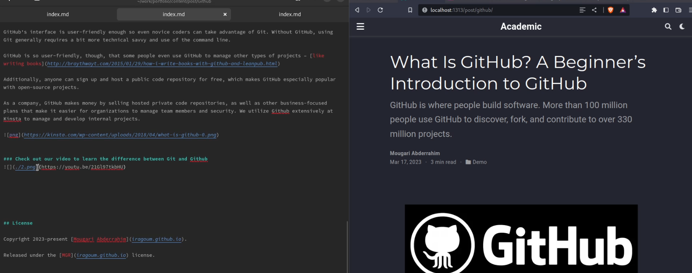

---
## Front matter
lang: ru-RU
title: Операционные системы
subtitle: Индивидуальный проект | Этап 2
author:
  - Абдеррахим Мугари.
institute:
  - Российский университет дружбы народов, Москва, Россия
date: 18 марта 2023

## i18n babel
babel-lang: russian
babel-otherlangs: english

## Formatting pdf
toc: false
toc-title: Содержание
slide_level: 2
aspectratio: 169
section-titles: true
theme: metropolis
header-includes:
 - \metroset{progressbar=frametitle,sectionpage=progressbar,numbering=fraction}
 - '\makeatletter'
 - '\beamer@ignorenonframefalse'
 - '\makeatother'
---

# Информация

## Докладчик

:::::::::::::: {.columns align=center}
::: {.column width="70%"}

  * Абдеррахим Мугари
  * Студент
  * Российский университет дружбы народов
  * [1032215692@pfur.ru](mailto:1032215692@pfur.ru)
  * <https://github.com/iragoum>

:::
::: {.column width="30%"}

:::
::::::::::::::

# Цель работы

- Целью второго раздела индивидуального проекта является добавление данных о себе на сайт.

# Материалы и методы

- Hugo go.
- Github
- Google chrome.

# Ход работы:

## Размещение фотографии владельца сайта:

- На этом шаге я опубликовал свою фотографию на сайте, и это было сделано путем перемещения моей фотографии в файл */portfolio/content/authors/admin*.

{width=70%}

## Размещение краткого описания о владельце сайта:

- После этого я опубликовал краткое описание о владельце сайта.

{#fig:002 width=90%}

## 

- И вот предварительный просмотр двух модификаций, которые я сделал на сайте.

{width=70%}

## Добавление интересов владельца сайта:

3. На этом шаге я добавил информацию об интересах владельца.

{width=70%}

## Добавление информации об образовании  владельца сайта

4. После этого я добавил информацию об образовании владельца сайта.

{width=70%}

## Создание поста о мероприятиях прошлой недели:

5. Я создал пост о том, что я сделал на прошлой неделе

{width=100%}

## Публикация статьи, объясняющей **github**:

6. затем я опубликовал пост о **Github**

{width=100%}

## Создание общедоступной версии сайта:

7. наконец, я сгенерировал сайт, используя **Hugo**

{width=50%}

# Выводы второго этапа индивидуального проэкта:

- В этом втором разделе индивидуального проекта мы узнали, как вносить изменения на сайт, как изменять личную информацию и как размещать статьи
