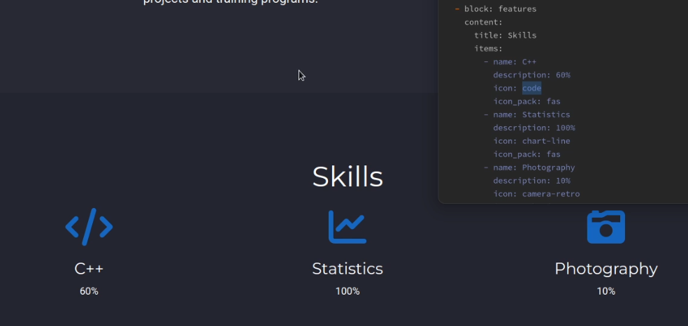
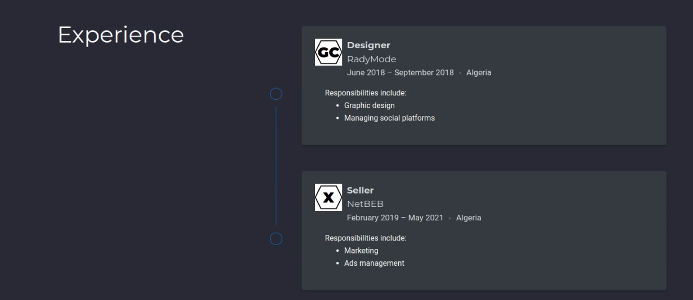
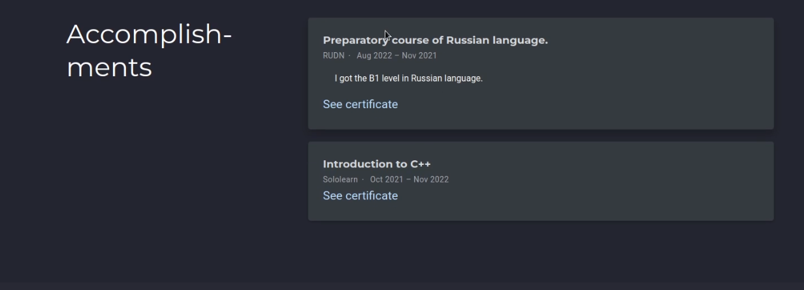
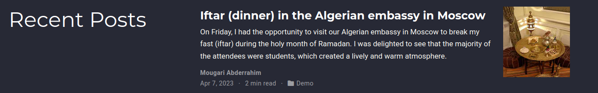
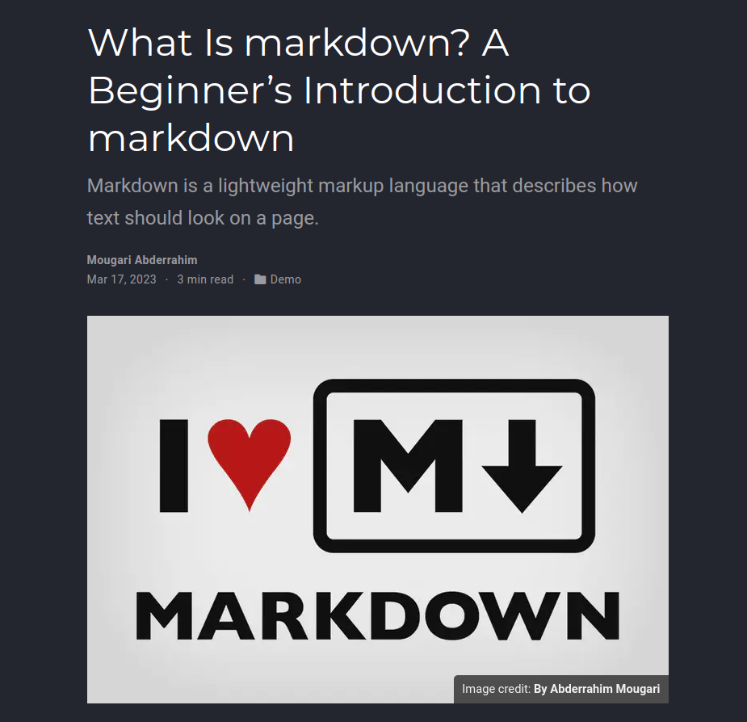
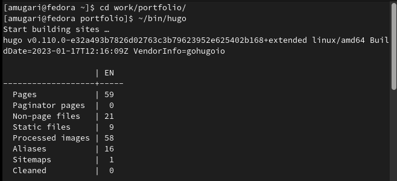
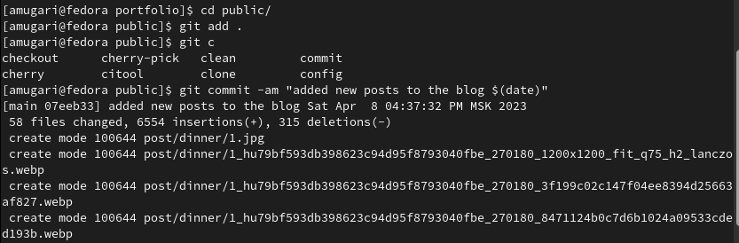

---
## Front matter
lang: ru-RU
title: Операционные системы
subtitle: Индивидуальный проект | Этап 3
author:
  - Абдеррахим Мугари.
institute:
  - Российский университет дружбы народов, Москва, Россия
date: 18 марта 2023

## i18n babel
babel-lang: russian
babel-otherlangs: english

## Formatting pdf
toc: false
toc-title: Содержание
slide_level: 2
aspectratio: 169
section-titles: true
theme: metropolis
header-includes:
 - \metroset{progressbar=frametitle,sectionpage=progressbar,numbering=fraction}
 - '\makeatletter'
 - '\beamer@ignorenonframefalse'
 - '\makeatother'
---

# Информация

## Докладчик

:::::::::::::: {.columns align=center}
::: {.column width="70%"}

  * Абдеррахим Мугари
  * Студент
  * Российский университет дружбы народов
  * [1032215692@pfur.ru](mailto:1032215692@pfur.ru)
  * <https://github.com/iragoum>

:::
::: {.column width="30%"}

:::
::::::::::::::

# Цель работы

- Целью третьего раздела индивидуального проекта является добавление достижений к сайту.

# Материалы и методы

- Hugo go.
- Github
- Google chrome.

# Ход работы:

## добавление навыков в блог:

- Прежде всего, мне нужно было добавить навыки в свое портфолио, поэтому я пошел по этому пути : */home/amugari/work/portfolio/content/*, затем я открыл файл **index.md** и начал добавлять навыки в блог.

{width=70%}

## Заполнение раздела "experience" данными:

- ниже по блоку навыков есть еще один блок для опыта, и я начал заполнять его опытом работы, который у меня был в Алжире

{width=90%}

## добавление достижений на сайт:

- затем я добавил на сайт свои достижения

{width=70%}

## Создание поста о мероприятиях прошлой недели:

- Я создал пост о том, что я сделал на прошлой неделе

{width=100%}

## добавление еще одного поста, объясняющего markdown:

- и, наконец, я добавил на сайт еще один пост, объясняющий **markdown**

{width=40%}

## генерация сайта с помощью hugo:

- наконец, я сгенерировал сайт, используя **Hugo** 

{#fig:006 width=70%}

## генерация сайта с помощью hugoю

{#fig:007 width=70%}

# Выводы третьего этапа индивидуального проэкта:

- В этом третьем разделе индивидуального проекта мы добавили данные о наших навыках, опыте и достижениях и опубликовали два поста одновременно.
