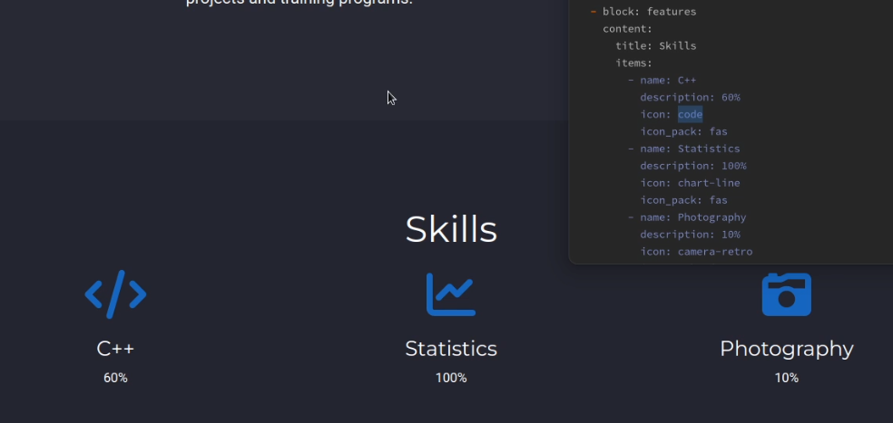
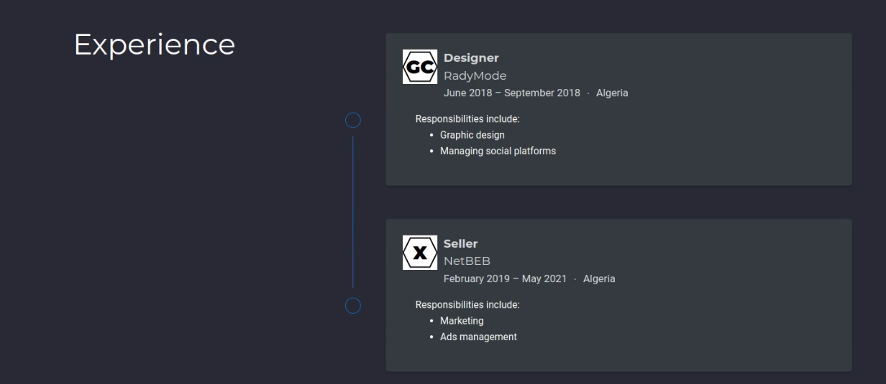
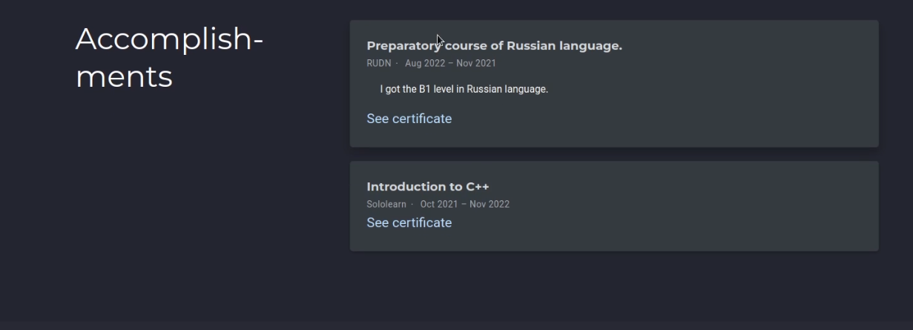
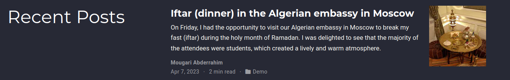
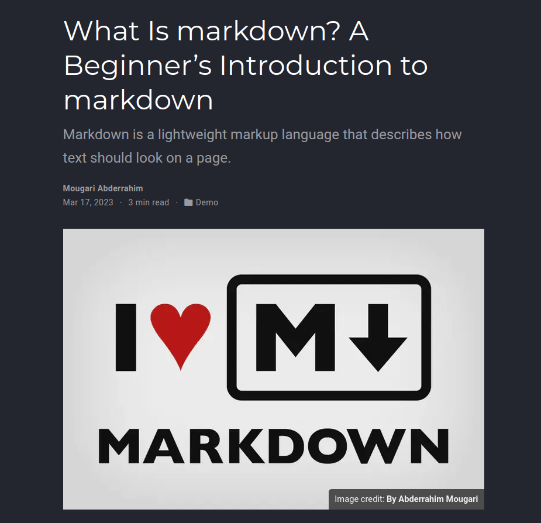
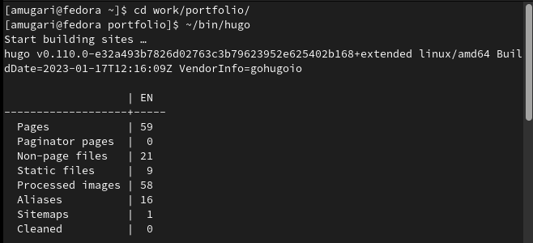
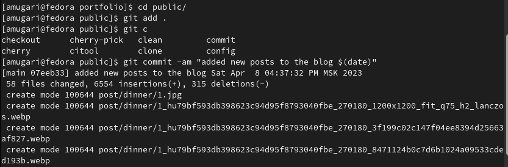

---
## Front matter
title: "Архитектура компьютеров и операционные системы. Раздел | Операционные системы"
subtitle: "Индивидуальный проект | Этап 3"
author: "Мугари Абдеррахим | НКАбд-03-22"

## Generic otions
lang: ru-RU
toc-title: "Содержание"

## Bibliography
bibliography: bib/cite.bib
csl: pandoc/csl/gost-r-7-0-5-2008-numeric.csl

## Pdf output format
toc: true # Table of contents
toc-depth: 2
lof: true # List of figures
lot: true # List of tables
fontsize: 12pt
linestretch: 1.5
papersize: a4
documentclass: scrreprt
## I18n polyglossia
polyglossia-lang:
  name: russian
  options:
	- spelling=modern
	- babelshorthands=true
polyglossia-otherlangs:
  name: english
## I18n babel
babel-lang: russian
babel-otherlangs: english
## Fonts
mainfont: PT Serif
romanfont: PT Serif
sansfont: PT Sans
monofont: PT Mono
mainfontoptions: Ligatures=TeX
romanfontoptions: Ligatures=TeX
sansfontoptions: Ligatures=TeX,Scale=MatchLowercase
monofontoptions: Scale=MatchLowercase,Scale=0.9
## Biblatex
biblatex: true
biblio-style: "gost-numeric"
biblatexoptions:
  - parentracker=true
  - backend=biber
  - hyperref=auto
  - language=auto
  - autolang=other*
  - citestyle=gost-numeric
## Pandoc-crossref LaTeX customization
figureTitle: "Рис."
tableTitle: "Таблица"
listingTitle: "Листинг"
lofTitle: "Список иллюстраций"
lotTitle: "Список таблиц"
lolTitle: "Листинги"
## Misc options
indent: true
header-includes:
  - \usepackage{indentfirst}
  - \usepackage{float} # keep figures where there are in the text
  - \floatplacement{figure}{H} # keep figures where there are in the text
---

# Цель работы

- Целью третьего раздела индивидуального проекта является добавление достижений к сайту.

# Задание

- Добавить информацию о навыках (Skills).
- Добавить информацию об опыте (Experience).
- Добавить информацию о достижениях (Accomplishments).
- Сделать пост по прошедшей неделе.
- Добавить пост на тему по выбору:
- Язык разметки Markdown.

# Выполнение работы :

1. добавление навыков в блог:

- Прежде всего, мне нужно было добавить навыки в свое портфолио, поэтому я пошел по этому пути : */home/amugari/work/portfolio/content/*, затем я открыл файл **_index.md** и начал добавлять навыки в блог(рис. @fig:001)

{#fig:001 width=70%}

2. ниже по блоку навыков есть еще один блок для опыта, и я начал заполнять его опытом работы, который у меня был в Алжире (рис. @fig:002)

{#fig:002 width=90%}

3. затем я добавил на сайт свои достижения  (рис. @fig:003)

{#fig:003 width=70%}

4. На этом шаге я добавил пост о том, что я сделал за прошедшую неделю (рис. @fig:004)

{#fig:004 width=70%}

5. и, наконец, я добавил на сайт еще один пост, объясняющий **markdown** (рис. @fig:005)

{#fig:005 width=50%}

7. наконец, я сгенерировал сайт, используя **Hugo** (рис. @fig:006) (рис. @fig:007)

{#fig:006 width=70%}

{#fig:007 width=70%}

# Выводы третьего этапа индивидуального проэкта:

- В этом третьем разделе индивидуального проекта мы добавили данные о наших навыках, опыте и достижениях и опубликовали два поста одновременно.
