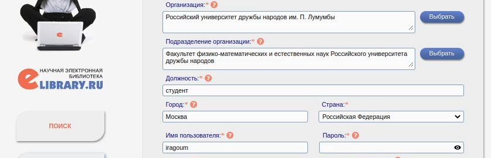
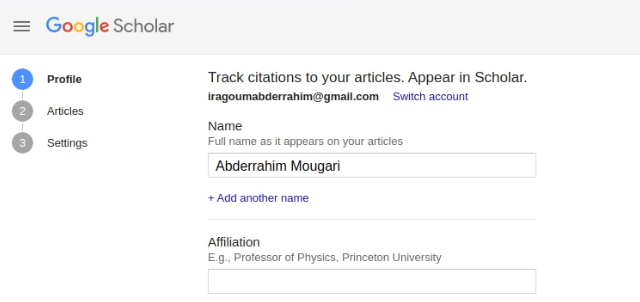
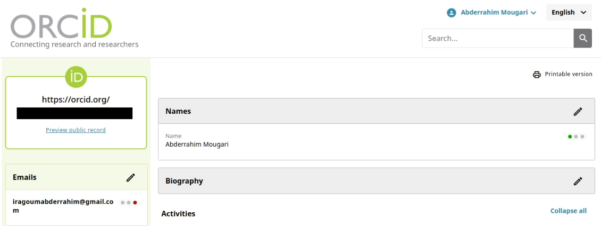
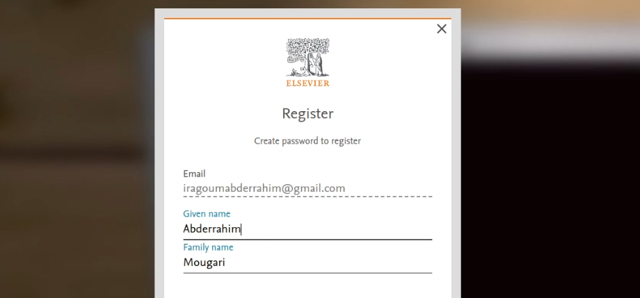
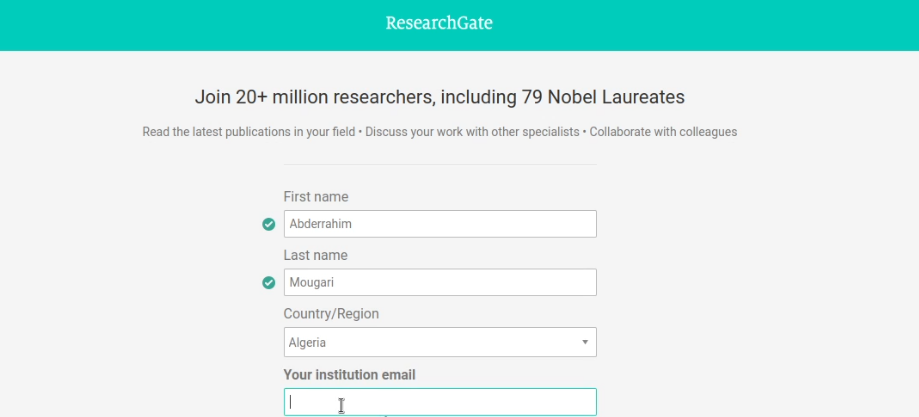
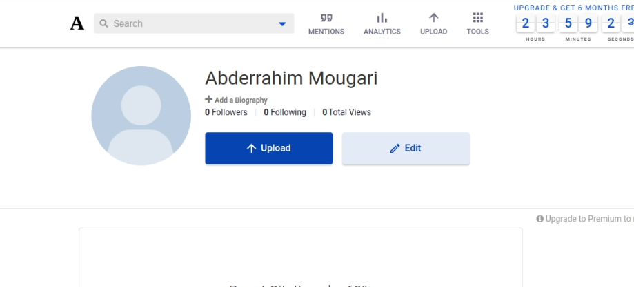
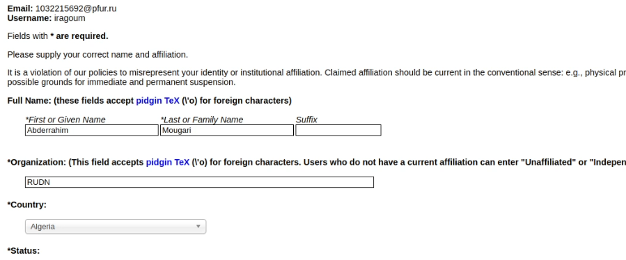
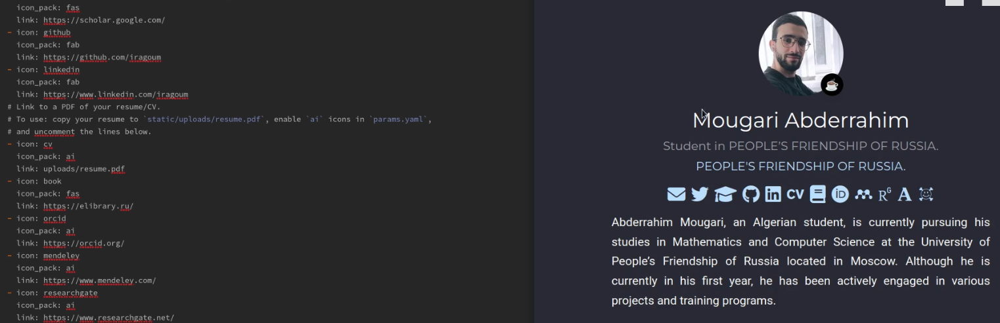
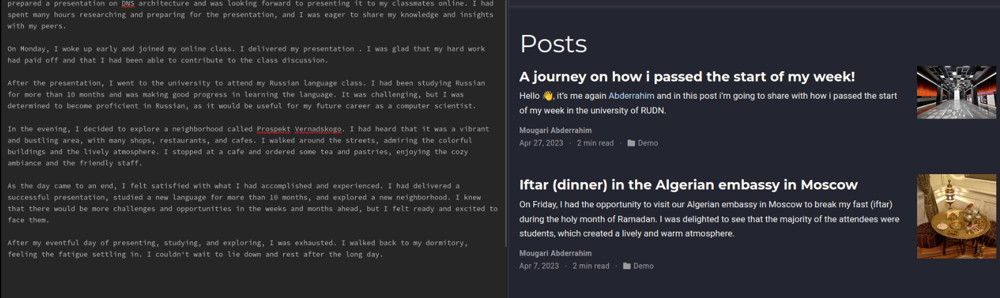
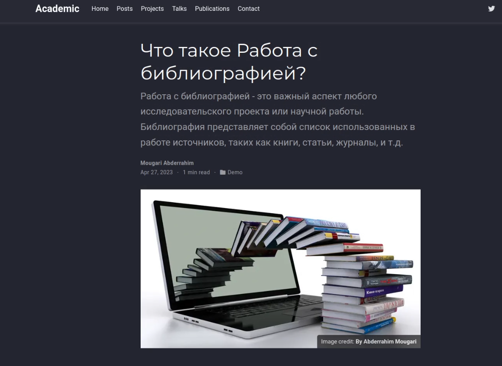

---
## Front matter
lang: ru-RU
title: Операционные системы
subtitle: Индивидуальный проект | Этап 4
author:
  - Абдеррахим Мугари.
institute:
  - Российский университет дружбы народов, Москва, Россия
date: 29 марта 2023

## i18n babel
babel-lang: russian
babel-otherlangs: english

## Formatting pdf
toc: false
toc-title: Содержание
slide_level: 2
aspectratio: 169
section-titles: true
theme: metropolis
header-includes:
 - \metroset{progressbar=frametitle,sectionpage=progressbar,numbering=fraction}
 - '\makeatletter'
 - '\beamer@ignorenonframefalse'
 - '\makeatother'
---

# Информация

## Докладчик

:::::::::::::: {.columns align=center}
::: {.column width="70%"}

  * Абдеррахим Мугари
  * Студент
  * Российский университет дружбы народов
  * [1032215692@pfur.ru](mailto:1032215692@pfur.ru)
  * <https://github.com/iragoum>

:::
::: {.column width="30%"}

:::
::::::::::::::

# Цель работы

- Целью четвертого раздела индивидуального проекта является добавление к сайту ссылки на научные и библиометрические ресурсы.

# Материалы и методы

- Hugo go.
- Github
- Google chrome.

# Ход работы:

# Зарегистрироваться на соответствующих ресурсах и разместить на них ссылки на сайте

## регистрация на сайте **elibrary**

- Первым шагом была регистрация на сайте**elibrary.ru**

{width=70%}

## регистрация на сайте **google scholar**

- Затем мне пришлось зарегистрироваться в **google scholar**

{width=70%}

## регистрация на сайте **ORCID**:

- я зарегистрировался на сайте **ORCID**

{ width=70%}

## регистрация на сайте **Mendely**

- Затем я зарегистрировался на сайте **Mendely**

{width=70%}

## регистрация на сайте **Researchgate**

- после этого я создал учетную запись на сайте **Researchgate**

{width=70%}

## регистрация на сайте **Academia.edu** и **arXiv**

- и, наконец, я открыл счет в обоих **Academia.edu ** и **arXiv**

{width=70%}

## регистрация на сайте **Academia.edu** и **arXiv**

{width=70%}

## регистрация на сайте **github.com**

- Не было необходимости открывать учетную запись в github, потому что она у меня уже была.

## Размещение ссылки на мои аккаунты на моем сайте

- После регистрации на всех сайтах я разместил ссылку на свои аккаунты на своем сайте

{ width=70%}

## создание поста за прошедшую неделю:

- здесь я написал пост о том, что я сделал на предыдущей неделе

{width=70%}

## добавление поста о работе с библиографией:

- здесь я написал пост о работе с библиографией.

{width=45%}

# Выводы четвертого этапа индивидуального проэкта:

- В этом четвертом разделе индивидуального проекта мы добавили к сайту ссылки на научные и библиометрические ресурсы.
