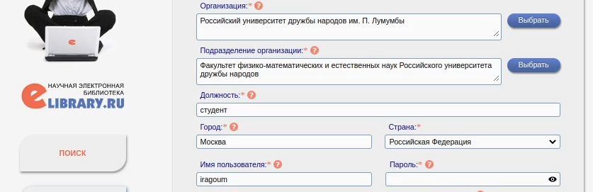
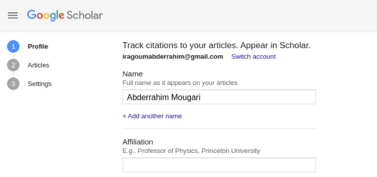
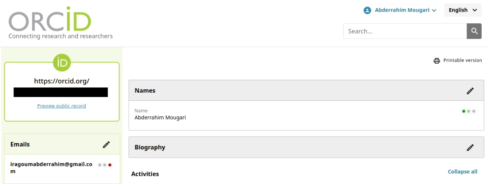
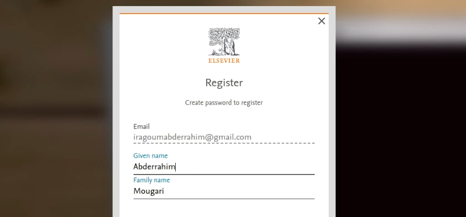
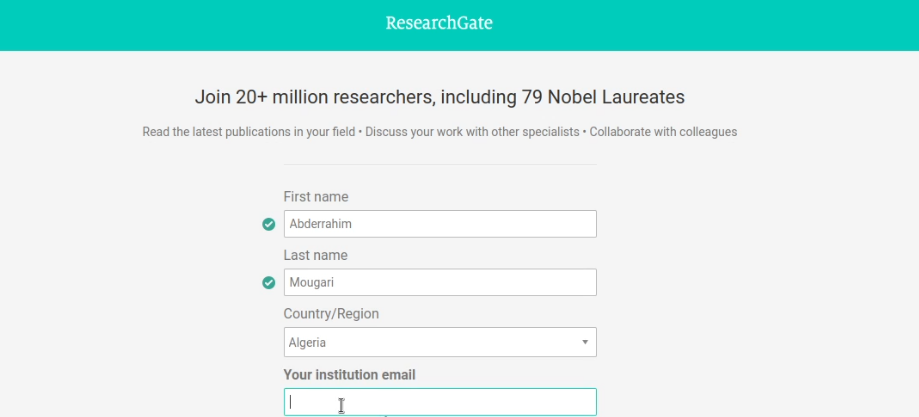
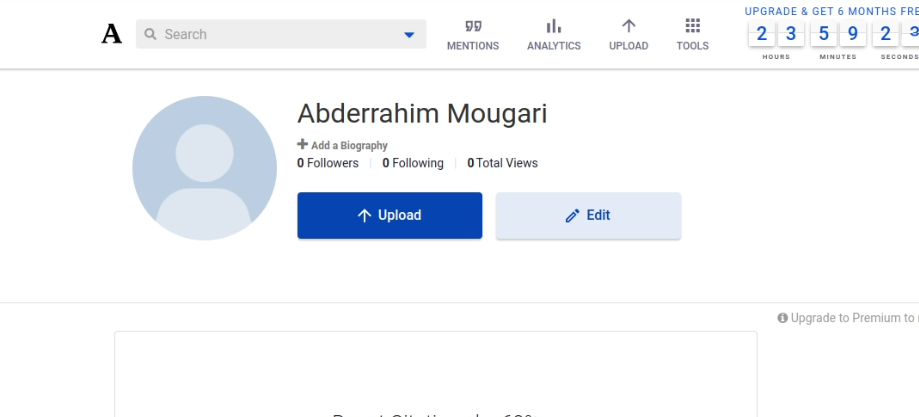
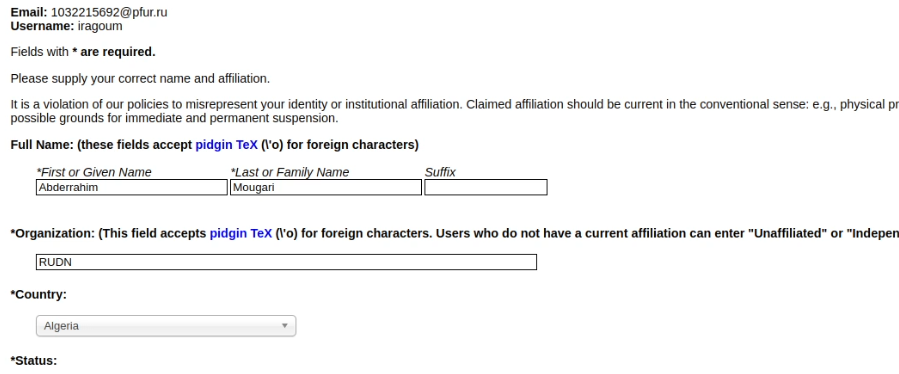
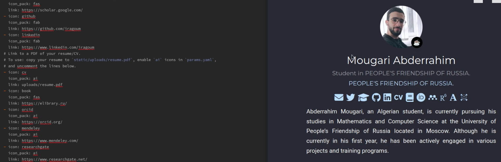
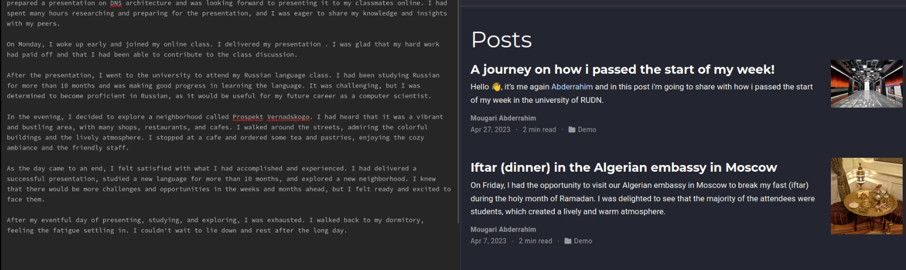
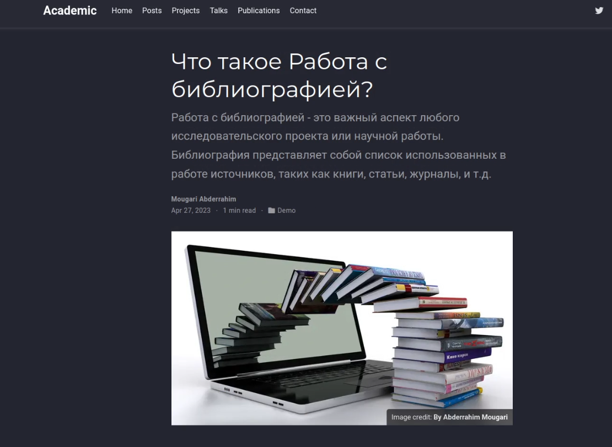

---
## Front matter
title: "Архитектура компьютеров и операционные системы. Раздел | Операционные системы"
subtitle: "Индивидуальный проект | Этап 4"
author: "Мугари Абдеррахим | НКАбд-03-22"

## Generic otions
lang: ru-RU
toc-title: "Содержание"

## Bibliography
bibliography: bib/cite.bib
csl: pandoc/csl/gost-r-7-0-5-2008-numeric.csl

## Pdf output format
toc: true # Table of contents
toc-depth: 2
lof: true # List of figures
lot: true # List of tables
fontsize: 12pt
linestretch: 1.5
papersize: a4
documentclass: scrreprt
## I18n polyglossia
polyglossia-lang:
  name: russian
  options:
	- spelling=modern
	- babelshorthands=true
polyglossia-otherlangs:
  name: english
## I18n babel
babel-lang: russian
babel-otherlangs: english
## Fonts
mainfont: PT Serif
romanfont: PT Serif
sansfont: PT Sans
monofont: PT Mono
mainfontoptions: Ligatures=TeX
romanfontoptions: Ligatures=TeX
sansfontoptions: Ligatures=TeX,Scale=MatchLowercase
monofontoptions: Scale=MatchLowercase,Scale=0.9
## Biblatex
biblatex: true
biblio-style: "gost-numeric"
biblatexoptions:
  - parentracker=true
  - backend=biber
  - hyperref=auto
  - language=auto
  - autolang=other*
  - citestyle=gost-numeric
## Pandoc-crossref LaTeX customization
figureTitle: "Рис."
tableTitle: "Таблица"
listingTitle: "Листинг"
lofTitle: "Список иллюстраций"
lotTitle: "Список таблиц"
lolTitle: "Листинги"
## Misc options
indent: true
header-includes:
  - \usepackage{indentfirst}
  - \usepackage{float} # keep figures where there are in the text
  - \floatplacement{figure}{H} # keep figures where there are in the text
---

# Цель работы

- Целью четвертого раздела индивидуального проекта является добавление к сайту ссылки на научные и библиометрические ресурсы.

# Задание

- Зарегистрироваться на соответствующих ресурсах и разместить на них ссылки на сайте:
1. eLibrary : **<https://elibrary.ru//>**
2. Google Scholar : **<https://scholar.google.com/>**
3. ORCID : **<https://orcid.org/>**
4. Mendeley : **<https://www.mendeley.com/>**
5. ResearchGate : **<https://www.researchgate.net/>**
6. Academia.edu : **<https://www.academia.edu/>**
7. arXiv : **<https://arxiv.org/>**
8. github : **<https://github.com/>**
- Сделать пост по прошедшей неделе.
- Добавить пост на тему по выбору: Работа с библиографией.

# Выполнение работы :

## Зарегистрироваться на соответствующих ресурсах и разместить на них ссылки на сайте:

1. Первым шагом была регистрация на сайте**elibrary.ru** (рис. @fig:001)

{#fig:001 width=70%}

2. Затем мне пришлось зарегистрироваться в **google scholar** (рис. @fig:002)

{#fig:002 width=70%}

3. я зарегистрировался на сайте **ORCID** (рис. @fig:003)

{#fig:003 width=70%}

4. Затем я зарегистрировался на сайте **Mendely** (рис. @fig:004)

{#fig:004 width=70%}

5. после этого я создал учетную запись на сайте **Researchgate**  (рис. @fig:005)

{#fig:005 width=70%}

6. и, наконец, я открыл счет в обоих **Academia.edu ** и **arXiv** (рис. @fig:006) (рис. @fig:007)

{#fig:006 width=70%}

{#fig:007 width=70%}

7. Не было необходимости открывать учетную запись в github, потому что она у меня уже была.

- После регистрации на всех сайтах я разместил ссылку на свои аккаунты на своем сайте (рис. @fig:008)

{#fig:008 width=70%}

## создание поста за прошедшую неделю:

- здесь я написал пост о том, что я сделал на предыдущей неделе (рис. @fig:009)

{#fig:009 width=70%}

## добавление поста о работе с библиографией:

- здесь я написал пост о работе с библиографией. (рис. @fig:010)

{#fig:010 width=70%}

# Выводы четвертого этапа индивидуального проэкта:

- В этом четвертом разделе индивидуального проекта мы добавили к сайту ссылки на научные и библиометрические ресурсы.
