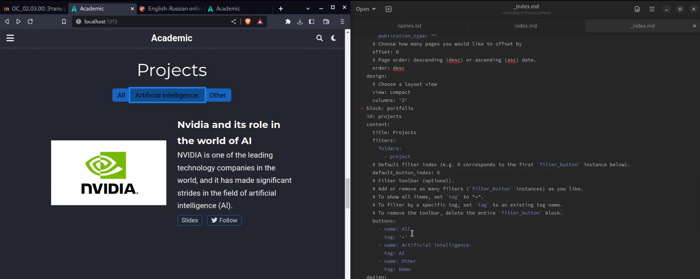
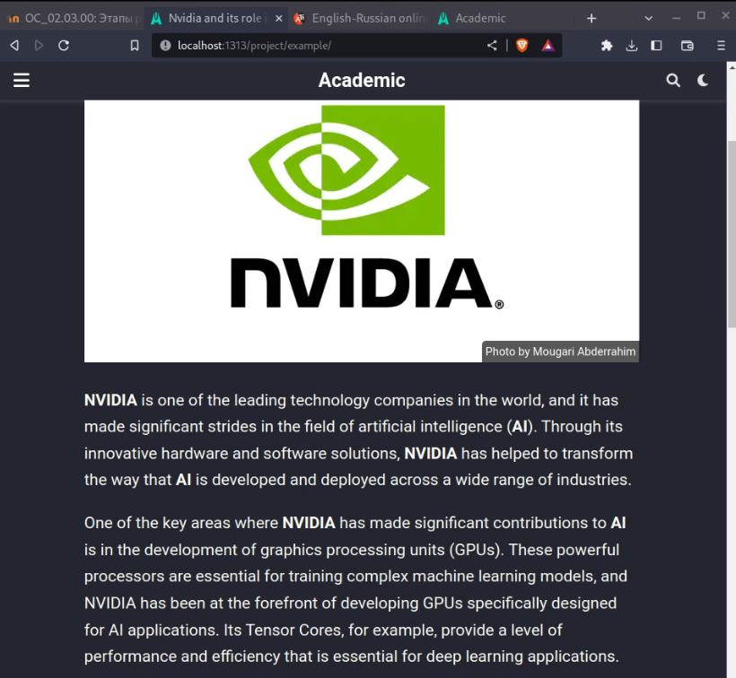
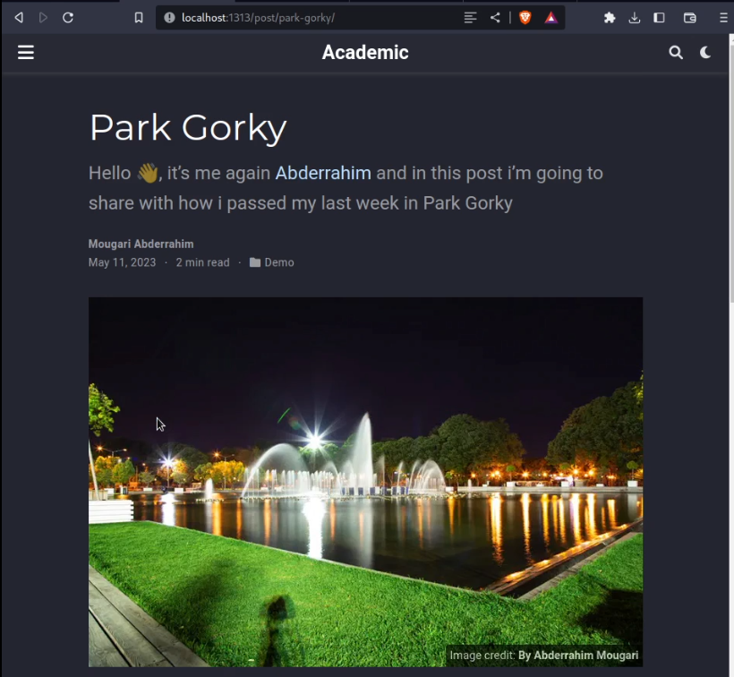
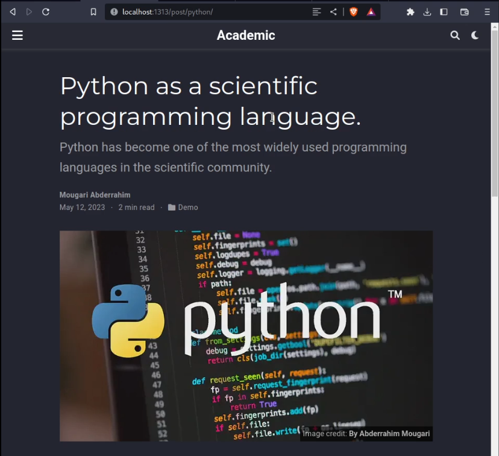

---
## Front matter
lang: ru-RU
title: Операционные системы
subtitle: Индивидуальный проект | Этап 5
author:
  - Абдеррахим Мугари.
institute:
  - Российский университет дружбы народов, Москва, Россия
date: 13 марта 2023

## i18n babel
babel-lang: russian
babel-otherlangs: english

## Formatting pdf
toc: false
toc-title: Содержание
slide_level: 2
aspectratio: 169
section-titles: true
theme: metropolis
header-includes:
 - \metroset{progressbar=frametitle,sectionpage=progressbar,numbering=fraction}
 - '\makeatletter'
 - '\beamer@ignorenonframefalse'
 - '\makeatother'
---

# Информация

## Докладчик

:::::::::::::: {.columns align=center}
::: {.column width="70%"}

  * Абдеррахим Мугари
  * Студент
  * Российский университет дружбы народов
  * [1032215692@pfur.ru](mailto:1032215692@pfur.ru)
  * <https://github.com/iragoum>

:::
::: {.column width="30%"}

:::
::::::::::::::

# Цель работы

- на этом этапе мы добавим пост о личном проекте и о том, как я провел свою последнюю неделю, и, наконец, пост о научных языках программирования

# Материалы и методы

- Hugo go.
- Github
- Google chrome.

# Ход работы:

## Задание

- Добавить с сайту все остальные элементы.
1. Сделать записи для персональных проектов.
2. Сделать пост по прошедшей неделе.
3. Добавить пост на тему по выбору: 
- Языки научного программирования.

## Создание постов для проектов:

- Здесь в качестве первого шага я добавил запись для личных проектов, добавив пост о Nvidia и ее роли в области искусственного интеллекта

{width=60%}

## Создание постов для проектов:

- А здесь, как вы можете видеть, уже готовая статья на нашу тему размещена на нашем сайте

{width=40%}

## Публикация поста о прошедшей неделе :

- после этого я сделал пост на прошлой неделе, в котором рассказал, как посетил парк Горького в Москве

{width=40%}

## Публикация поста о научных языках программирования

- и, наконец, я добавил пост на тему научных языков программирования

{width=40%}

# Выводы четвертого этапа индивидуального проэкта:

- на этом этапе мы добавили пост о личном проекте и о том, как я провел свою последнюю неделю, и, наконец, пост о научных языках программирования
