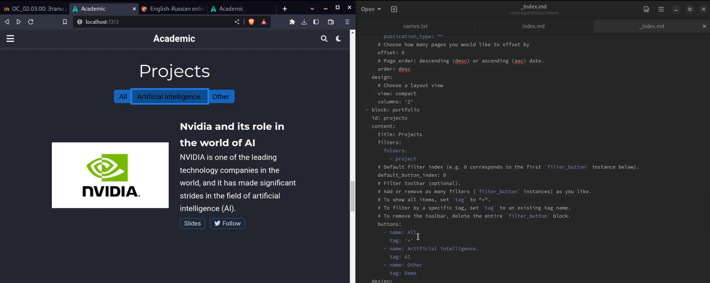
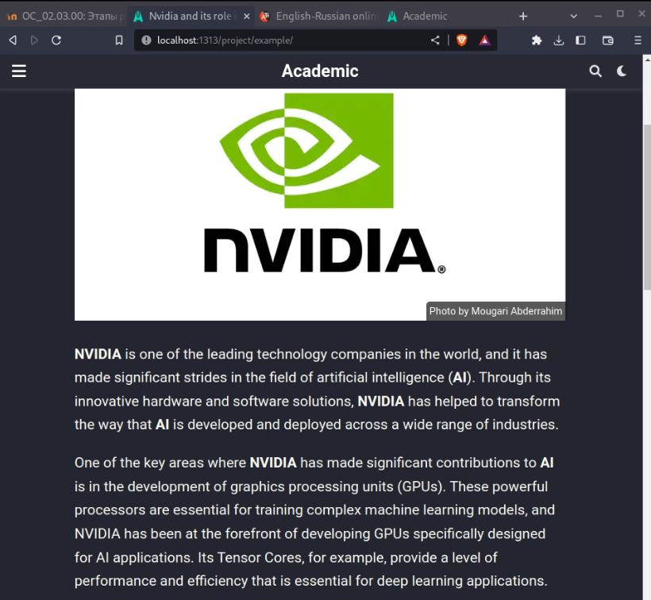
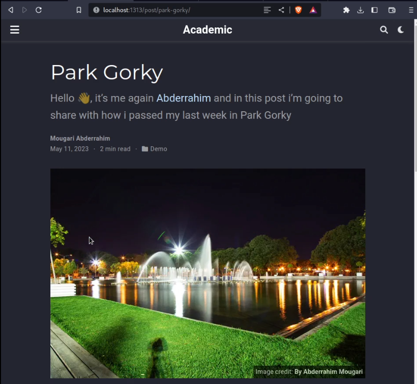
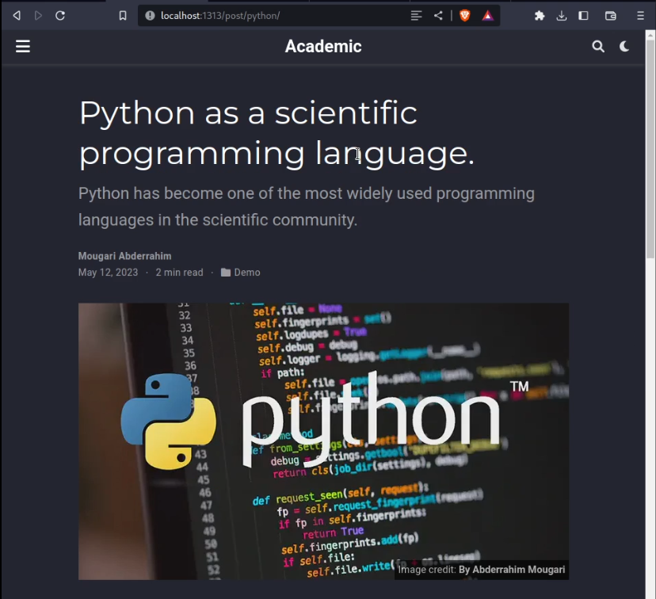

---
## Front matter
title: "Архитектура компьютеров и операционные системы. Раздел | Операционные системы"
subtitle: "Индивидуальный проект | Этап 5"
author: "Мугари Абдеррахим | НКАбд-03-22"

## Generic otions
lang: ru-RU
toc-title: "Содержание"

## Bibliography
bibliography: bib/cite.bib
csl: pandoc/csl/gost-r-7-0-5-2008-numeric.csl

## Pdf output format
toc: true # Table of contents
toc-depth: 2
lof: true # List of figures
lot: true # List of tables
fontsize: 12pt
linestretch: 1.5
papersize: a4
documentclass: scrreprt
## I18n polyglossia
polyglossia-lang:
  name: russian
  options:
	- spelling=modern
	- babelshorthands=true
polyglossia-otherlangs:
  name: english
## I18n babel
babel-lang: russian
babel-otherlangs: english
## Fonts
mainfont: PT Serif
romanfont: PT Serif
sansfont: PT Sans
monofont: PT Mono
mainfontoptions: Ligatures=TeX
romanfontoptions: Ligatures=TeX
sansfontoptions: Ligatures=TeX,Scale=MatchLowercase
monofontoptions: Scale=MatchLowercase,Scale=0.9
## Biblatex
biblatex: true
biblio-style: "gost-numeric"
biblatexoptions:
  - parentracker=true
  - backend=biber
  - hyperref=auto
  - language=auto
  - autolang=other*
  - citestyle=gost-numeric
## Pandoc-crossref LaTeX customization
figureTitle: "Рис."
tableTitle: "Таблица"
listingTitle: "Листинг"
lofTitle: "Список иллюстраций"
lotTitle: "Список таблиц"
lolTitle: "Листинги"
## Misc options
indent: true
header-includes:
  - \usepackage{indentfirst}
  - \usepackage{float} # keep figures where there are in the text
  - \floatplacement{figure}{H} # keep figures where there are in the text
---

# Цель работы

- на этом этапе мы добавили пост о личном проекте и о том, как я провел свою последнюю неделю, и, наконец, пост о научных языках программирования

# Задание

- Добавить с сайту все остальные элементы.
1. Сделать записи для персональных проектов.
2. Сделать пост по прошедшей неделе.
3. Добавить пост на тему по выбору: 
- Языки научного программирования.
# Выполнение работы :

## Создание постов для проектов:

- Здесь в качестве первого шага я добавил запись для личных проектов, добавив пост о Nvidia и ее роли в области искусственного интеллекта (рис. @fig:001)

{#fig:001 width=60%}

- А здесь, как вы можете видеть, уже готовая статья на нашу тему размещена на нашем сайте (рис. @fig:002)

{#fig:002 width=50%}

## Публикация поста о прошедшей неделе :

- после этого я сделал пост на прошлой неделе, в котором рассказал, как посетил парк Горького в Москве (рис. @fig:003)

{#fig:003 width=50%}

## Публикация поста о научных языках программирования

- и, наконец, я добавил пост на тему научных языков программирования (рис. @fig:004)

{#fig:004 width=60%}

 
# Выводы пятого этапа индивидуального проэкта:

- на этом этапе мы добавили пост о личном проекте и о том, как я провел свою последнюю неделю, и, наконец, пост о научных языках программирования.
